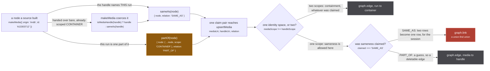
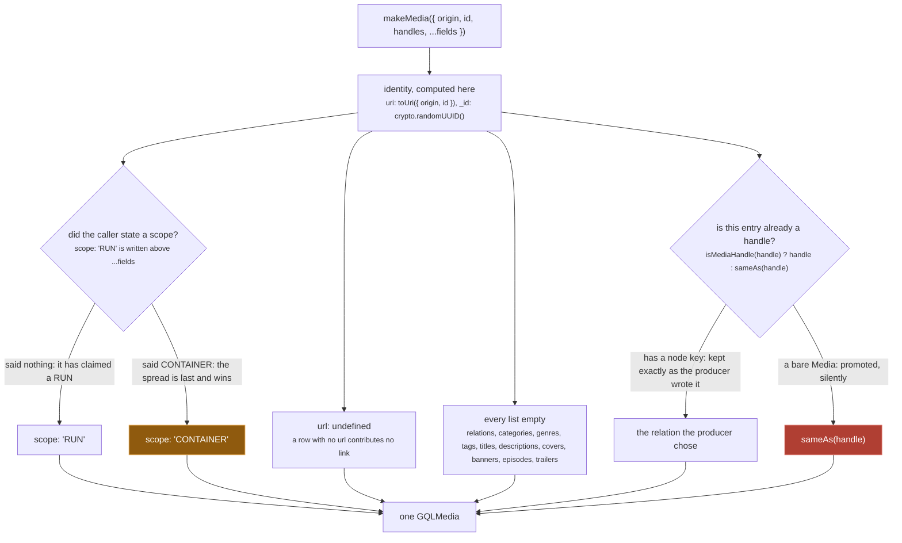
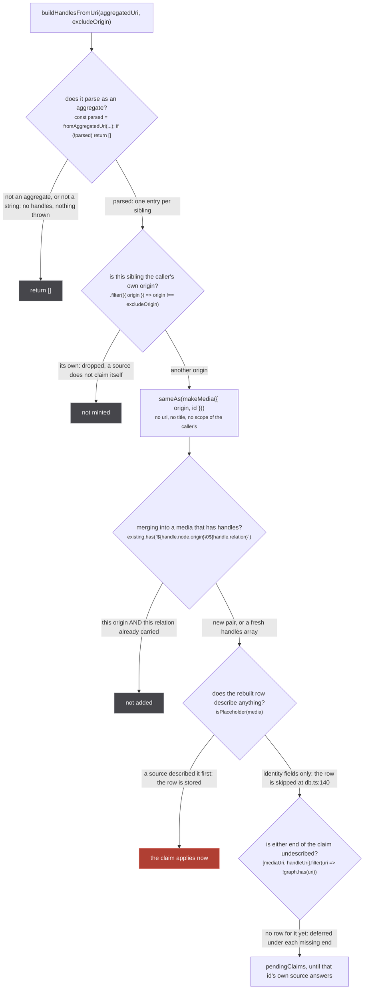
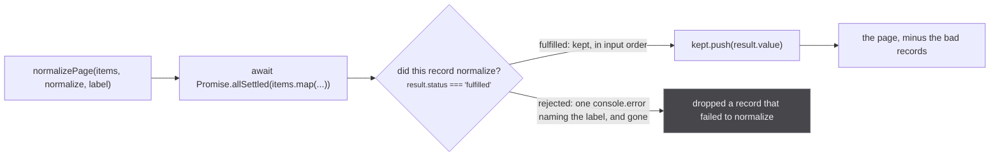

A source never writes to the store. It builds objects and hands them back, and every object it builds
comes out of one 509 line module, `src/sources/utils.ts`. Two of its exports are one line each, and
the difference between them is the difference between a link that can be undone and a weld that
cannot:

`src/sources/utils.ts:27`

```ts
export const sameAs = (node: GQLMedia): GQLMediaHandle => ({ node, relation: 'SAME_AS' })
```

`src/sources/utils.ts:40`

```ts
export const partOf = (node: GQLMedia): GQLMediaHandle => ({ node: { ...node, scope: 'CONTAINER' }, relation: 'PART_OF' })
```

Everything below is what happens to those two shapes on the way to `graph`, and what the rest of the
module does so a source can hand over an object at all.

## Two constructors, two fates



*One rose node on the figure, and `partOf` cannot reach it by any route: the CONTAINER stamp it puts on its copy is what makes the first decision come out "two scopes" no matter what the claim said.*

The routing is `src/worker/store/db.ts:187-197`: the cross-scope edge at `db.ts:190`, the union at
`db.ts:193`, the `PART_OF` edge at `db.ts:196`. The 2x2 those two decisions implement is written out
as a table in the comment at `db.ts:166-169`, and the sentence under it is the whole design:

`src/worker/store/db.ts:171`

> Guesses go on edges, which are deletable; only asserted sameness within one scope goes on a union.

Read the two doc comments next to each other, because they are the same sentence from two directions.

`src/sources/utils.ts:23-26`

> This handle names THIS run. Unions the cluster, permanently, with no inverse. The default, and the
> only relation any producer asserted before 2026-09-04.

`src/sources/utils.ts:29-39`

> This media is one PART of what the handle names: a run of that show, a film published under that
> series. Carries the url without claiming to be it, and never unions.
>
> Use it wherever the honest answer used to be to drop the link: a show-level id from a source with no
> season concept, an IMDb id, a Crunchyroll /series/ url on a film.
>
> THIS IS THE SCOPE STAMP. A PART_OF target is by definition a container of this run, so the node goes
> out as a copy scoped CONTAINER whatever it said, and the store then keeps it out of every run's
> identity space for good (scope is sticky toward CONTAINER there). The input is left untouched.

So `partOf` does two things, not one. It sets the relation, and it rewrites the node's scope. The copy
is load bearing in both directions: the stamp is what the store reads, and the spread is why the
caller's own object does not silently change scope under it. `tests/unit/sources/utils.test.ts:130`
pins both halves, including `expect(show.scope).toBe('RUN')` on the input after the call.

:::danger
**`graph.link` has no inverse, and `sameAs` is the only way to reach it.**
`graph.link` (`src/worker/store/graph.ts:279-291`) is a union-find union. The `UnionFind` surface is
`has`, `find`, `union`, `component` and `allComponents`, declared at `graph.ts:10-16`: there is no
split, no unlink, no disunion anywhere in the repo, and `union` ends by deleting the old root's
component record, which destroys the record of which members came from which side. Two media welded
by a `sameAs` stay welded until `resetStore()`, which is tests only.

What it costs when the id names a show rather than a run is measured, and the schema says so where a
producer will read it:

`src/worker/resolvers/media/schema.gql:79-86`

> The handle names THIS run. The only relation that unions clusters, in `upsertMedia`, and the union
> has NO INVERSE: once two media are welded they stay welded for the session.
>
> Minting this for an id that names a SHOW is the single most expensive mistake available here. It
> merged three Mushoku Tensei seasons, four Demon Slayer films and fifteen Dragon Ball Z films, each
> time because one id was the only thing a source could offer and the only relation was this one.
:::

:::caution
**The CONTAINER stamp is a one-way door.** It destroys nothing, and it does not come back. Once any row
for a uri has said CONTAINER, `db.ts:146` refuses to let a later row saying RUN, or saying nothing,
flip it:

`src/worker/store/db.ts:142-145`

> Scope is STICKY toward CONTAINER: once any row for this uri said CONTAINER, a later row that says
> RUN or says nothing does not flip it back. The failure with no inverse is a wrong SAME_AS, and
> the failure of a wrong CONTAINER is a missing SAME_AS, which a later slice can recover. The
> merge function alone would let an incoming RUN overwrite it (scalars are last-write-wins).

That is what a `partOf` handle spends. It is also why nothing on this page treats a CONTAINER stamp as
free: the recoverable failure is the one it chooses.
:::

### Who mints which

Three source modules call `partOf`, at six sites. Kitsu builds one per streaming pointer it cannot read
as a film (`src/sources/kitsu/extractor.ts:96`), JustWatch routes its offers through it
(`justwatch/extractor.ts:400` and `:510`), and Watchmode is the source that exists in its current
shape because of it: `watchmode/extractor.ts:134` returns `partOf(node)` for every provider handle,
after `:133` has decided the one narrow case that may be `sameAs`, and `:155` and `:162` mint its imdb
and tmdb ids the same way. Watchmode's own comment says why
the claim is made at the point of the claim rather than left to the store's backstop:

`src/sources/watchmode/extractor.ts:148-150`

> `imdb` stays, as PART_OF: a `tt` id names the show and there is no season-level equivalent, which is
> the whole reason `SHOW_LEVEL_ORIGINS` exists. Saying so here rather than relying on that Set to
> demote it means the claim is honest at the point it is made.

### The third route, which the brief does not name

There is a way to get the CONTAINER outcome without calling `partOf` at all, and three sources use it.
They put a bare media into the handle list with the scope already set:

`src/sources/tvmaze/extractor.ts:60`

> The imdb id is the SHOW's, one for every season, so it is a CONTAINER whichever row carries it.

`src/sources/tvmaze/extractor.ts:61-63`

```ts
const buildHandles = (show: TvmazeShow): GQLMedia[] => {
  const imdb = show.externals?.imdb
  return imdb ? [makeMedia({ origin: 'imdb', id: imdb, url: `https://www.imdb.com/title/${imdb}`, scope: 'CONTAINER' })] : []
}
```

Trakt does the same for its imdb and tmdb ids (`trakt/extractor.ts:80-84`) and so does tvdb
(`tvdb/extractor.ts:41`). These are bare medias, so `makeMedia` coerces each one to `sameAs`, and the
claim that reaches `upsertMedia` says SAME_AS. It still lands on an edge, because the node's scope
makes `mediaScope !== handleScope` true. That is the `BARE` lane on the figure above, and it is worth
knowing that the two routes are not equivalent in what they say, only in what they do: `partOf` states
the containment, while a scope stamp lets the store infer it. Trakt is explicit that the second is
deliberate there, since every row it mints is a container anyway:

`src/sources/trakt/extractor.ts:76-79`

> Everything this source mints is CONTAINER: it reads /shows/ and /search/show only, so a row is
> trakt's show slug and the imdb and tmdb ids on it are the show's, identical for every season. The
> bare tmdb tv id is the one to watch, since tmdb is not in the store's show-level backstop and
> `tmdb/extractor.ts` mints real `<id>-s<n>` runs that a bare id must never be unioned with.

## `makeMedia`, and the coercion in the middle of it



*Two defaults decide something permanent, and both are the quiet branch: a source that says nothing about scope has claimed a RUN, and a handle handed over bare has claimed sameness.*

`makeMedia` is `utils.ts:59-81`. `isMediaHandle` at `utils.ts:20` is the whole test, and it is
structural: `'node' in handle`. So the coercion at `utils.ts:66` cannot tell a producer that meant
SAME_AS from one that forgot to say anything, and it resolves that in favour of the union. The comment
above the type says why that is the right way round, and it is an argument about migration rather than
about correctness:

`src/sources/utils.ts:9-16`

> A handle, or the media to make a SAME_AS handle out of.
>
> `makeMedia({ handles: [media] })` still means what it always meant, because SAME_AS is what all 49
> producer sites were already asserting. Only a producer that means something else has to say so, with
> `partOf(...)`. The BREAKING half of this refactor is deliberately on the reading side, where a
> missed site shows nothing rather than throwing.

Three more things the figure is compressing:

- **The field spread is last** (`utils.ts:80`), so every default above it is overridable. `origin`,
  `id` and `handles` are destructured out of `fields`, so those three alone are out of its reach; `uri`
  and `_id` are not, and are simply never passed by anything in the tree.
- **`relations` is a different axis and starts empty.** `utils.ts:67-68`: *Narrative edges, and empty
  unless a source names some. Separate from `handles` on purpose: see `MediaRelation` in
  worker/resolvers/media/schema.gql for why the two axes never mix.* The schema is blunter, at
  `schema.gql:114-120`: *Nothing here may ever union a cluster. A sequel is a DIFFERENT work, and
  treating one as the same row is the mistake that merged three Mushoku Tensei seasons when it was
  made with SAME_AS.*
- **The episode forms are the same shape with one asymmetry.** `makeEpisode` (`utils.ts:83-96`) runs
  the same coercion through `episodeSameAs` at `:90`. But `episodePartOf` (`utils.ts:44`) stamps no
  scope, and cannot: an Episode has no `scope` field. The two episode constructors are therefore a
  relation and nothing else.

## Rebuilding handles out of a uri

The address bar is a producer. `ag:(anilist:108465,cr:G24H1N3MP,tvmaze:52279)` names three ids, and
`buildHandlesFromUri` turns the ones that are not the caller's own into handles. Three sources call it,
at five sites on their search-and-link paths: crunchyroll at `crunchyroll/extractor.ts:527`, unogs at
`unogs/extractor.ts:439` and `:457`, appletv at `appletv/extractor.ts:380` and `:393`. JustWatch goes
through `mergeHandles` instead, at `justwatch/extractor.ts:711` and `:738`, because it already has
handles of its own to keep.



*Everything a uri contributes is an identity claim and nothing else, so the claim is the only half of it that can be wrong.*

The refusal at the top is total and silent: `fromAggregatedUri` (`src/utils/uri.ts:212-230`) returns
`undefined` for a non-string and for anything `SCANNARR_REGEX` (`uri.ts:97`) does not match, and
`buildHandlesFromUri` answers `[]` (`utils.ts:467`). `ag:()` is a legal aggregate with no siblings and
also comes back as `[]`, because `handleUrisValues` filters out entries with no origin or no id
(`uri.ts:218`). Nothing here throws.

`tests/unit/sources/utils.test.ts:145` pins the whole shape on the real example above: the result is
`['anilist:108465', 'tvmaze:52279']`, both SAME_AS, and each node has no url, no titles and no
CONTAINER scope.

The comment on the function is the most honest paragraph in the module, and it is the one to read
before touching this path:

`src/sources/utils.ts:444-464`

> Every handle an aggregated uri names, as SAME_AS, minus the caller's own origin.
>
> SAME_AS PRESERVES TODAY'S BEHAVIOUR and is not an endorsement of it. The uri is user input: a stale
> bookmark re-injects whatever claims it carries, and `graph.link` has no inverse. What makes that
> worth keeping for now is the shared-link case, where the uri is the only evidence those siblings
> exist until their own sources answer.
>
> The awkward part, and the reason this wants its own measurement rather than a guess: `makeMedia`
> defaults `url: undefined`, so a handle rebuilt here carries NO url at all. It contributes the
> identity claim and nothing else, which is precisely the half that can go wrong. Demoting it to
> PART_OF would therefore make it contribute nothing, so the honest options are "keep asserting" or
> "delete the function", not a middle one.
>
> A rebuilt sibling is a BARE node, and carries no scope of the caller's. The caller has read nothing
> about those ids, so a stamp here was a claim about rows it never saw, written onto them: a CONTAINER
> caller flipped every run sibling to CONTAINER for good (scope is sticky that way in the store) and
> welded them in the container space, and a RUN caller minted a RUN row for a show whose own row was
> still in flight and unioned with it. The store holds a claim naming a bare node until the node's
> own source describes it, so the uri contributes the claim and nothing else, in every direction.

That last sentence is the bottom of the figure, and it is implemented in two places rather than here.
`IDENTITY_FIELDS = new Set(['uri', 'origin', 'id', 'scope'])` at `db.ts:104`, `isPlaceholder` at
`db.ts:105-108`, and the `continue` at `db.ts:140` keep a bare rebuilt row out of the store entirely;
the claims loop then finds no row for it (`db.ts:179-183`) and defers. The store's own comment names
this function as the thing it is defending against:

`src/worker/store/db.ts:99-103`

> The fields that NAME a row rather than describe it. A row carrying nothing else is a placeholder
> rebuilt from a uri (`buildHandlesFromUri` in sources/utils.ts mints one per sibling of an aggregated
> uri), and a uri says nothing about what it names: the row would contribute no field to a merge and
> its scope is `makeMedia`'s default. So it is not stored, and a claim naming it waits for a row that
> is. A CONTAINER stamp counts as a description, since it is a source's own reading of the id.

Note the asymmetry that last sentence creates, because it is exactly the difference between the two
lanes of the first figure. A `partOf` node is scoped CONTAINER, so `isPlaceholder` is false for it and
it is stored immediately, even with no url and no title. A rebuilt sibling is scoped RUN by default, so
it is not.

### `mergeHandles` dedupes on the relation too

`mergeHandles` (`utils.ts:480-487`) mutates its argument in place and adds only what is missing. The
key is the pair, not the origin:

`src/sources/utils.ts:473-479`

> Add the handles an aggregated uri names to a media, for origins it does not already carry.
>
> Dedupes by ORIGIN and by RELATION together. Origin alone was enough while every handle meant the
> same thing; it is not now. A media already carrying `partOf(imdb:tt123)` would otherwise block the
> uri from contributing a SAME_AS for imdb, or the reverse, depending only on which arrived first.

One reading worth having in front of you: the filter at `utils.ts:485` tests each new handle against
`existing`, which is built once from `media.handles` at `:482` and never updated. The extras are not
deduped against each other. An aggregated uri naming two ids of one origin, such as
`ag:(cr:G24H1N3MP,cr:G24H1N3MP-GS00374452)`, therefore contributes both as SAME_AS. That is a real
shape (it is the exact pair `mostSpecific` at `src/utils/uri.ts:34-41` exists to choose between) and
the store then unions them, which `uri.ts:30-31` already calls a defect: *TWO ids of one origin in one
cluster is itself a defect and this does not fix it, it only stops the defect choosing the worst of
them.*

## One bad record must not empty the feed



*The only refusal on this page that is per item rather than per claim, and the only one that logs.*

`normalizePage` is `utils.ts:138-150`. `Promise.allSettled` at `:143` is the whole mechanism, and the
comment above it is an argument about what a page resolver is for:

`src/sources/utils.ts:130-137`

> Normalize a page of upstream records, dropping only the ones that fail.
>
> A page resolver is all-or-nothing by default: a plain `.map` throws and a `Promise.all` rejects
> as soon as one record is malformed, so the source yields nothing and one bad entry costs the
> whole page. That is what turns a single odd upstream record into an empty feed, and it defeats
> the point of having several sources, since the surviving source goes dark too.

The log line is `console.error(\`${label}: dropped a record that failed to normalize\`, result.reason)`
at `utils.ts:147`, and `label` is what tells you which source it was.

## The rest of the module

**`handleNodes` and `sameAsNodes`** (`utils.ts:47` and `:56-57`) are the reading side of the same
distinction, and the comment on the second is the rule every consumer has to obey:

`src/sources/utils.ts:49-55`

> Only the nodes this media claims to BE.
>
> The filter that has to be applied anywhere sameness is assumed: episode lists, title and cover
> merging, cluster membership. Reading a PART_OF node as though it were this media is the original bug
> in a new hiding place, and its episode list is every run's at once.

The rule is enforced. The helpers are not the thing enforcing it: a grep of the whole tree, tests
included, finds no caller of either function outside its own definition. Every site that needs the
filter open-codes it instead, at `src/worker/store/aggregate.ts:104`,
`src/router/watch/index.tsx:30`, `src/router/home/media-modal.tsx:496` and
`src/router/home/episode-origins.ts:19`. The heaviest enforcement is a different shape again: the store
does not filter PART_OF handles out, it cuts the subtree under them, at
`src/worker/store/aggregate.ts:145`, which returns `[{ ...handle.node, handles: [] }]` for a PART_OF
node and recurses only through SAME_AS. That figure belongs to
[from an answer to a row](/write/answer-to-row/); what matters here is that the comment above these
two unused exports is where the rule is written down.

**`stripTitle`** (`utils.ts:178-183`) is the normaliser under every title comparison in the module,
and its comment is a measurement:

`src/sources/utils.ts:176-177`

> keeps letters of every script. Stripping to `[a-z0-9]` erased a japanese title down to its ascii
> digits, so ani.zip's "転生したらスライムだった件 (2026)" was the literal string "2026" and was equal to
> every other 2026 show.

It is read by `titleSimilarity` and `searchScore` in this file (`utils.ts:252-253`, `:268-269`), by
`isGenericEpisodeTitle` and the episode-title rule in `src/sources/similar.ts:109` and `:203`, and by
`src/worker/store/fuzzy-merge.ts:122`.

**`makeMovieEpisode`** (`utils.ts:109-125`) exists because a film has to reach the same playback path
an episode does, and it carries one constraint that reads as arbitrary and is not:

`src/sources/utils.ts:99-108`

> A movie is modelled as a one episode series so it can reuse the episode keyed
> playback path, which is the only path the watch route and the source selector
> understand. The episode id suffixes the media id, so the uri comes out as
> `${media.uri}-1`, matching the toUriEpisodeId convention in utils/uri.
>
> episodeNumber must stay 1 rather than null: the media episodes resolver drops
> every episode with a null episodeNumber, and groups the rest by that number,
> which is what merges one movie's per-source episodes into a single row.

That resolver is `src/worker/resolvers/media/index.ts:208`, `.filter(ep => ep.episodeNumber != null)`,
and the grouping it feeds is `:211-212`. `episodeNumber: 1` is set at `utils.ts:123`, after the field
copies and before `...overrides`, so an override can still remove it. The same rule is stated twice in
the file, once as a line comment at `utils.ts:98` and once in the doc block below it.

## Where the code disagrees with the brief

- **The page brief describes `handleNodes` and `sameAsNodes` as the applied filter.** They have no
  callers anywhere in the tree, tests included. The rule they document is real and is enforced at four
  open-coded sites plus the subtree cut in `aggregate.ts`, listed above.
- **The brief lists two constructors as the two fates.** There is a third route to the containment
  edge, used by tvmaze, trakt and tvdb: a bare media carrying `scope: 'CONTAINER'`, coerced to
  `sameAs` on the way in and demoted by the store's cross-scope rule on the way out.
- **The subsystem report cites the SAME_AS schema documentation as `media/schema.gql:20-28`.** That
  range is the `TV_SHORT` enum member. The `MediaHandleRelation` enum is `schema.gql:78-98`, with the
  SAME_AS doc at `:79-86` and the PART_OF doc at `:88-96`. The text quoted is otherwise verbatim.
