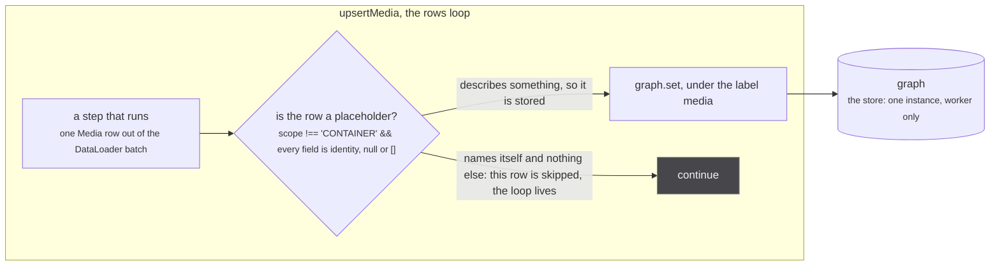
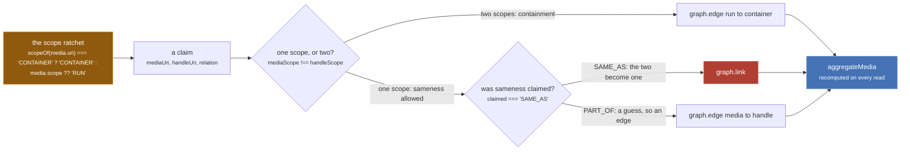
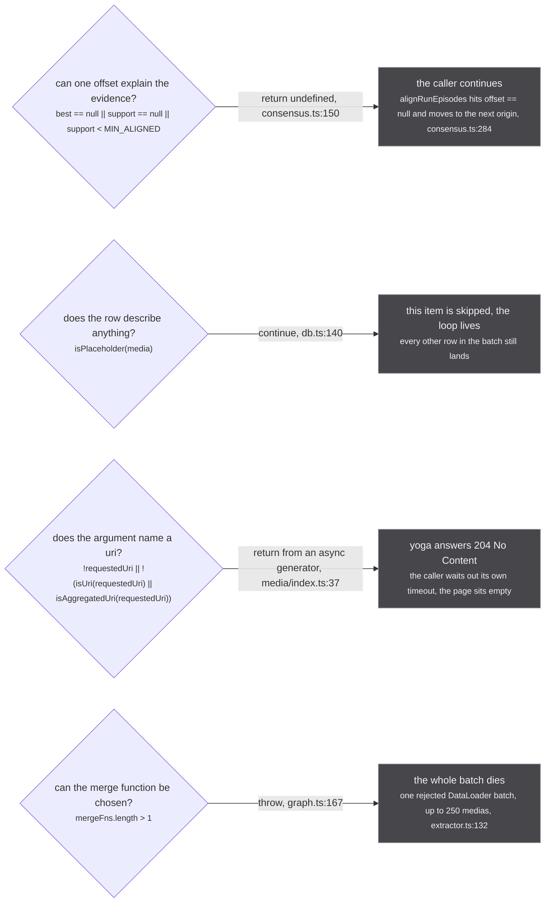
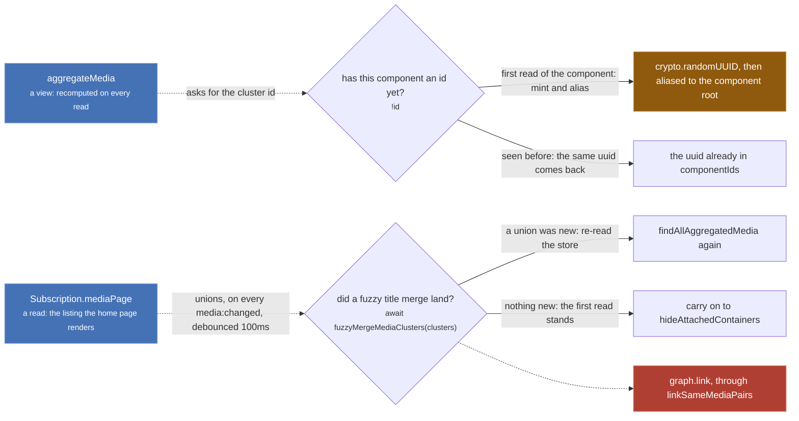

Every figure on this site is a mermaid fence rendered in your browser, never a picture. That is on
purpose: a diagram that is text can be diffed against the code it describes, and
`docs/scripts/check-diagrams.mjs` loads every page in a real browser, in both themes, and fails if a
fence did not draw an `<svg>`.

Four things are worth learning once, here, so no later page has to teach them: what the shapes mean,
how a decision node is written, what the colours say about permanence, and how a refusal is drawn.

## Shapes



*A rectangle is a step, a rhombus is a decision, a cylinder is the store, a box around several nodes is one function or one loop, and a short dim node hanging off a decision is a refusal that ends that path.*

The decision in that figure is a real one. The loop is `src/worker/store/db.ts:139-152`,
`isPlaceholder` is defined at `db.ts:105-108` and applied at `db.ts:140`, and a row that passes it is
written at `db.ts:147`. The reason it exists is the
kind of comment this site exists to surface:

`src/worker/store/db.ts:99-103`

> The fields that NAME a row rather than describe it. A row carrying nothing else is a placeholder
> rebuilt from a uri (`buildHandlesFromUri` in sources/utils.ts mints one per sibling of an aggregated
> uri), and a uri says nothing about what it names: the row would contribute no field to a merge and
> its scope is `makeMedia`'s default. So it is not stored, and a claim naming it waits for a row that
> is. A CONTAINER stamp counts as a description, since it is a source's own reading of the id.

## A decision node carries its condition, verbatim

Line one is the question in English. Line two is the condition as it is written in the file, in
`<small>`. That is the whole convention, and it is why the site's config turns HTML labels on:

`docs/astro.config.mjs:17-19`

> The diagrams here are wide: the flow crosses ~36 sources, a worker, three id spaces and a
> read pipeline. `htmlLabels` is what lets a node carry a second line in a smaller face, which
> is how a decision node states its CONDITION under its question without doubling in width.

That comment is right about `htmlLabels` and stale about the count. There are **24** built-in source
modules, pinned by name and by length at `tests/unit/sources/index.test.ts:19-24`. The 36 figure counts
JustWatch's provider mappings, not source modules. Say 24.

Edge labels say what the branch **is**, not "yes" or "no". `refused: 204, no payload` tells you
something; `no` tells you where to look next and nothing else. Line numbers live in the prose beside a
figure rather than inside a node label, because a label is read at a glance and a citation is read
deliberately. The exception is an edge whose subject is the site itself, as in the refusal figure
below.

## Colour carries permanence, and nothing else

Not importance, not subsystem, not happy path. Four classes, the same four names and the same four
colours on every page:

| class | colour | means |
| --- | --- | --- |
| `irrev` | rose | no inverse exists. `graph.link`, and the scalar overwrite in `lastWriteLongestArray` |
| `ratchet` | sun | one-way door. RUN to CONTAINER, `SHOW_LEVEL_ORIGINS`, a minted `componentId` |
| `view` | brand blue | computed on every read, persists nothing. `aggregateMedia`, `alignRunEpisodes`, `runEpisodes` |
| `refuse` | dim grey | a path that ends here, and nothing permanent is at stake |

The dim class does double duty, and it is worth knowing which you are looking at. On a path figure it
is a refusal: a short terminal node hanging off a decision, with no arrow leaving it. On
[the permanence legend](/start/whole-flow/#the-permanence-legend) it is the append-only band, `graph.edge` and
`graph.connect` and `graph.set`, where nothing is destroyed and a delete could be implemented. That is
exactly the argument `db.ts:171` makes for routing every guess onto an edge. A node with no class at
all is an ordinary step.

Copy this block verbatim into any flowchart that touches the store. It is the same block the front
page's legend carries, character for character:

```text
classDef irrev fill:#b03f33,stroke:#e0796f,color:#ffffff
classDef ratchet fill:#8f5a0e,stroke:#f2b45c,color:#ffffff
classDef view fill:#4572b5,stroke:#8db0de,color:#ffffff
classDef refuse fill:#46464b,stroke:#8b8c93,color:#f2f2f4
```

**Hex literals, not the site's CSS variables, and that is not a preference.** The obvious version of
this block is `fill:var(--s-rose-soft)`, which would follow the reader's theme for free. Mermaid's
flowchart grammar cannot read it: the opening parenthesis of `var(` ends the style token, and the whole
diagram fails to parse. The first figure on this page, written that way, answered
`Parse error on line 9 ... Expecting 'SEMI', 'NEWLINE', 'SPACE', 'EOF', 'COLON', 'STYLE', 'NUM',
'COMMA', 'NODE_STRING', 'UNIT'` and drew nothing. Measured against mermaid 11.17.2 in headless
Chromium on 2026-09-10, on the four figures of this page, with a deliberately broken fifth diagram as
the control that had to fail and did. So each class pins its own fill AND its own text colour, and the
pair is chosen to read on both the light card and the dark one.

Here are three of them on one real fragment, the tail of `upsertMedia`. The fourth, `refuse`, is on
the figure above and on the refusal figure below:



*One rose node on the whole figure, and everything to its left exists to keep the wrong pair away from it.*

Read left to right: a scope is decided once and does not come back (`db.ts:146`), then a claim is
routed by the two scopes and the claimed relation. The cross-scope edge is `db.ts:190`, the union is
`db.ts:193`, the `PART_OF` edge is `db.ts:196`, and whatever the routing decides, the page you see is
recomputed from the cluster by `aggregateMedia` (`src/worker/store/aggregate.ts:306`).
The 2x2 that `D1` and `D2` implement is written out in full at `db.ts:166-169`, and the sentence under
it is the design:

`src/worker/store/db.ts:171`

> Guesses go on edges, which are deletable; only asserted sameness within one scope goes on a union.

:::danger
**Rose is not decoration: it means no inverse exists.** `graph.link` (`src/worker/store/graph.ts:279-291`)
is a union-find union, and the whole `UnionFind` surface is `has`, `find`, `union`, `component` and
`allComponents` (declared at `graph.ts:10-16`, returned at `graph.ts:120`). There is no split, no
unlink, no disunion anywhere in the repo. `union` ends with `components.delete(oldRoot)` at
`graph.ts:103`, which destroys the record of which
members came from which side, so nothing afterwards can ask what this component would hold with one
node removed. The only reset is `resetStore()` at `db.ts:509-513`, which empties the whole store and is
tests only.
:::

:::caution
**Sun means a one-way door, with nothing destroyed.** The scope ratchet at `db.ts:146` is the example
every other page points at:

`src/worker/store/db.ts:142-145`

> Scope is STICKY toward CONTAINER: once any row for this uri said CONTAINER, a later row that says
> RUN or says nothing does not flip it back. The failure with no inverse is a wrong SAME_AS, and
> the failure of a wrong CONTAINER is a missing SAME_AS, which a later slice can recover. The
> merge function alone would let an incoming RUN overwrite it (scalars are last-write-wins).
:::

## Four ways to say no, drawn four different ways

The mechanism a refusal uses decides what the caller does next, and three of these render an identical
empty page, so the figures distinguish them on sight.



*Four refusals, four blast radii: one value, one item, one request, one batch of up to 250.*

The numbers in those conditions are real and are worth knowing: `MIN_ALIGNED = 2`
(`src/worker/store/consensus.ts:111`), and the loader that dies in row four is
`new DataLoader(..., { cache: false, batch: true, maxBatchSize: 250, batchScheduleFn: 50ms })` at
`src/worker/extractor.ts:129-134`.

Row three is the expensive one, and it is the only refusal in the system that logs, because from
outside the worker it is invisible:

`src/worker/resolvers/media/index.ts:35`

> a refused page and a slow one are indistinguishable from outside the worker without this

Every source's default resolvers are written around the same trap, which is why they yield a null
payload instead of ending:

`src/worker/extractor.ts:459-462`

> most sources cannot answer show-plus-evidence, and the default has to YIELD that rather
> than end: a subscription generator that completes without yielding makes yoga respond
> 204 No Content, which the caller would sit on until its timeout instead of reading a
> refusal off the first payload

That yielded `{ media: null }` at `extractor.ts:457` is a fifth kind of no, and the one a source uses
most: a payload that says "not mine", which the caller can read immediately.

**One correction to the page brief.** The inventory hands `media/index.ts:36` to the `return undefined`
row. The code disagrees: `subscribe` there is an `async function*`, so line 37 is a bare `return` out
of a generator, which is the 204 case, and it is drawn as such above. The `return undefined` example is
taken from `alignmentOffset` instead, where the caller's own `continue` at `consensus.ts:284` shows what
"the caller continues" means, with a comment worth reading on the way past:

`src/worker/store/consensus.ts:282-283`

> `== null`, not falsy: 0 is a real answer, and it means this source already counts the way the
> run does. Treating it as absent is harmless here and wrong everywhere it would be copied.

## A dashed edge crosses the read/write line

Solid arrows carry data along the path you expect. A dashed arrow means the arrow crosses from a read
into a write, and there are exactly two of them in the system. Both are drawn dashed everywhere they
appear on this site.



*Both lanes start in a function named like a read. One mints an id that is never collected, the other welds two clusters together.*

The first lane is `clusterId` at `src/worker/store/aggregate.ts:293-294`, called from
`aggregateMedia` at `aggregate.ts:310` and `:321`. It looks like a lookup, and `graph.componentId`
(`graph.ts:234-244`) mints on first call: the `crypto.randomUUID()` is `graph.ts:239` and the alias
that makes `resolve(id)` find the cluster is `graph.ts:241`. What it is keyed on is the point:

`src/worker/store/aggregate.ts:290-292`

> Keyed on the union-find ROOT of the cluster's identity space, never on a member: the smallest uri
> moved whenever a member sorting before it landed, and the container cut in `findAllAggregatedMedia`
> handed the same cluster a second id. Any member maps to the same root.

The second lane is `resolvers/media/index.ts:127-129`. The listing resolver calls
`fuzzyMergeMediaClusters`, which reaches `linkSameMediaPairs` at `db.ts:216-224`, whose `graph.link`
is `db.ts:220`. A page listing is therefore a write path, and it is the only read on the site that
can change what another page shows.

## What a figure on this site will not do

- **No flowchart of a code path without its branches.** A path drawn as a straight line is a claim that
  it cannot fail, and almost nothing here is that. The one exception is
  [the permanence legend](/start/whole-flow/#the-permanence-legend), which is a key rather than a path.
- **No decision node without its condition.** If the condition will not fit, the figure is too big and
  gets split, not shortened.
- **No line numbers inside a node label, and no colour that means anything but permanence.** An edge
  label may carry a site when the site is the subject, which is why the refusal figure above names one
  per branch; a node says what it does and the prose says where it lives.
- **No figure wider than the reader.** A wide figure breaks out of the text column by up to 9rem and
  then scrolls inside its own box (`docs/src/styles/custom.css:196-235`); the page itself never scrolls
  sideways, and the checker fails the build if it does.
