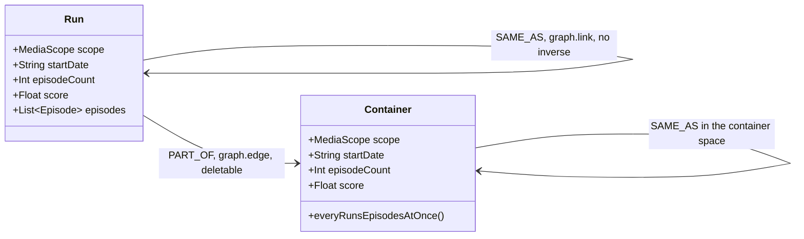
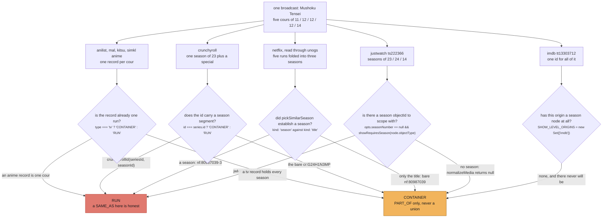
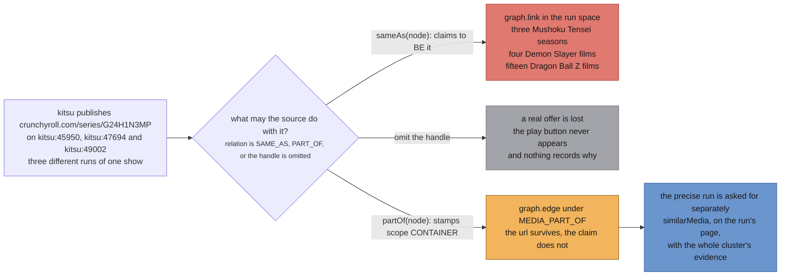
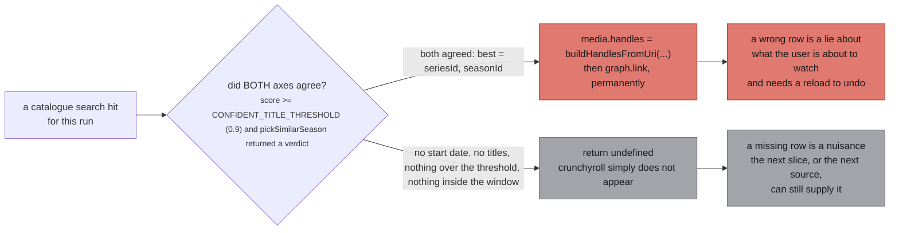

Stub's unit is a **run**: one cour, one film. It is what a card shows, what episodes hang off, and
what a `SAME_AS` handle may claim to be. Every catalogue upstream models a **show** instead: one page,
one id, every season hanging under it.

The two do not line up, and they do not line up in a way that is worse than merely imprecise. A
handle is an identity claim, and `graph.link` is a union-find union with no inverse
(`src/worker/store/graph.ts:279-291`). So a show id minted as `SAME_AS` does not produce a slightly
wrong row. It welds every run of that show into one media for the rest of the session.

`src/worker/extractor.ts:178-184`:

> WHY THIS EXISTS. Stub models a broadcast run; every catalogue models a show. A source holding a
> show-level link (Kitsu publishes Crunchyroll's `/series/<id>/` url on EVERY season record) has
> something true about the show and nothing it may honestly mint as a handle, because a handle is an
> identity claim and `graph.link` is a union-find union with no inverse. Dropping the link loses a
> real offer; minting it welds every season of the show. This is the third option: hand the show id
> back to the origin that owns it, say what we know about our run, and take the run it names, which
> IS an honest identity and links like any other.

## The two shapes

`MediaScope` has exactly two values, and the schema says what each is for
(`src/worker/resolvers/media/schema.gql:106-111`):

> **RUN**: One broadcast run: a cour, a film. The unit this store aggregates and the unit a card shows.
>
> **CONTAINER**: A show, a series, a franchise page: something several runs are part of.



*The four fields on each box are the ones that decide things: `scope` picks the identity space, `startDate` and `episodeCount` are the two axes every gate on this site reads, and `score` decides which spelling of a field survives aggregation. The self-arrow on `Run` is the one edge with no inverse; the self-arrow on `Container` is the same operation in a second, separate union-find.*

Two identity spaces, never one, and nothing crosses between them
(`src/worker/store/db.ts:7-12`):

> Two identity spaces, one per scope. A run's SAME_AS unions in the first, a container's in the
> second, and nothing ever unions across them: a show-level id entering a run's cluster is what
> welded Mushoku Tensei season 1 to season 3 on the live site (the bare crunchyroll series id and the
> bare tvmaze show id were fuzzy merged into season 1's cluster on the search path, and season 3's
> media path then asserted sameness through one of them; `graph.link` is a union-find with no
> inverse).

The labels are `media:same_as` and `container:same_as` (`src/worker/store/db.ts:14-15`), and
`sameAsLabelFor` at `db.ts:94` is the one line that picks between them.

:::danger[`graph.link` has no inverse]
`upsertMedia` calls `graph.link(mediaUri, handleUri, sameAsLabelFor(mediaScope))` at
`src/worker/store/db.ts:193`. That is a union-find union: `link` finds both roots and calls
`uf.union(a, b)` (`graph.ts:279-291`). There is no unlink, no split, and no record inside the
union-find of which pair caused the merge. A `SAME_AS` minted for a show id is permanent for the
session, and the only fix is a reload.

`graph.edge` and `graph.connect` write adjacency and can be reasoned about after the fact. `link` is
the one primitive that destroys the information needed to undo it.
:::

## The same broadcast, five ways

Mushoku Tensei broadcast as five cours of 11, 12, 12, 12 and 14 episodes. Here is what the
catalogues did with it, all measured, all in the tree today.



*Every lane asks the same question in its own file, and the rose outcome is the one that cannot be taken back. The conditions are, in order: `src/sources/simkl/extractor.ts:87`, `src/sources/crunchyroll/extractor.ts:174`, `src/sources/unogs/extractor.ts:342`, `src/sources/justwatch/extractor.ts:470`, and `src/worker/store/db.ts:42`.*

Each lane, with the measurement behind it.

**anilist, mal, kitsu, simkl anime records.** The record already is one cour, so its bare id is a
run and needs no scoping. `src/sources/simkl/extractor.ts:84-86`:

> A tv record is one show with every season under it (its episodes carry a season field), so it is a
> CONTAINER. An anime record is one run, the reason this source is worth reading: Mushoku Tensei is
> five records here, each with its own mal, anilist and kitsu id.

Note what `simkl` does with its own imdb id at `:89-92`: `imdbScopeForType` stamps CONTAINER on
everything but a film, because *all five Mushoku Tensei records carry tt13303712*.

**crunchyroll.** One season of 23 plus a special, against AniList's 11 and 12. The id shape is
`crunchyrollId(seriesId, seasonId, episodeId)`, joined on `-`
(`src/sources/crunchyroll/extractor.ts:151-152`), and the scope falls straight out of whether the
season segment is there (`:170-174`):

> An id with no season segment is the bare series id, which Crunchyroll shares across every season,
> so it names the SHOW. It enters the store as a CONTAINER and never a run's identity space: the
> bare cr:G24H1N3MP fuzzy merged into Mushoku Tensei season 1's cluster on the search path is what
> welded season 1 to season 3 on the live site. Anything carrying a season segment is one run.

The same mismatch shows up again at read time. `src/sources/crunchyroll/extractor.ts:264-267`,
measured on the live site 2026-08-31, before the guard that now exists:

> the Mushoku Tensei season 3 page listed 24 rows for a 14 episode season. Rows 1 to 10 were right,
> because AniZip scores 0.9 against this source's 0.5 and won them; row 11 carried AniZip's season 3
> title over a season 1 description; and rows 12 to 24 were season 1 outright, since AniZip publishes
> no English title past episode 11.

**netflix, through unogs.** Five runs folded into three seasons.
`src/sources/unogs/extractor.ts:337-340`:

> WHAT THIS SOURCE STILL CANNOT DO, recorded rather than hidden: Netflix does not agree with anime
> about what a season is. It splits Fullmetal Alchemist's single 64 episode run into five seasons of
> about 13 and folds Mushoku Tensei's five runs into three. No amount of counting fixes a
> disagreement about the unit; the fold veto only ever detects the direction it can see.

Counting episodes to guess the season is exactly the failure this page is about, and it was measured
(`unogs/extractor.ts:326-332`): over 33 real multi-season Netflix series and their 105 anime runs,
the episode count alone is ambiguous for **48 of the 105**, and answering anyway landed **51 runs on
a season another run already held**. Netflix lists Mushoku Tensei as 24, 25 and 11 episodes; anime
season 1 has 11, so the count picked Netflix season 3 for it while season 3's own page took the same
`nf:80987039-3` by its ordinal. One id, two runs, in five of five runs of
`scripts/reproduce-season-weld.mjs` on 2026-09-05.

When a season is established, `normalizeDetail` mints `${media.id}-${seasonNumber}` and stamps
`scope: 'RUN'` (`unogs/extractor.ts:268-271`). When it is not, the bare `nf:<id>` goes in as a
CONTAINER and the run hangs under it as PART_OF.

**justwatch.** `ts222366` is Mushoku Tensei entire. `src/sources/justwatch/id.ts:13-17`:

> The suffix is the SEASON'S OWN objectId, not its ordinal. JustWatch gives every season one
> (Mushoku Tensei is 222366 with seasons 230388, 378206, 490814), so this is a real id in their space
> rather than a position in a list - it does not move when a season is renumbered, split into cours,
> or has a recap inserted ahead of it, all of which happen and all of which would otherwise silently
> repoint an existing uri at different episodes.

That is the test for an honest id: **a second observer can reproduce it**. `230388` is JustWatch's
own number for that season and will be the same tomorrow. `-s2` derived from a position in a list is
not, which is why an ordinal-minted id is *a guess wearing a precise uri*
(`src/worker/extractor.ts:188`).

Having a real season id does not make the units agree. JustWatch folds cours the same way Netflix
does: measured 2026-09-10, it publishes seasons of 23, 24 and 14 against our cours of
11/12/12/12/14, the title and date gates both pass, and `pickSimilarSeason` then returns undefined.
Only the cour whose length happened to equal a JustWatch season (14 against 14) survived.

**imdb.** One `tt` id for the whole thing, and nothing finer exists to mint instead. This is the one
origin hard-coded in the store (`src/worker/store/db.ts:17-26`):

> Origins whose id names a SHOW and has no season-level equivalent to name instead.
>
> A handle is an identity claim: linking it says "this media and that one are the same thing". An
> IMDb `tt` id is the series, so every season of a show carries the same one and the claim is that
> they are all one media - which is what merged Mushoku Tensei's three seasons even after JustWatch,
> TMDB and TVmaze each stopped doing it, because five separate sources (tvmaze, trakt, simkl, omdb,
> watchmode) all emit it.
>
> TMDB and TVmaze could be scoped because both model seasons; IMDb does not, so there is no honest
> season id to mint and scoping would invent one that no source could independently reproduce.

`SHOW_LEVEL_ORIGINS = new Set(['imdb'])` at `db.ts:42` has exactly one member, and `scopeOf` at
`db.ts:91-92` reads it first, before the stored row and before the `'RUN'` default.

### Who can mint a run id, and who cannot

| shape | constructor | file:line | reproducible by a second observer |
| --- | --- | --- | --- |
| `<seriesId>-<seasonId>` | `crunchyrollId(seriesId, seasonId, episodeId)` | `crunchyroll/extractor.ts:151` | yes, Crunchyroll's own season guid |
| `<objectId>-<seasonObjectId>` | `jwId(objectId, seasonObjectId)` | `justwatch/id.ts:20` | yes, JustWatch's own season objectId |
| `<id>-s<n>` | `seasonScopedId(id, seasonNumber)` | `season.ts:189` | yes, tmdb and tvmaze publish the season number |
| `<id>-<seasonNumber>` | inline at `unogs/extractor.ts:269` | `unogs/extractor.ts:269` | yes, Netflix's own season number |
| bare show id | nothing to mint | imdb, watchmode, trakt, tvdb | no, and this is why they are CONTAINER |

The three that cannot are not gaps waiting to be filled. `trakt/extractor.ts:76` and
`tvdb/extractor.ts:32` both say the same thing: *everything this source mints is CONTAINER*, because
each reads a `/shows/` or `/series/` endpoint and never sees a season. Watchmode was disabled on
2026-09-04 for exactly this and came back the next day as PART_OF (`src/sources/index.ts:26-32`):

> Watchmode was DISABLED on 2026-09-04 and is back on 2026-09-05, unchanged in what it knows and
> changed in what it claims. Every provider handle it mints is show level, because its record is a
> show and it has no season concept anywhere in the file. As SAME_AS each of those welded two runs
> together, and refusing them individually left it contributing nothing, so it was unplugged.

## Three ways one id can be wrong

A source holding a show-level url has three options and only three. The first two were both taken
before `partOf` existed, and both were wrong.



*The rose branch is permanent and the grey one is silent, which is why the third exists. `partOf` is the only branch that keeps the url and asserts nothing, and the only one whose mistake a later slice can still correct.*

`src/sources/utils.ts:29-40`, the whole thing, because it is the argument this page exists to make:

> This media is one PART of what the handle names: a run of that show, a film published under that
> series. Carries the url without claiming to be it, and never unions.
>
> Use it wherever the honest answer used to be to drop the link: a show-level id from a source with
> no season concept, an IMDb id, a Crunchyroll /series/ url on a film.
>
> THIS IS THE SCOPE STAMP. A PART_OF target is by definition a container of this run, so the node
> goes out as a copy scoped CONTAINER whatever it said, and the store then keeps it out of every
> run's identity space for good (scope is sticky toward CONTAINER there). The input is left
> untouched.

```ts
export const partOf = (node: GQLMedia): GQLMediaHandle => ({ node: { ...node, scope: 'CONTAINER' }, relation: 'PART_OF' })
```

Kitsu is the worked case (`src/sources/kitsu/extractor.ts:83-89`):

> CARRIED AS PART_OF for everything else, because the show id is true as containment and false as
> identity. Kitsu publishes the same `crunchyroll.com/series/G24H1N3MP/...` on kitsu:45950,
> kitsu:47694 and kitsu:49002, three different runs of Mushoku Tensei, so minting it welds all three
> permanently; a film published under a series page is part of that series too. The precise run is
> not asked for here: the WORKER asks the owning origin on the run's page, once per run and
> container, with the whole cluster's evidence (the best day-precise date, every title, the
> highest-scored count, the episode titles), which is more than this record knows at handle time and
> is spent on no listing.

The schema states both halves of the trade in one place
(`src/worker/resolvers/media/schema.gql:92-96`, on `PART_OF`):

> It carries the handle's url WITHOUT claiming to be it, so a show-level id is worth keeping instead
> of being dropped. It never unions, so no number of these can weld two runs together. What it costs
> is that nothing may read episodes, titles, covers or any other metadata across it: the thing on the
> other end is a bigger thing, and its episode list is every run's at once.

:::caution[The scope stamp is a ratchet, and `graph.set` is last-write-wins under it]
`upsertMedia` derives the stored scope as
`scopeOf(media.uri) === 'CONTAINER' ? 'CONTAINER' : media.scope ?? 'RUN'`
(`src/worker/store/db.ts:146`). Once any row for a uri said CONTAINER, a later row saying RUN, or
saying nothing, does not flip it back. There is no transition in the other direction anywhere in the
file.

`db.ts:142-145` gives the reason:

> Scope is STICKY toward CONTAINER: once any row for this uri said CONTAINER, a later row that says
> RUN or says nothing does not flip it back. The failure with no inverse is a wrong SAME_AS, and the
> failure of a wrong CONTAINER is a missing SAME_AS, which a later slice can recover. The merge
> function alone would let an incoming RUN overwrite it (scalars are last-write-wins).

That last clause is exact. The `media` label registers `lastWriteLongestArray` as its merger
(`db.ts:85`), and that function is `result[key] = val ?? existing[key]` for every non-array field
(`graph.ts:396`): the incoming value wins unless it is null or undefined. Arrays take the longer of
the two, with the tie going to the incoming one (`graph.ts:394`). So every scalar a source writes
overwrites what was there, and the scope ratchet is the explicit exception that had to be coded
around it.
:::

## The exchange rate

The reason all of this is asymmetric is stated once, at the top of Crunchyroll's search gate
(`src/sources/crunchyroll/extractor.ts:361-364`):

> Anything missing is a refusal, never a guess: no start date, no titles, nothing over the threshold,
> or nothing inside the window, and this returns undefined and Crunchyroll simply does not appear.
> That is the correct trade. A missing row is a nuisance; a wrong row is a lie about what the user is
> about to watch, and it is not recoverable without a reload.



*The two costs are not the same size and the code does not pretend they are. Both outcomes are drawn as terminals because neither retries: `Subscription.media` is a yield-once generator, and the only second chance is the re-ask, which needs another source to widen the uri first.*

The constants on that gate, at `src/sources/crunchyroll/extractor.ts:366-370`:

- `CONFIDENT_TITLE_THRESHOLD = 0.9`
- `MAX_SERIES_CANDIDATES = 3`
- `MAX_SEARCH_QUERIES = 4`
- `SEASON_DATE_WINDOW = 45 * 24 * 60 * 60 * 1000`, shared, at `src/sources/catalogue-gate.ts:230`

And the two axes, spelled out at `crunchyroll/extractor.ts:346-359`:

> TITLE decides the franchise. Season markers come off both sides first, because a catalogue that
> models a show as one series with several seasons names it once without the season, and charging a
> correct match for that difference is what would force the threshold back down. Every title the
> cluster knows is tried and the best wins, since catalogues disagree about the canonical name.
>
> DATE decides the season. The candidate season's first episode must have aired within
> SEASON_DATE_WINDOW of this media's start date.
>
> Neither axis alone is close to sufficient, which is the whole reason both are here. Title alone
> cannot separate the 2001 and 2019 "Fruits Basket", nor season 1 from season 3 of anything, and it
> is exactly a multi-season show that this path exists to rescue. Date alone matches every show that
> aired the same week. Requiring both is what makes a hit worth trusting.

Read those two paragraphs against the mismatch this page opened with. TITLE picks the show, which is
what a catalogue models. DATE picks the run, which is what stub models. The gate needs both because
the two systems each answer only half the question.

## Where the code has moved past its own comment

The header block above describes the DATE axis as a direct comparison: *the candidate season's first
episode must have aired within SEASON_DATE_WINDOW of this media's start date*. The implementation no
longer does that. `searchAndLinkMedia` calls `pickSimilarSeason(evidence, candidates)` at
`src/sources/crunchyroll/extractor.ts:518`, which is the five-rule picker in `src/sources/similar.ts`
shared with every source that answers `similarMedia`. The nested comment at `:487-506` records the
change and why:

> THE SAME PICKER `seasonForShow` USES, rather than a date comparison of this path's own.
>
> This path had one rule where that one has five, and none of the guards the others carry. Measured
> 2026-09-09 against the manami database joined to real AniList dates: 82 pairs of RELATED entries
> premiere within 45 days of each other AND clear this file's own 0.9 title gate on both sides, 37 of
> them with a TV side.

So the refusal set is now wider than the header lists: a fold veto, a year veto, and a refusal when
**two** seasons sit inside the window, which is exactly what two parts released together look like.
The header's list of four refusals is still true; it is no longer complete. The diagram above says
"`pickSimilarSeason` returned a verdict" rather than quoting the window comparison, because that is
what line 518 actually does.

One more, smaller, and worth knowing before reading the diagrams on later pages: the inventory that
generated this site describes `upsertMedia`'s union step as a single `graph.link`. There are two
writes per accepted `SAME_AS` claim, at `db.ts:192-193`: a `graph.connect` into `ASSERTED_LABELS`,
which records the adjacency without unioning anything, and then the `graph.link`. Only the second is
irreversible, and only the second feeds `changed`.
