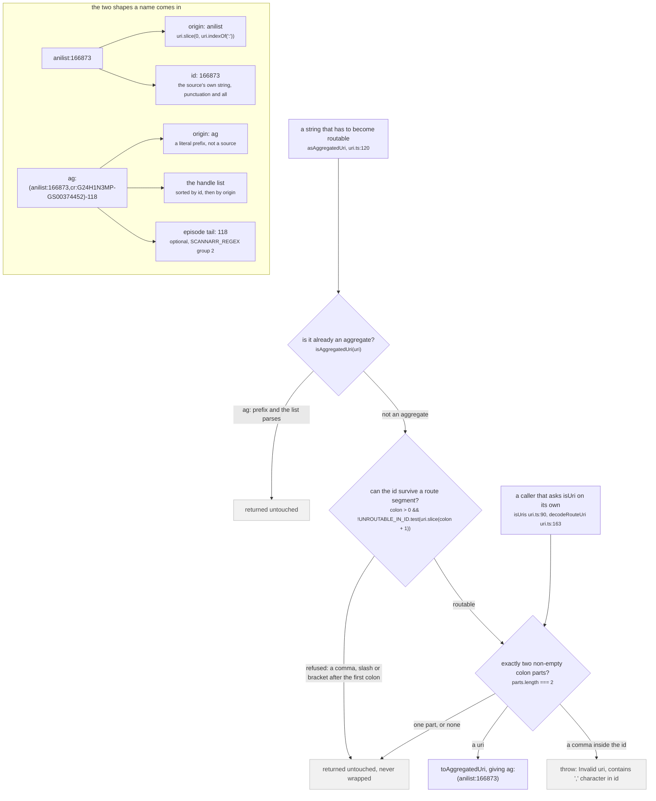
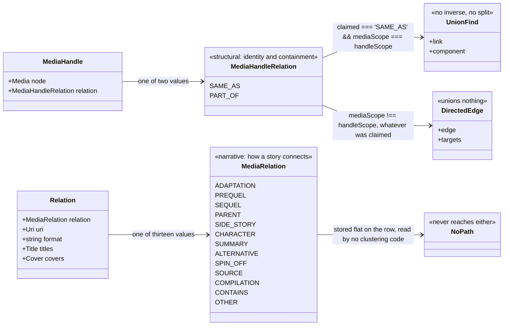
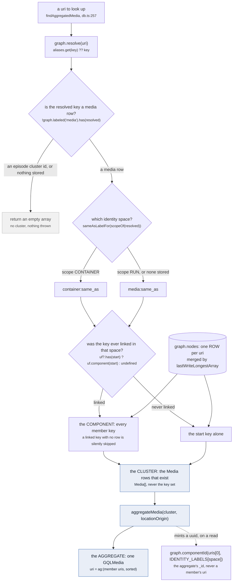

Sixteen words, each with the function that produces the thing and the line that decides it. Every
other page on this site assumes these and will not stop to explain them again.

Read them in the order below. They stack: a **uri** names a row, a **claim** about two uris becomes a
**component**, the rows of that component are a **cluster**, and a **view** of the cluster is what a
page actually renders.

## origin, id, uri

A **uri** is `origin:id`. `` type Uri = `${string}:${string}` `` (`src/utils/uri.ts:3`), and the split is
positional rather than parsed: `originOf` is `uri.slice(0, uri.indexOf(':'))` (`src/worker/store/db.ts:44`).

The **origin** is the short name a source publishes under: `anilist`, `cr`, `mal`, `jw`, `imdb`. The
**id** is whatever that source calls the thing, verbatim, including its own punctuation:
`cr:G24H1N3MP-GS00374452` is one Crunchyroll season, and the hyphen inside it is Crunchyroll's series
id joined to its season id, not a separator this codebase owns.

A uri names **one source's row**. It never names a work. That is the next word.

## aggregated uri

An **aggregated uri** names a work as a *cluster of source rows*:
`ag:(anilist:166873,cr:G24H1N3MP-GS00374452)`. The type is
`` `ag:(${Uris})${''|`-${string}`}` `` (`src/utils/uri.ts:95`) and everything about it is read back by
one regex, `SCANNARR_REGEX = /ag:\((.*)\)(?:-(.*))?/` (`src/utils/uri.ts:97`).

Why a page never links to the plain uri, `src/utils/uri.ts:107-119`:

> The routable form of a work's uri: an aggregate, even when only one source is known.
>
> A relation and a graph node name a work by the SOURCE that mentioned it, `anilist:166873`, because
> that is all the naming source could say. Linking straight to it opens a page pinned to one source:
> the store has a single row to work with, so no other source is ever asked and the page shows
> whatever AniList alone knows. Wrapped as `ag:(anilist:166873)` it is the same work asked as a
> CLUSTER, which is the form the store keeps resolving: it fans out to the other sources, folds in
> whatever answers, and the modal rewrites its own address as the cluster grows.



*The only `throw` in the file sits on a branch `asAggregatedUri` can never take: `UNROUTABLE_IN_ID` refuses a comma one decision earlier, so the throw is reachable only from a direct caller of `isUri`.*

Three validators, three different refusals, and none of them agree on what a uri is
(`src/utils/uri.ts:71-105`):

- `isUri` counts colon-separated non-empty parts and answers on `parts.length === 2`. It **throws** on
  `parts[1]?.includes(',')` (`:77`). It accepts `https://example.test/x` as origin `https`, which is
  exactly why `asAggregatedUri` asks `isRoutableUri` first (`:122-125`).
- `isRoutableUri` refuses `UNROUTABLE_IN_ID = /[,/()]/` anywhere after the first colon (`:83-88`). The
  comment says what each character costs: *"a ',' splits the handle list inside `ag:(...)` and a '/'
  splits ONE segment of a route path ('/watch/:mediaUri/:episodeUri'), so either one silently turns a
  working uri into one no route matches"*.
- `isAggregatedUri` returns true for `ag:()`. `match[1]` is the empty string, so `!uris` short-circuits
  the list check (`:104`).

:::caution[The empty aggregate is valid]
`ag:()` passes `isAggregatedUri`, parses to `handleUris: []`, and produces a media subscription that
stays open and yields nothing. Nothing anywhere refuses it.
:::

:::caution[Two producers, two encodings]
`toAggregatedUri` runs its content through `encodeURI` (`uri.ts:175-197`); `buildAggregatedIdentity`
in `aggregate.ts:296-303` joins the sorted uris raw. Both mint `ag:(...)` strings and they are not
byte-identical for an id containing anything `encodeURI` touches.
:::

## handle, and the two relations

A **handle** is one row pointing at another row, plus a word for what that pointing means:

```graphql
type MediaHandle {
  """The related row. Carries its own uri, origin, id and url."""
  node: Media!
  """What this edge asserts. Only SAME_AS unions clusters."""
  relation: MediaHandleRelation!
}
```

(`src/worker/resolvers/media/schema.gql:226-231`.) A handle is an **identity claim**, and there are two
completely separate enums in this codebase whose values both get called "relation" in conversation.
They must never be confused, and this is the figure that keeps them apart.



*Two values on the left union clusters or hang edges; thirteen on the right do neither, by construction.*

The store's own statement of the split, `src/worker/store/types.ts:31-37`:

> How one work relates to another as a STORY, mirroring `MediaRelation` in the graphql schema.
>
> The OTHER axis from `HandleRelation`, and the distinction is load bearing: nothing here may ever
> union a cluster, because a sequel is a different work. See the enum's own doc in
> `worker/resolvers/media/schema.gql`.

And the schema's, `src/worker/resolvers/media/schema.gql:116-120`:

> That enum answers "are these the same thing", this one answers "how does this story connect to that
> one", and the schema has kept them apart deliberately since the handle enum was written: PREQUEL says
> nothing about sameness and SAME_AS says nothing about story order. Nothing here may ever union a
> cluster. A sequel is a DIFFERENT work, and treating one as the same row is the mistake that merged
> three Mushoku Tensei seasons when it was made with SAME_AS.

`handleRelationEnum` is `['SAME_AS', 'PART_OF']` (`types.ts:28`). `mediaRelationEnum` is thirteen
values (`types.ts:38-41`), stored flat as `Relation` rows on the media (`types.ts:52-65`) precisely so
that no second copy of the other work enters the store's identity space.

:::danger[SAME_AS has no inverse]
`SAME_AS` is the only relation that unions, in `upsertMedia`, through `graph.link`
(`src/worker/store/graph.ts:279`). `graph.link` is a union-find. There is no `unlink`, no `split`, no
`disunion` anywhere in the repo, and `union` deletes the record of which members came from which side
(`graph.ts:82-105`). Once two rows are welded they stay welded for the life of the worker.

The schema says it in one sentence, `schema.gql:80-85`: *"The handle names THIS run. The only relation
that unions clusters, in `upsertMedia`, and the union has NO INVERSE: once two media are welded they
stay welded for the session. Minting this for an id that names a SHOW is the single most expensive
mistake available here. It merged three Mushoku Tensei seasons, four Demon Slayer films and fifteen
Dragon Ball Z films, each time because one id was the only thing a source could offer and the only
relation was this one."*
:::

`PART_OF` is the honest alternative when a source has only a show-level id. `partOf`
(`src/sources/utils.ts:40`) is one line and it does two things: it wraps the node in a `PART_OF` handle
**and** it stamps the copy `scope: 'CONTAINER'`, which is the next word.

## scope, run, container

**Scope** decides which identity space a row's `SAME_AS` claims union in. Two values,
`mediaScopeEnum = ['RUN', 'CONTAINER']` (`types.ts:87`), documented in `schema.gql:100-111`:

> Which kind of thing a row names, and so which identity space its SAME_AS claims union in.
>
> Sameness is only ever asserted within one scope. A claim that crosses scopes is read as PART_OF,
> whatever the producer asked for: a run is part of its show, never the same thing as it.

- **RUN**: *"One broadcast run: a cour, a film. The unit this store aggregates and the unit a card
  shows."* (`schema.gql:107`.)
- **CONTAINER**: *"A show, a series, a franchise page: something several runs are part of."*
  (`schema.gql:109`.)

Scope is not stored per claim. It is read off the uri at write time by `scopeOf`
(`src/worker/store/db.ts:91-92`), a three-step ladder: `SHOW_LEVEL_ORIGINS.has(originOf(uri))` first,
then the stored row's own `scope`, then `'RUN'` as the default. `SHOW_LEVEL_ORIGINS` has exactly one
member, `new Set(['imdb'])` (`db.ts:42`).

`sameAsLabelFor` (`db.ts:94`) turns a scope into the union-find label, and it is total: `CONTAINER`
gives `container:same_as`, everything else gives `media:same_as`. The three identity spaces are
`MEDIA_SAME_AS = 'media:same_as'` (`db.ts:14`), `CONTAINER_SAME_AS = 'container:same_as'` (`db.ts:15`)
and `EPISODE_SAME_AS = 'episode:same_as'` (`db.ts:45`). They are separate union-find instances, so a
union in one is invisible in the others.

:::danger[The scope ratchet is one way]
`const scope: MediaScope = scopeOf(media.uri) === 'CONTAINER' ? 'CONTAINER' : media.scope ?? 'RUN'`
(`db.ts:146`). Once any row for a uri said `CONTAINER`, no later row moves it back, and the comment at
`db.ts:142-145` says why the asymmetry is deliberate: *"The failure with no inverse is a wrong SAME_AS,
and the failure of a wrong CONTAINER is a missing SAME_AS, which a later slice can recover. The merge
function alone would let an incoming RUN overwrite it (scalars are last-write-wins)."*
:::

## claim

A **claim** is a handle flattened into a pair of uris on its way to the store:

```ts
type Claim = { mediaUri: string; handleUri: string; relation?: HandleRelation }
const claimKey = ({ mediaUri, handleUri, relation }: Claim) => `${mediaUri}\0${handleUri}\0${relation ?? 'SAME_AS'}`
```

(`src/worker/store/db.ts:110-111`.) The relation rides all the way down because it is the store, not
the source, that acts on it: the store derives the outcome from the two uris' scopes plus the claimed
relation, and only one of the four cells is a union. A claim naming a uri no row describes yet is not
applied and not dropped: it is deferred under each missing end and retried when a row lands
(`db.ts:113-130`, `:177-183`).

## row, cluster, component, aggregate

These four are the ones most often used interchangeably in conversation. They are four different
things.



*The component lives in the union-find and outlives the call; the cluster, the aggregate and its uri are computed per call and thrown away. The one dashed arrow is the read that writes.*

- A **row** is one source's `Media`, keyed by its uri in `graph.nodes` (`graph.ts:124`). A second write
  for the same uri does not replace it, it merges through `lastWriteLongestArray` (`graph.ts:388`):
  scalars last-write-wins but only a non-nullish one, arrays strictly longest-wins.
- A **component** is a set of *keys* in one union-find (`graph.ts:107`). It can contain keys with no
  row at all: `graph.link` calls `uf.find`, which calls `ensure`, so linking a uri that was never `set`
  creates a member for it (`graph.ts:61-67`, `:279-291`).
- A **cluster** is the *rows* of a component. `graph.cluster(start, label)` (`graph.ts:316-330`) walks
  the component and pushes `nodes.get(key)` only when there is one, so a rowless member disappears from
  the cluster while staying in the component forever. When the key was never linked it returns the
  single row, or nothing.
- An **aggregate** is one `GQLMedia` computed from a cluster by `aggregateMedia`
  (`aggregate.ts:306`). It throws on an empty cluster (`:307`) and it is the only object on the read
  path whose `_id` is not a uri.

The `_id` rule, `aggregate.ts:290-294`:

> Keyed on the union-find ROOT of the cluster's identity space, never on a member: the smallest uri
> moved whenever a member sorting before it landed, and the container cut in `findAllAggregatedMedia`
> handed the same cluster a second id. Any member maps to the same root.

Note the asymmetry: an aggregated media's `_id` is a `componentId` uuid, while an inflated relation
keeps its own uri as `_id` (`aggregate.ts:195`), *"and `_id` is its uri rather than a cluster id for
exactly that reason"*, the reason being that nothing downstream may treat it as a row this store holds.

:::danger[componentId is a write during a read]
`graph.componentId` (`graph.ts:234-244`) mints a `crypto.randomUUID()` and registers it in the alias
table the first time a component is aggregated. The doc at `graph.ts:39-44`: *"minted once per
component, carried across unions (the survivor keeps its id; when both sides had one the larger
component's wins, ties to the lexicographically smaller root, and the other id becomes an alias of the
survivor), and dropped by `clear`."* The losing uuid is never deleted, so an `_id` a client is still
holding resolves to the survivor after a merge.
:::

## view

A **view** is anything computed per read and thrown away. The whole store divides on this line, and the
cleanest statement of it is `alignRunEpisodes` explaining why it will not write its own result,
`src/worker/store/consensus.ts:247-250`:

> READ TIME, AND A COPY. The stored node keeps Crunchyroll's own number, because it is keyed by
> Crunchyroll's guid and is reachable through the whole season from other paths: `graph.set` is
> last-write-wins, so rewriting it here would change what those other readers see. What the run needs
> is a VIEW, and a view is what this returns.

Views on the read path: `aggregateMedia`, `aggregateEpisode` (`aggregate.ts:306`, `:401`),
`mergeByEpisodeNumber` (`db.ts:475`), `alignRunEpisodes` and `runEpisodes` (`consensus.ts`),
`findPartOfMedia` (`db.ts:276`), `applyMediaFilters`, `exportStore`. Not views, whatever they look
like: `graph.link`, `graph.set`, the scope ratchet, `graph.componentId`, and
`fuzzyMergeMediaClusters` running inside a page read.

## tier

A **tier** is a score band, and the store's numeric consensus is **lexicographic across tiers, never
additive**. `tieredConsensus` (`consensus.ts:36-58`) takes the best score present,
`const tier = Math.max(...stated.map(claim => claim.score ?? 0))` (`:44`), keeps only the claims at
exactly that score, and lets the most-supported value among those win. Nothing below the top tier is
consulted at all.

Why a sum was rejected, `consensus.ts:12-22`:

> SO THE TIERS ARE LEXICOGRAPHIC, NEVER ADDITIVE. The best score present decides which claims are
> looked at; among those, the value the most of them claim wins; nothing below that tier is consulted
> at all. A source cannot be outvoted by any number of sources beneath it.
>
> A SUM WAS TRIED FIRST AND IS WRONG, measured three ways on 2026-09-09:
>
>   Mushoku Tensei S1 part 1, once the streaming tier echoes Crunchyroll's packaging:
>     24 scores cr 0.5 + jw 0.2 + nf 0.2 + appletv 0.2 + paramount 0.2 = 1.3
>     11 scores mal 0.9 + kitsu 0.3                                    = 1.2
>   and the sum publishes the folded 24, which is the defect it was written to stop. Five catalogues
>   restating one packaging is one witness counted five times.

An unscored row is its own tier at the bottom, because `claim.score ?? 0` reads a missing score as `0`
(`:42-45`).

## The whole vocabulary, in one table

| word | what it is | where it is decided |
| --- | --- | --- |
| origin | the short name a source publishes under | `db.ts:44` |
| uri | `origin:id`, naming one source's row | `uri.ts:3` |
| aggregated uri | `ag:(uri,uri)` with an optional `-episodeId` tail, naming a work | `uri.ts:95`, `:97` |
| handle | `{ node, relation }`: one row pointing at another, with a claim attached | `schema.gql:226` |
| handle relation | `SAME_AS` or `PART_OF`. Only `SAME_AS` unions | `types.ts:28`, `schema.gql:78` |
| media relation | thirteen narrative values. Unions nothing, ever | `types.ts:38`, `schema.gql:113` |
| scope | `RUN` or `CONTAINER`: which identity space a row's sameness unions in | `types.ts:87`, `db.ts:91` |
| run | one broadcast run: a cour, a film. The unit a card shows | `schema.gql:107` |
| container | a show, a series, a franchise page | `schema.gql:109` |
| claim | a handle flattened to `{ mediaUri, handleUri, relation? }` for the store | `db.ts:110` |
| row | one source's stored `Media`, merged field by field | `graph.ts:124`, `:388` |
| component | a set of keys in one union-find. May hold keys with no row | `graph.ts:107` |
| cluster | the rows of a component. Rowless members are skipped | `graph.ts:316` |
| aggregate | one `GQLMedia` computed from a cluster, `_id` a component uuid | `aggregate.ts:306`, `:293` |
| view | anything computed per read and never written back | `consensus.ts:247` |
| tier | the top score band, the only one a numeric consensus consults | `consensus.ts:44` |

## Where this page corrects the brief

The page inventory describes `graph.cluster(uri, label)` as producing "a component". It does not. The
component is the union-find's key set (`graph.ts:107`); `graph.cluster` returns `T[]`, pushing a node
only when `nodes.get(key)` is truthy (`graph.ts:322-323`). The difference is not cosmetic: `graph.link`
accepts a uri that was never stored, so a component can carry a member that no cluster, and therefore
no aggregate, will ever show. `upsertMedia` prevents that upstream with `pendingClaims`;
`upsertEpisodes` does not.
