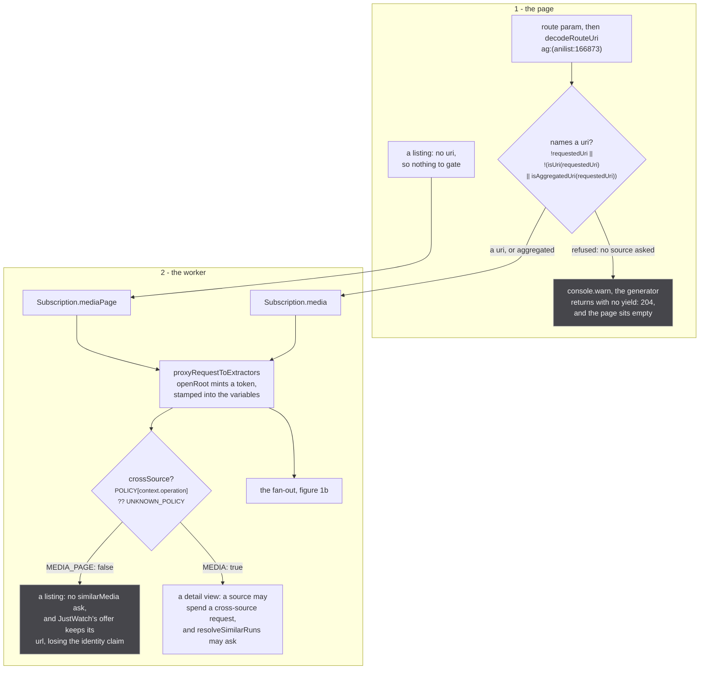
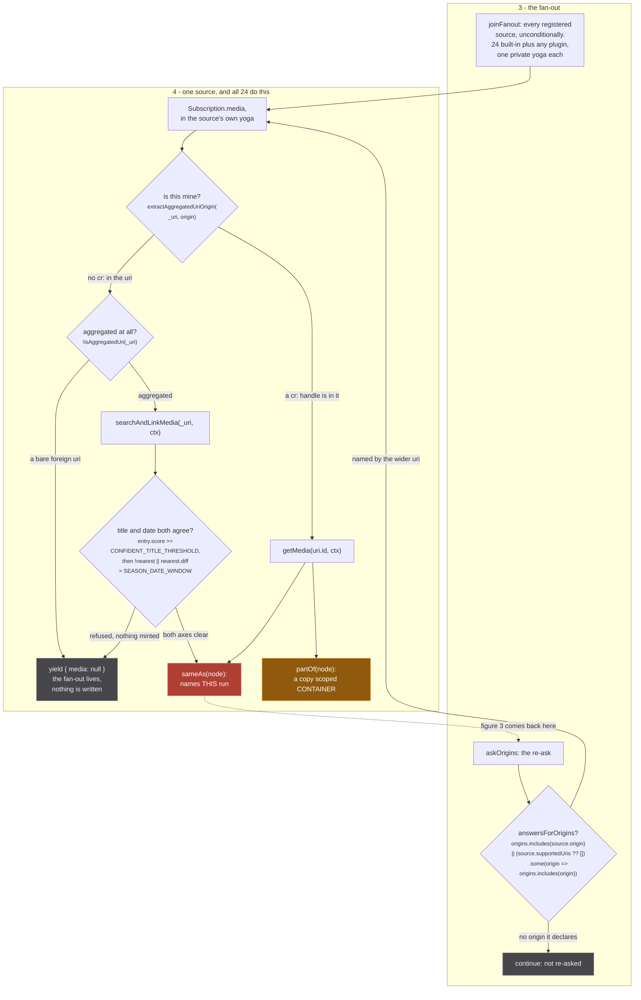
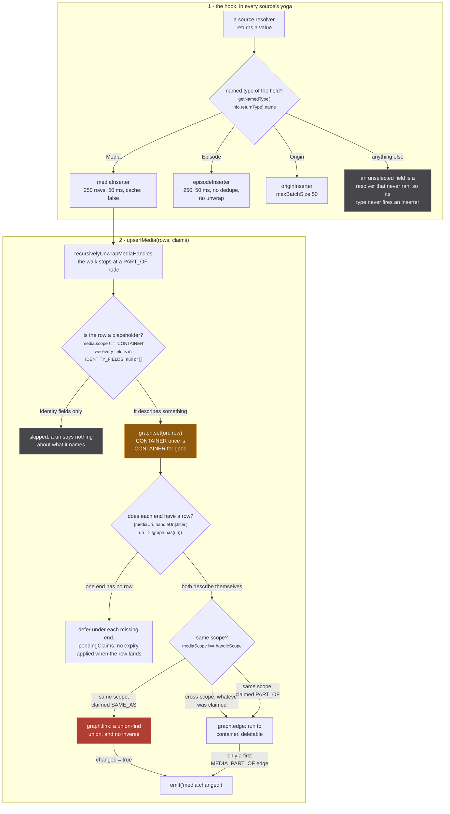
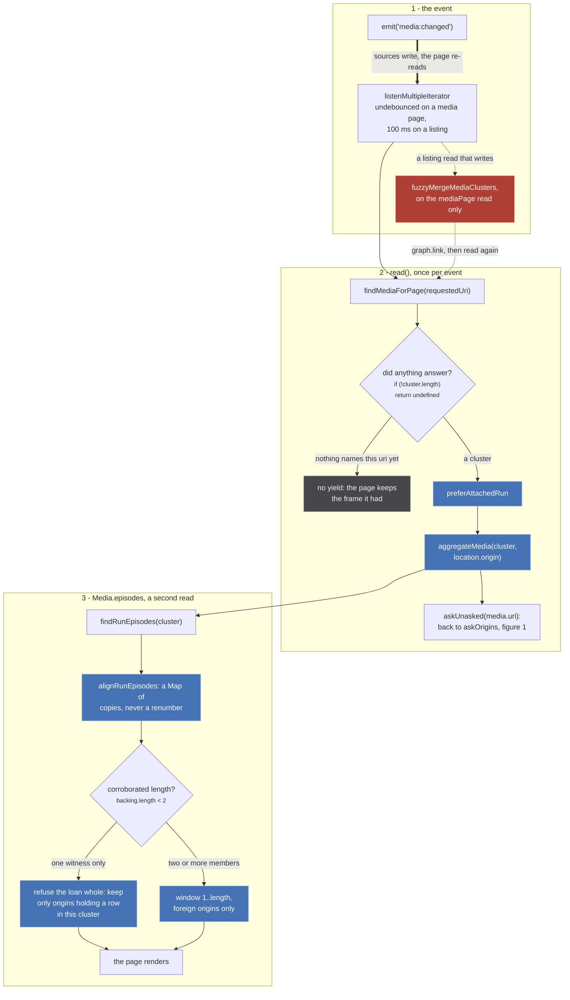
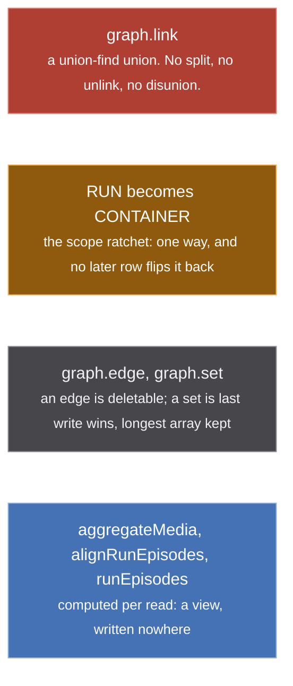
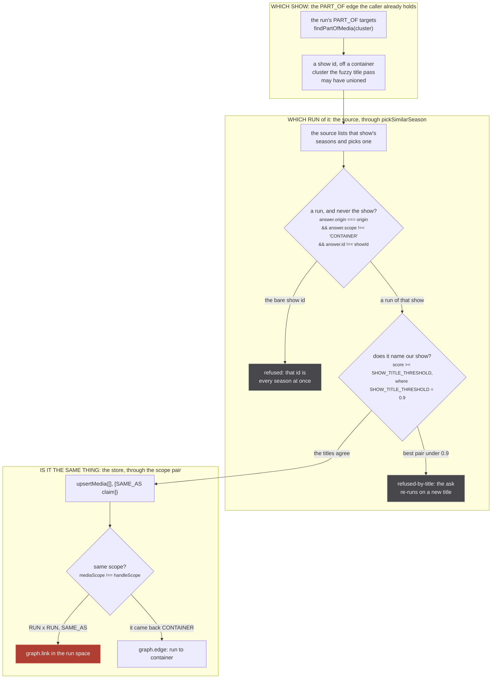

stub is handed a uri and has to answer two questions with it: what is this thing, and where can you
watch it. No single catalogue answers both, so it asks 24 of them at once and merges what comes back.
This page is the map of that. Every other page on the site zooms one box on it.

## Five sentences, before anything else

1. **Every registered source is asked, unconditionally.** `joinFanout` (`src/worker/extractor.ts:746`)
   has no origin test, no uri inspection and no `supportedUris` check. All 24 built-in modules
   (`tests/unit/sources/index.test.ts:24` pins the count) plus any connected plugin get the app's own
   document, replayed verbatim against their own private GraphQL server.
2. **A source recognises itself by finding its own handle in the uri it was handed.** That is the
   whole of self-selection, and it is why a source can answer "not mine" and be right at the time and
   wrong a second later.
3. **Nothing comes back the way it went.** A source writes to the store through an envelop hook on
   its own resolver's return value; the app-level resolver ignores the fan-out's return values
   entirely and re-reads the store on a `media:changed` event. The answer path is a side channel.
4. **A handle is an identity claim.** A `SAME_AS` handle between two media of the same scope becomes
   a union-find union, and a union-find union has no inverse.
5. **stub models a RUN and catalogues model a SHOW.** A run is a cour or a film, the thing a card
   shows and the thing episodes belong to. Most of the machinery below is the exchange rate between
   those two.

:::danger
**One operation in this system cannot be undone.** `graph.link` is a union-find union, and
`createUnionFind` exposes no split, no unlink, no disunion. Once two media are welded they stay
welded for the life of the worker: the only reset is `resetStore()`, which empties the whole store
and is tests only. Everything else on this page exists to keep the wrong pair away from that one
call.
:::

The union is `union()` at `src/worker/store/graph.ts:81-104`, and the line that makes it permanent is
`components.delete(oldRoot)` at `:103`: after it, nothing can ask which members came from which side.
`resetStore` is `src/worker/store/db.ts:509-513`, and its own comment on `graph.clear` reads *Tests
only*.

## The map, in four figures

Drawn as one figure this is 48 nodes, and rendered it measures 6,500px wide, where every label shrinks
past reading. So it is cut at its real seams: the **ask** ends where a source mints a handle, the
**write** ends where the store emits, and the **read** starts there and comes back around. The four
share one node vocabulary and the same four colours, and the conditions on the decision nodes are
verbatim from the files cited beside each figure.

### 1a. The ask: the page and the worker

*The gate at the top is the only one that can end the whole request: it returns without yielding, and not one source is asked.*

### 1b. The fan-out, and one source

*Two refusals here produce an identical empty page from different places: a source yielding null is a normal payload the fan-out continues past, where the gate in figure 1a ends the generator outright.*

The uri gate is `src/worker/resolvers/media/index.ts:33-38`. It returns without yielding, and a
generator that completes without yielding makes yoga answer 204, so the page sits at
`data === undefined` forever. That is why the warning next to it exists:

> `src/worker/resolvers/media/index.ts:35`
>
> a refused page and a slow one are indistinguishable from outside the worker without this

The two gate constants are real and are on the figure: `CONFIDENT_TITLE_THRESHOLD = 0.9`
(`src/sources/catalogue-gate.ts:98`) and `SEASON_DATE_WINDOW = 45 * 24 * 60 * 60 * 1000`
(`:230`), with at most `MAX_CATALOGUE_CANDIDATES = 3` survivors date-checked (`:109`). The whole gate
refuses before it starts when there is no date at all, `if (!known.startDate) return undefined`
(`:286`), because a gate on one axis is measurably not a gate.

The re-ask lane (`askOrigins`, `src/worker/extractor.ts:825`) is entered from the read, not from the
page. The reason is the best paragraph in the resolver:

> `src/worker/resolvers/media/index.ts:43-48`
>
> The uri the sources were asked about is the one the caller had at subscribe time, and a card
> on the home page links to a narrow one: the listing builds its media without running the
> mappers that mint a `cr:` handle (sources/anilist/extractor.ts:320 against :295). A source
> can only recognise itself by finding its own handle in the uri it is handed, so every source
> missing from that narrow uri answered "not mine" and ENDED, milliseconds before another
> source contributed its id.

The two mint nodes are the whole point of the ask, and they are two different promises:

> `src/sources/utils.ts:24-25`
>
> This handle names THIS run. Unions the cluster, permanently, with no inverse. The default, and the
> only relation any producer asserted before 2026-09-04.

> `src/sources/utils.ts:36-38`
>
> THIS IS THE SCOPE STAMP. A PART_OF target is by definition a container of this run, so the node goes
> out as a copy scoped CONTAINER whatever it said, and the store then keeps it out of every run's
> identity space for good (scope is sticky toward CONTAINER there). The input is left untouched.

### 2. The write

*The claimed relation is only consulted in the same-scope cells. Cross-scope, both directions, the store writes an edge and ignores what the source asked for.*

`useOnResolve` (`src/worker/extractor.ts:473-495`) fires on a resolver's **return value**, keyed on
that field's named type, which is why a row lands whole even where a field is not selected, and why
an unselected `episodes` means `episodeInserter` never fires at all. The 2x2 the store derives is
written out in the code above the loop, `src/worker/store/db.ts:166-169`, and the union is
`graph.link` at `db.ts:193`.

The subtree cut at `src/worker/store/aggregate.ts:135` is the one guard on this figure whose absence
has a name:

> `src/worker/store/aggregate.ts:115-124`
>
> THE WALK STOPS AT A PART_OF NODE, and that is the load bearing part. A PART_OF node is a CONTAINER,
> usually a show, and its own handles are claims about the CONTAINER rather than about the run that
> pointed at it. Carrying them through means two different runs, each hanging PART_OF off the same
> show, each contribute a SAME_AS pair rooted at that show:
>
>     season 1 -PART_OF-> cr:SERIES -SAME_AS-> kitsu:42323
>     season 3 -PART_OF-> cr:SERIES -SAME_AS-> kitsu:49002
>
> and `cr:SERIES` is one uri, so the union-find puts kitsu:42323 and kitsu:49002 in one cluster. Two
> seasons welded, with no inverse, by a relation whose entire purpose is not to weld.

:::caution
**Scope is sticky toward CONTAINER.** Once any row for a uri said CONTAINER, a later row saying RUN
or saying nothing does not flip it back (`src/worker/store/db.ts:146`). The argument is at
`db.ts:142-145`: *the failure with no inverse is a wrong SAME_AS, and the failure of a wrong
CONTAINER is a missing SAME_AS, which a later slice can recover.* Note the last sentence of that
comment, which is the reason the line exists at all: *the merge function alone would let an incoming
RUN overwrite it (scalars are last-write-wins).*
:::

### 3. The read, and the loop

*The thick edge is the one that carries the design: every other arrow on these four figures points into the store, and this is the only one out of it and back around. The dashed edges cross the read/write line, which is the site's convention for a read that writes.*

Everything blue on this figure is recomputed on every event and stored nowhere.
`alignRunEpisodes` says so itself:

> `src/worker/store/consensus.ts:247-250`
>
> READ TIME, AND A COPY. The stored node keeps Crunchyroll's own number, because it is keyed by
> Crunchyroll's guid and is reachable through the whole season from other paths: `graph.set` is
> last-write-wins, so rewriting it here would change what those other readers see. What the run needs
> is a VIEW, and a view is what this returns.

The `backing.length < 2` branch is `src/worker/store/consensus.ts:234`, inside `runEpisodes` at
`:157`. It is the only decision on the figure that hides a row, and it refuses rather than trims when
only one member vouches for the length:

> `src/worker/store/consensus.ts:227-232`
>
> AN UNCORROBORATED LENGTH REFUSES THE LOAN OUTRIGHT rather than slicing on it.
>
> A lent season is only useful if the run can say which of its episodes are its own, and a length
> one source claims cannot. Mushoku Tensei season 2 part 1 is the case: MAL publishes no count at
> all and AniList says 13 for a run that aired 12, so windowing to 13 put a thirteenth row on the
> page that only Crunchyroll had. Declining leaves the page exactly as it was.

## The permanence legend

Four colours, and they carry permanence and nothing else. Every flowchart on this site uses these
four `classDef` names for these four meanings.

*This is the one figure on the site with no decision node, and deliberately: it is the key every other figure is read with.*

## The three questions the system asks, and who answers each

Every claim that reaches `graph.link` has answered all three, and each one is answered by a different
part of the system. The lane below is the `similarMedia` path, which is where all three are visible
at once.

*Three separate answers, three separate places they can be wrong, and only the third one is irreversible. The first is inherited: nothing in this lane re-checks it.*

The lane's own module says which question it is and is not answering:

> `src/sources/similar.ts:10-12`
>
> The rules decide WHICH season of a show and never WHICH show: the show id the caller holds settles
> that, and it came off a PART_OF edge whose container cluster the fuzzy title pass may have unioned
> on a listing. A wrong container union upstream is trusted here, so a pick is only as right as it.

And the claim it produces is an ordinary one, which is what makes the figure's third lane the same
lane as figure 2's:

> `src/worker/similar-consumer.ts:271-277`
>
> Only a root whose policy spends cross-source work asks (a listing never does). A read with no
> evidence records nothing, and a read whose run has no title asks nothing, since an answer could not
> be checked against the show. The claim goes through `upsertMedia` with no rows: the answer's own
> row lands through the answering extractor's insertion, the claim waits for it under
> `pendingClaims`, and a RUN x RUN union emits `media:changed`, which re-runs the page's read, whose
> re-ask of the newly named origin is how the answer's episodes reach the store. The container edge is
> never touched.

The run check is `isRunAnswerFrom` at `src/sources/similar.ts:125-129`, the title check is
`answerNamesOurShow` at `:310-320` against `SHOW_TITLE_THRESHOLD = 0.9` (`:303`), and the scope pair
is `db.ts:187`. The threshold has a measurement behind it, not a taste: *correct pairs 1.000, the
nearest wrong pair 0.8135, a spin-off* (`similar.ts:300-301`).

## Deliberately not on these figures

The omissions are chosen, not missed. Each has its own page:

- plugin registration and the reduced contract a third-party source runs under: [Plugin sources](/request/plugins/)
- `withBackoff`, the retryable status set and both spellings of `retry-after`: [Fetching, and backing off](/request/fetch-and-backoff/)
- the request-context registry, why the token rides in the variables, and the miss counter: [The request context](/request/request-context/)
- `pendingClaims`, and the race that put it there: [Claims that wait](/write/pending-claims/)
- `exportStore`, which reads the asserted adjacency and never the unions: [Exporting](/read/export/)
- the origin fan-out, which is a second loop that stamps nothing: [The fan-out](/request/fan-out/)
- the five gates of the fuzzy title merge: [The five gates](/merge/gates/)
- the five rules of `pickSimilarSeason`: [The rules](/similar/rules/)
- the alignment offset vote and its three refusals: [Aligning a numbering](/merge/alignment/)

## Where the code disagreed with the plan for this page

Two corrections, both already applied to the figures above.

**`graph.set` is not append only.** The legend node calls it last write wins, because that is what
the merge does: `lastWriteLongestArray` (`src/worker/store/graph.ts:388-400`) writes
`result[key] = val ?? existing[key]` for a scalar, and for an array keeps whichever of the two is
longer, discarding the shorter one whole. No provenance is kept either way, so nothing downstream
can ask what a given origin said. Only `graph.edge` is append only.

**The scope decision has three outcomes, not two.** The plan drew the 2x2 as one decision with two
edges, a union on one side and an edge on the other. The loop at `src/worker/store/db.ts:187-198`
has three: cross-scope writes an edge whatever was claimed, same-scope plus `SAME_AS` links, and
same-scope plus `PART_OF` writes an edge too. The third is drawn, because a claim that says PART_OF
between two runs is the one case where a source's own word is what keeps it off the union.
