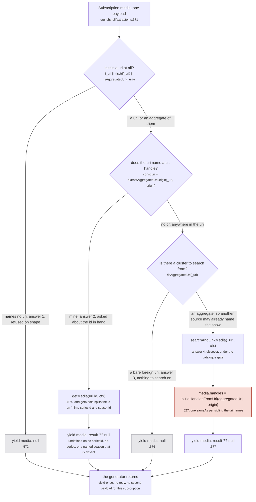
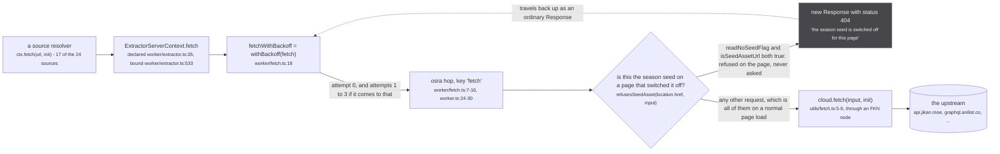

One uri becomes 24 concurrent GraphQL subscriptions, one per registered source, each against a private yoga replaying the page's own document. Nothing picks which sources to ask: every source gets the question and decides for itself whether it names them.

## The gate

wouter hands a route segment through undecoded, so every uri passes `decodeRouteUri` (src/utils/uri.ts:162-170) at the router (media-modal.tsx:599, watch/index.tsx:177-182) and again in the worker (src/worker/resolvers/media/index.ts:33). It must then satisfy `isUri(uri) || isAggregatedUri(uri)`; anything else logs `media: refused '<uri>', which names no uri` and returns **without yielding** (:34-37): yoga answers 204 No Content and the page holds `data === undefined` forever, no error anywhere. Inside a source the rule inverts: a refusal is a `yield` of null and never a return (defaults at src/worker/extractor.ts:457-463), or a `similarMedia` generator ending silently would hold its caller for `SIMILAR_MEDIA_TIMEOUT_MS = 30_000` (:198).

| | `Subscription.media` | `Subscription.mediaPage` |
| --- | --- | --- |
| uri gate | `decodeRouteUri` then `isUri \|\| isAggregatedUri` (media/index.ts:33) | none |
| root operation | `MEDIA` (media/index.ts:39) | `MEDIA_PAGE` (media/index.ts:100) |
| reads the fan-out payload | no | yes, via `extractUris` on `mediaPage.nodes` |
| re-ask | `askOrigins` on every newly named origin | none |
| re-read trigger | `media:changed`, `episode:changed` | `media:changed`, debounced 100ms |

## The fan-out

`proxyRequestToExtractors` builds one `Fanout` carrying `ctx.params.query`, the page's literal document, then runs one loop: `for (const extractor of extractors) joinFanout(fanout, extractor)` (worker/extractor.ts:792). `joinFanout` contains exactly one test, `if (fanout.joined.has(extractor)) return` (:747). It reads neither the uri, nor `supportedUris`, nor `origin`. `extractors` is a mutable module singleton (:551, mutated at :683 and :719), so "every registered source" means every source registered when that loop runs: 24 today ([the registry](/tldr/sources/)), plus one per source a connected plugin registers.

On the MEDIA path every payload is dropped on the floor: rows reach the store down a side channel ([the write path](/tldr/write/)), the store emits `media:changed`, and the resolver re-reads the cluster and yields the aggregate (media/index.ts:81-87). Reading a source's answer says nothing about whether it answered: [the fan-out](/request/fan-out/).

## Self-selection

A source recognises itself by finding its own handle inside the uri it was handed: `extractAggregatedUriOrigin(uri, origin)` (utils/uri.ts:43-46), which picks the most specific match. Specificity is prefix extension, not length, so the guard carries the hyphen (`startsWith` of the id plus `-`, uri.ts:14-41): without it `cr:G24H1N3MP` beats `cr:G24H1N3MP-GS00374452` in every locale, and a 14 episode season page lists 24 rows.

*Crunchyroll answers one uri four ways, and only answer 4 mints a permanent SAME_AS claim.*

Three of the four are the same bytes, `{ media: null }`, so a refusal on shape and a source that found nothing upstream are indistinguishable. jikan is asked every time and refuses every aggregated uri: its gate is `!uri || !isUri(uri)` (jikan/extractor.ts:374) and `isUri` demands exactly two colon-separated parts (uri.ts:71-80), which no aggregate has. On a detail page its rows arrive through `mediaPage`. More at [self-selection](/request/self-selection/).

## What a source is allowed to spend

The root operation rides in the GraphQL variables (a header throws `Cannot convert argument to a ByteString` on user text; urql's operation context does not vary the operation key). Only `token` is read off the wire, and `rootId`, `operation` and `chain` are regenerated from the worker's `hops` registry, so a plugin rewriting them changes nothing (src/worker/request-context.ts:118-127).

| operation | `crossSource` | what it buys | what it costs |
| --- | --- | --- | --- |
| `MEDIA` | true | justwatch turns a `/watch/` url into a Crunchyroll series id | a token plus a CMS request, per film result |
| `MEDIA_PAGE` | false | the offer keeps its url and loses only the identity claim | nothing on a results page reads that id |
| `SIMILAR_MEDIA` | true | `resolveSimilarRuns` proceeds (similar-consumer.ts:281) | never opened as a root; reachable from a test |
| absent | true, `UNKNOWN_POLICY` | today's behaviour, failing open | `misses++` is the only tell (request-context.ts:73, :125) |

Read in exactly two places: justwatch/extractor.ts:372 and similar-consumer.ts:281.

## The re-ask

The uri was captured at subscribe time and `Subscription.media` is yield-once with no retry, so a source whose id arrives a moment later already answered "not mine" and ended. `askUnasked(media.uri)` inside `read()` batches every newly named origin, and `askOrigins` opens a fresh subscription at the sources matching `answersForOrigins` (src/sources/supported.ts:27-29), which reads two sets: the origin a source publishes under, and the foreign origins it can be asked with. Conflating them kills anizip, which mints `anizip:` and answers from a mal id.

| bound | sources | why |
| --- | --- | --- |
| 2 asks | 22 of 24 | one opening ask, plus one for its own origin |
| 4 asks | anizip | `supportedUris = ['anidb', 'mal']` (anizip/extractor.ts:13) |
| 6 asks | offline | `['offline', ...INDEXED_ORIGINS]`, mal, anilist, kitsu, anidb (offline/extractor.ts:48, index-lookup.ts:20) |

`askedOrigins` is a ratchet and the `add` happens **before** `askOrigins` runs (media/index.ts:58-65), so an origin counts as asked whether the subscription started, the upstream answered, or the source threw. `supportedUris` decides who gets a second question, never what comes back: anizip declares `anidb` but its resolver reads only a mal handle (:120-126), so an anidb-only cluster spends a subscription and refuses. The re-ask is targeted rather than a blanket re-fan because nothing caches this: `useResponseCache` sits at ttl 15 minutes (worker/extractor.ts:470) and never fires, since @envelop/response-cache exposes `onExecute` only and all five call sites here are `.subscription(...)`. Derivation in [the re-ask](/request/re-ask/).

## Fetch and backoff

*The request leaves the worker and only becomes a network call back on the page, so the seed refusal answers 404, never 503.*

`MAX_RETRIES` is 3 (backoff.ts:17), so four attempts, and `backoffDelay` adds 1s, 2s and 4s of latency with no `console` call anywhere in the module (:37-38). Which statuses buy a retry, and which deliberately do not, is at [/tldr/rules/](/tldr/rules/).

Exhaustion is asymmetric: four retryable statuses in a row end at `return response`, failing status and body intact (:75), four rejections at `throw error` (:71). Both shapes reach the caller, which is why `if (!response.ok) throw` is the only thing between a 503 body and `JSON.parse`. `withBackoff` has no idempotence test, so AniList's `method: 'POST'` (anilist/extractor.ts:287) is retried too, safe only because every POST here is a read. Retried bodies are cancelled, the last one is not (:77). Detail at [fetch and backoff](/request/fetch-and-backoff/).

Nothing comes back the way it went out: the ask is a trigger, the answers are rows, and the page learns what it asked for by re-reading the store. What a source is allowed to put in those rows, and what it must prove before minting an identity claim, is [what a source may claim](/tldr/sources/).
