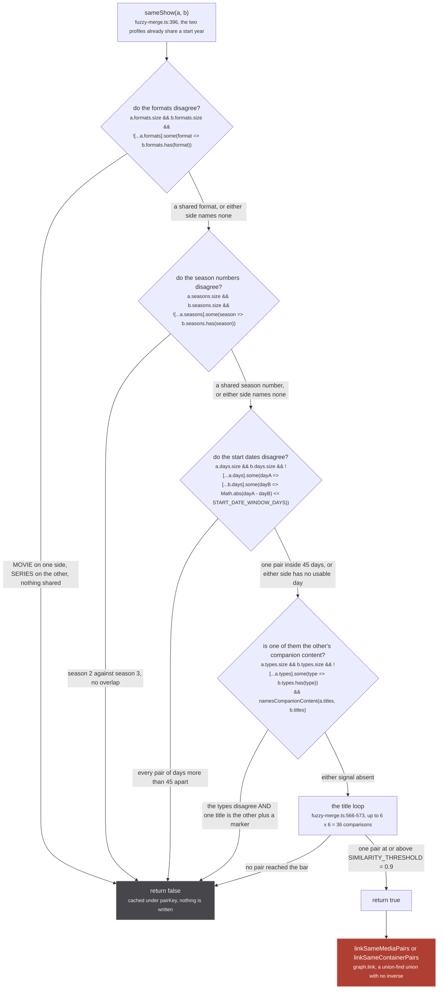
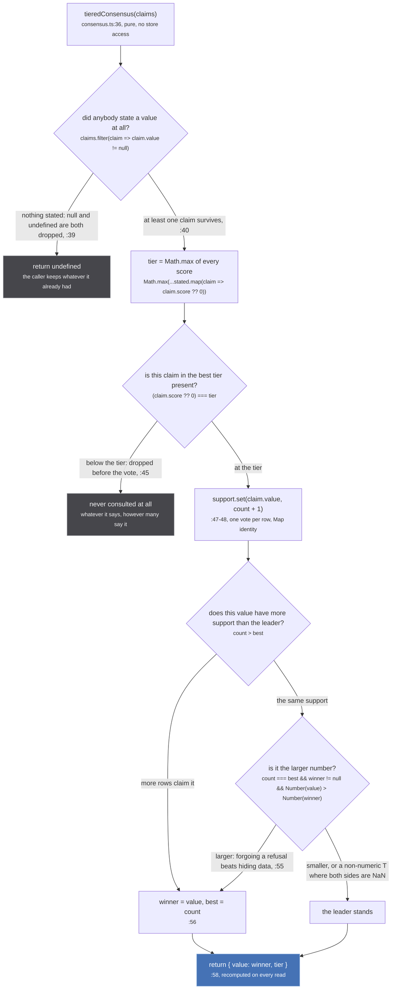

Two rows are the same thing when a title match survives four vetoes inside a shared start year. `fuzzyMergeMediaClusters` (src/worker/store/fuzzy-merge.ts:594) is the only permanent weld a page READ can create: `Subscription.mediaPage` runs it on every `media:changed`, debounced at 100ms (src/worker/resolvers/media/index.ts:108, :127), and `graph.link` (src/worker/store/graph.ts:279) has no inverse anywhere in the repo. Everything after it is a view.

A cluster joins one bucket per distinct year any member claims (:597-605); one with no dated member joins none and cannot merge; one with no identity-bearing title is skipped before any pair forms (:599). `years` keeps a January 1 date and `days` throws it away off the same string (:292, :298, `startDay` :173): seven sites across six modules template `${year}-01-01`, and believing it destroys 14992 of 17946 streaming attaches, dropping it none (:150-156).

*The five gates inside `sameShow`, in firing order. Each condition in full at [/merge/gates/](/merge/gates/).*

Silence never blocks. Every veto needs BOTH sides to speak: an untyped, undated, season-less one-title streaming cluster passes all four untouched, so reading the gate list as safety is the standing mistake here. The exact-title shortcut then returns true with no similarity computed at all (:568), which is why `isOnlySeasonLabel`, `HAS_LETTER` and the companion gate exist at all: the 0.9 bar gates nothing once two clusters share one byte-identical normalized title (:566-574).

| veto | site | what the measurement said |
| --- | --- | --- |
| formats | :397 | `TV_SHORT` folds to `TV` first (:74), or a cluster only AniList types would empty `types` and stop vetoing below |
| season numbers | :431 | making silence block was modelled on manami (41537 records) and refused: 323 wrong welds refused against 12007 correct merges lost, 1 per 37; best of ten narrower variants, ratio 0.22 (:398-426) |
| start dates | :494-497 | 577 same-year pairs, 118 still weld, 83 refused, 81 of 15549 merges lost (0.52%), 0 of 17946 attaches (:455-475). Sweep 30: 0.83, 45: 1.02, 60: 1.13, 90: 1.59, 180: 3.64 (:28-33). The ceiling is structural, since two consecutive cours sit about 91 days apart, and the ratio is the wrong thing to optimise: first trap at [/tldr/rules/](/tldr/rules/) |
| companion content | :562-565 | both signals 49 of 84 for 2 merges, ratio 24.5; the marker alone 0.382, the type disagreement alone 0.115 (:505-514). COMPANION_MARKERS holds ten, led by specials and special (:92-95) |

No number could replace that season veto:

| title pair | similarity | site |
| --- | --- | --- |
| Mushoku Tensei Season 2 against Season 3, two seasons | 0.9175, above the bar | tests/unit/worker/store/season-separation.test.ts:14 |
| yami shibai 16 against 17, two different shows (a trailing number is compared as a value, `differOnlyByTrailingNumber` :389) | 0.8849 | fuzzy-merge.ts:384-388 |
| onii-chan! against oniichan, one show | 1.0000 | fuzzy-merge.ts:384-388 |

A refused pair is free: the verdict is memoized under `pairKey` and the row skipped (the map is wiped whole past MAX_CACHED_DECISIONS = 50_000, :607). A wrong union lasts the session. That asymmetry pays for the apply loop, which re-reads both components and re-decides them in the same turn as the link (:637-655), because a DataLoader flush on a 50ms timer can weld a season 2 into a component judged while it held only season 1; the second look is an AND with the first and can only refuse. Scope decides what a verdict may DO: two runs union, `linkSameMediaPairs` refuses a pair with a CONTAINER on either side (db.ts:216-219, and did not until 2026-09-04), an imdb uri reads CONTAINER before any stored row (db.ts:42, :92), and a cross-scope match rides a PART_OF edge, which can be deleted (db.ts:241-245). Link ordering is at [/merge/fuzzy-merge/](/merge/fuzzy-merge/).

## Consensus is a vote, never a sum

*Lexicographic, never additive: a source cannot be outvoted by any number of sources beneath it.*

A weighted sum was written first, measured wrong three ways on 2026-09-09 and identical in 100 of 100 dist-seed clusters (consensus.ts:4-34): Crunchyroll plus four streaming catalogues restating its packaged 24 sum to cr 0.5 + jw 0.2 + nf 0.2 + appletv 0.2 + paramount 0.2 = 1.3, against mal 0.9 + kitsu 0.3 = 1.2, one witness counted five times. The per-source scores themselves are at [/tldr/sources/](/tldr/sources/). The tie to the larger value (:55) is free in three view readers and spent in the fourth: the number becomes `runEvidence.episodeCount` (src/worker/similar-consumer.ts:174), which is the bar `foldVetoed` refuses a candidate season on (src/sources/similar.ts:147-150) before a survivor clearing SHOW_TITLE_THRESHOLD = 0.9 (similar.ts:303) is claimed SAME_AS. [/merge/consensus/](/merge/consensus/) has the rest.

## Aligning and windowing

`alignmentOffset` reads only the air dates two lists share: never a title, start date, season number or score. A day either side counts (:135-140), since ani.zip stamps `2021-01-10T15:00:00Z` where Crunchyroll publishes the Tokyo 11th. It needs MIN_ALIGNED = 2 votes for one offset with no runner-up tied (:111, :150-153), and answers undefined otherwise. Callers test `== null`: offset 0 is real, meaning that source already counts as the run does (:282-284), so `if (!offset) continue` is identical at this one call site and wrong the moment it is copied.

`runEpisodes` hides nothing until TWO members claim the agreed length. `backing.length < 2` declines the lent season outright rather than slicing on it (:234): twelve sources set `episodeCount = episodes.length`. Only a strictly lower tier is trimmed, and `equals` is `>= tier`, not `=== tier`, computed over the WHOLE cluster while `tier` is computed over the claims that stated a count (:211), so a higher-scored member publishing no count sits above the tier and is never windowed. The window is 1 to length inclusive (:240), not a ceiling: after alignment the previous cour lands at 0 and below and goes too, and db.ts:429 removes the group it emptied. Both hand back copies ([/merge/windowing/](/merge/windowing/)), since `graph.set` is last-write-wins with no provenance and one episode node serves every run the season was lent to.

## What survives

Two anomaly rules: two ids of one origin, and a run listing more episodes than its sources agree it is long (src/worker/store/anomalies.ts:70-72). The `extendsId` filter is one-way on purpose, since read symmetrically `[A, A-1, A-2]` reports nothing about a cluster that welded two seasons (:36-38). Neither runs in production: `clusterAnomalies` is imported once, by tests/unit/worker/store/merge-fixtures.test.ts:15. Its production twin gates rather than reports: a weld `findSeedWelds` names, or a dropped share above SEED_MAX_WELD_SHARE = 0.02, fails the publish (src/sources/offline/seed-gate.ts:77, :35, :449).

A container the fuzzy pass leaves alone still has to be resolved to one of its runs, and that question is put to the origin that owns it: [similarMedia](/tldr/similar/).
