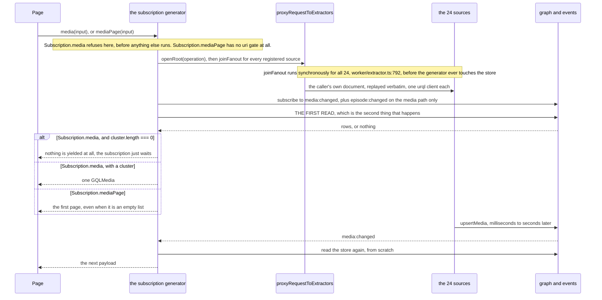
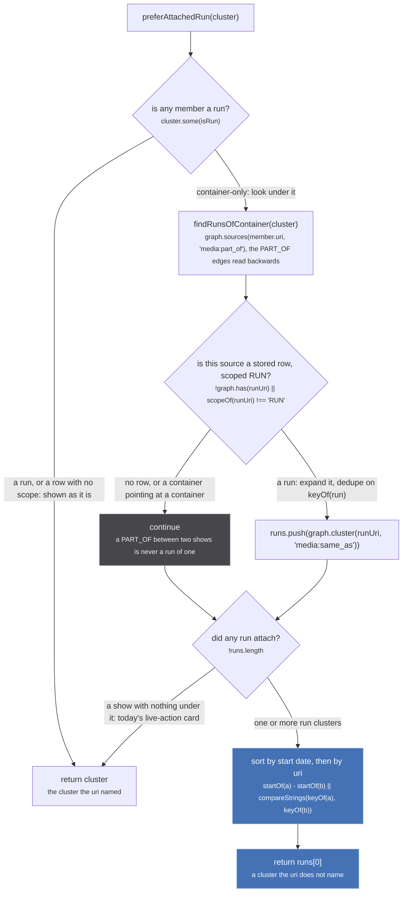

A read is a **view**. `aggregateMedia`, `alignRunEpisodes` and `runEpisodes` run on every yield and store none of their output: a wrong aggregate is fixed by changing code, never by repairing data.

## Five entry points

| entry point | asked by | the cluster it answers with |
| --- | --- | --- |
| `Subscription.media` (`resolvers/media/index.ts:30`) | one media page | `findMediaForPage`, which prefers an attached run |
| `Subscription.mediaPage` (`media/index.ts:94`) | listings, search, season pages | `findAllAggregatedMedia`, over the whole store until a source answers |
| `Media.episodes` (`media/index.ts:180`) | the episode rows under a media | `findRunEpisodes`, off the first SAME_AS handle that resolves |
| `ctx.findAggregatedMedia` (`worker/extractor.ts:81`) | a source asking what the store already holds | first non-empty handle cluster, never `preferAttachedRun` |
| `exportStore` (`store/export.ts:31`) | seed dumps | asserted adjacency, never `graph.cluster` |

The first four mint an id: `clusterId` calls `graph.componentId`, which writes a `crypto.randomUUID()` into `componentIds` for a never-aggregated component (`store/graph.ts:234-244`), removable only by `graph.clear`. Only `exportStore` marks nothing, so the [read/write line](/invariants/view-or-write/) is not where the names put it.

`Subscription.media` refuses a non-uri before any of this runs, and that refusal is indistinguishable from a slow read ([the gate](/tldr/ask/)). `isUri` throws rather than refusing when an id carries a comma (`utils/uri.ts:77`), so `foo:a,b` never reaches it.

*Sources are asked first, the store read second: the first answer has nothing to do with the answers still in flight.*

## Finding a cluster

`findAggregatedMedia` resolves the uri, refuses anything not labelled `media`, and returns its component in the space its scope picks (`store/db.ts:257`). `findMediaForPage` falls back through an aggregated uri's handles in **origin-major** order (`fromAggregatedUri` sorts by id then origin, the last sort being the primary key: `utils/uri.ts:219-220`), keeping the first that holds a run.

*The only read that answers with a cluster the uri does not name; the show's ids return on its PART_OF handles.*

A page and a source asking one uri get different clusters: `ctx.findAggregatedMedia` breaks on the first non-empty handle with no run preference, because a source about to mint a season id needs the container it asked for. `isRun` is `scope !== 'CONTAINER'` (`db.ts:95`), so a scopeless row beats a genuine container. [Rest](/read/finding-a-cluster/).

## aggregateMedia, in four disciplines

| discipline | where | rule |
| --- | --- | --- |
| branch on cluster SIZE | `store/aggregate.ts:308-317` | one member keeps its own uri, id, origin and url, skips every dedupe, and can carry `['ANIME','MOVIE','SERIES']` at once |
| first non-null in score order | `aggregate.ts:328-351` | 11 scalars written with `??` after `...acc`, 10 lists concatenated, members sorted `(b.score ?? 0) - (a.score ?? 0)` |
| whatever the top member said | anything NOT named there | including `null`, forever, because after one iteration the key is present on `acc` |
| the final override pass | `aggregate.ts:371-398` | 13 fields replaced: `runLength` for `episodeCount`, `reconcileCategories`, `seasonOf` as one quotation, `dedupeLabels`, `byScore` |

Score order decides the spelling that survives, so the top-scored source's titles lead and its tier is the one `runLength` reads: identical to a plain reduce in 100 of 100 snapshot clusters, because one member holds the top tier alone (`aggregate.ts:383`, 2026-09-09). Which source that is, and what else a score buys, is at [/tldr/sources/](/tldr/sources/). [Field by field](/read/aggregate-media/).

## Episodes

`Media.episodes` walks **SAME_AS handles only** (`sameAsHandleUris`, `aggregate.ts:103`): a PART_OF node is a show, and `unogs` hangs every season's episodes, renumbered 1..n, off one, so a leaked handle makes the row count the longest season. The cluster comes from the first handle that **resolves** (`media/index.ts:198-201`), since a row still in flight resolves to `[]`, and reading that as no cluster drops the page onto the unwindowed walk.

`findAggregatedEpisodesForMedia` (`db.ts:432`) walks HAS_EPISODE for every member, expands each episode into its **EPISODE_SAME_AS component first**, then folds by number in `mergeByEpisodeNumber` (`db.ts:475`). Component first reaches episodes the HAS_EPISODE walk never saw, since a sibling hanging off a media uri outside this cluster arrives with it, and asserted sameness outranks a coincidence of numbering. The number step is safe only because the input is one run, and takes a positive whole number alone, `Number.isInteger(value) && value > 0` (`db.ts:480`), so specials stay separate. It exists because nothing mints an episode handle between two metadata sources (`db.ts:460-461`): twelve kitsu episodes plus twelve anizip ones drew twenty four rows before it (2026-09-09).

Every refusal returns `parent.episodes ?? []`, always `[]` since both `aggregateMedia` seeds set it, so a missing row looks like a show with none. The resolver filters on `!= null` (`media/index.ts:208`), looser than the merge, so a zero-numbered episode draws first. Windowing and lending: [episodes](/read/episodes/).

## Filters, search, sorts

| rule | where | what it decides |
| --- | --- | --- |
| `applyMediaFilters` runs AFTER `hideAttachedContainers` | `media/index.ts:130`, then `:137` | a container hides only when a run cluster in the same list points at it, so filtering first leaves an orphan card for the series a movie belonged to |
| strict: an absent field fails | `store/filter.ts:33-40` | genres and tags lowercase both sides and narrow, formats and categories are case-sensitive alternatives |
| status is a filter like any other | `filter.ts:42-52` | the bundled catalogue publishes no status (192 of 219 SUMMER 2026 rows read UPCOMING in a dump cut six weeks early), so it drops every row only that catalogue describes |
| `SEARCH_RELEVANCE_THRESHOLD` 0.7 | `media/index.ts:21` | a row with no titles scores 0 and is always dropped when `search` is set |
| the sorts loop re-sorts in place, after the relevance pass | `media/index.ts:154-161` | a sort named alongside a query discards the ranking; the loop is `for (const sort of sorts)`, so two members in one request run two full sorts and the last wins. The only guard is a client ternary at `router/search/index.tsx:228` |
| `POPULARITY` ascending, `POPULARITY_DESC` descending | `store/filter.ts` `applyMediaSorts` | the names mean what the `_DESC` suffix means everywhere, AniList's own enum included; the home row and the search page ask for `POPULARITY_DESC`; an unranked media sorts last in both directions (fixed 2026-09-12, it was inverted before) |
| rebuilds debounced 100 ms on `media:changed` alone | `media/index.ts:108` | an episode landing redraws a media page and not a listing |

Six of seven axes get rows from sources that never heard the question (search 14 modules, season, year and status 4, genres, formats and tags 1, categories 0): this table is the whole distance between ask and page, [in full](/read/filters-and-search/).

## The read that is a write

`mediaPage` unions clusters mid-read: `if (await fuzzyMergeMediaClusters(clusters))` calls `graph.link`, then re-reads the store (`media/index.ts:127-129`). Opening a listing permanently changes what every later read answers, including reads that never asked for a listing. The gate is `SIMILARITY_THRESHOLD` 0.9 (`store/fuzzy-merge.ts:7`), where the 0.7 above only hides a card: [what the merge is allowed to do](/tldr/merge/). The whole-store fallback one line up is load bearing for its own reason, at [/tldr/write/](/tldr/write/).

## Export

`exportStore` never calls `graph.cluster`: it walks `ASSERTED_LABELS`, an adjacency-only record of every pair a source claimed through a handle (`db.ts:56-64`), because one identity label carries both handle and fuzzy unions, and a union-find cannot say what a component would be with a node removed. So a fuzzy union is invisible to the published seed. The two refusals differ: `excludeOrigins` is not walked through, so a bridge only that origin supplied splits, while `passThroughOrigins` is walked through and left out (spelling `offline` as the first left a median identity of 2 where the store held 4 or 5, 2026-09-05). `exportedAt` is a fresh `toISOString()` (`export.ts:102`), so a whole-payload diff always reports a change while `clusters` is byte-identical: [export](/read/export/).

The one write hiding in that read is the fuzzy pass, and what it is allowed to weld is [the merge](/tldr/merge/).
