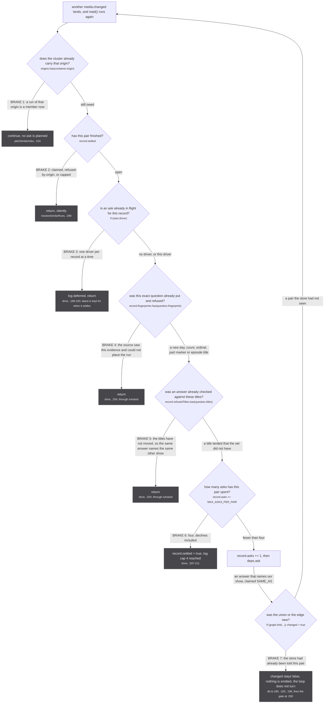

A catalogue's show-level url is true as containment and false as identity, and minting it as a handle welds every run that shares it into one media for the session ([the three kitsu runs that shared one](/)). The pointer is therefore carried as a PART_OF edge through `container(pointer)`, and only `attr.subtype === 'movie' && mintableAsFilmHandle(pointer)` mints a handle instead (src/sources/kitsu/extractor.ts:96, :100-105); Netflix `/title/<id>` and `/watch/<id>` are the whole of that list today (kitsu/stream-id.ts:82). The worker then asks the owning origin which of its own seasons this run is ([why](/similar/why/)).

## The consumer

`Subscription.media` is the only caller: `if (!policyFor({ context }).crossSource) return` (src/worker/similar-consumer.ts:281) keeps listings from ever asking. It runs after aggregation, once per (run cluster, container) pair, because only the worker holds the best day-precise date, every title, `runLength`'s top-tier consensus count and every PART_OF container. `planSimilarAsks` drops a container whose origin is already in the cluster, building `origins` from EVERY member, CONTAINER-scoped rows included (:147), stricter than its own docstring. Each record keeps two memories ([consumer](/similar/consumer/)): `fingerprints`, because more evidence about the season cannot change which show an answer names, and `refusedTitles`, because a title landing later can. kitsu's romaji-only first read scores 0.441 against Crunchyroll's English series title (tests/unit/worker/similar-consumer.test.ts:276-281).

## The funnel

`similarOutcomeFrom` is the only path to any source's `similarMedia`, with ten exits, one `similarMedia: ` line each because scripts/check-similar-media.mjs parsing the deployed console is the only checker ([funnel](/similar/funnel/)). `declined` is retried and `refused` is final for that evidence, but both increment `record.asks`, so a source that times out four times settles the pair on the cap without refusing anything.

| exit | what removes the ask |
| --- | --- |
| `no-evidence` | no origin, no `showId`, or `hasEvidence` false (src/worker/extractor.ts:316) |
| `bad-show-id` | `SAFE_SHOW_ID` `/^[A-Za-z0-9._~-]{1,128}$/`, the first id a CALLER chooses (:244, :326) |
| `not-implemented` | 5 of 24 sources, read off the definition's resolvers (:292-295) |
| joined | an identical `similarAskKey` shares the in-flight promise and spends no budget (:349-355) |
| `ceiling` | `MAX_SIMILAR_MEDIA_PER_CALLER` 8 (:227), `MAX_CONCURRENT_SIMILAR_MEDIA` 32 (:216) |
| `timeout` | `SIMILAR_MEDIA_TIMEOUT_MS` 30_000; the subscription DID open, so declined never means unsent (:198, :382-384) |
| `error` | thrown inside `firstSimilarMedia` |
| `not-a-run` | `answer.origin === origin && answer.scope !== 'CONTAINER' && answer.id !== showId` (src/sources/similar.ts:125-129) |
| `null` | the yielded refusal every implementing resolver sends rather than ending; a generator that ends without yielding settles nothing (worker/extractor.ts:277) and costs the full 30s |
| `answered` | a run id, handed to the consumer |

The consumer adds three more: `refused-by-origin` when the cluster gained that origin's run mid-flight, `refused-by-title` when `answerNamesOurShow` scores under `SHOW_TITLE_THRESHOLD` 0.9 (:303) with season markers stripped from both sides by `franchiseTitle` (src/sources/utils.ts:335-345), and `claimed`.

## The rules

`pickSimilarSeason` decides WHICH season and never WHICH show; the show came off a PART_OF edge the fuzzy pass may have unioned, which is what the 0.9 re-check exists for. Every rule picks over ALL candidates and only then checks its vetoes: a vetoed pick is a refusal, never a fall-through, because that fall-through is how season 1 of Mushoku Tensei reached Netflix season 3 ([rules](/similar/rules/)).

| rule | admits | refuses |
| --- | --- | --- |
| 1 date | exactly one premiere within `SEASON_DATE_WINDOW` 45 days of a day-precise start (src/sources/catalogue-gate.ts:230) | zero (catalogues disagree) or two (two parts at once). Exempt from the year veto |
| 2 episode titles | one candidate with `MIN_EPISODE_TITLE_MATCHES` 3 matched and `EPISODE_TITLE_COVERAGE` 0.6 of its real titles (similar.ts:67-69) | a fold of two equal cours scores 12/24 = 0.50; a four-episode bonus block scores 12/16 = 0.75 and passes |
| 3 ordinal | one ordinal, no part marker, a count, one candidate `seasonNumber` match | `ordinals.size > 1` returns from the whole function (:216), above this rule |
| 4 year | the single candidate dated our year, with a count | a candidate whose length is unknown cannot be shown not to be a fold |
| 5 first | the lowest `seasonNumber`, exact count (or `<=` when there is one candidate) | anything else |
| vetoes | | fold `theirs > ours` on every rule; year on every rule but 1. `countOf` is `episodeCount \|\| undefined`, so a season listing zero has no length, never a length of 0 (:134-137) |

## The document

`SIMILAR_MEDIA_DOCUMENT` is the selection every one of these asks carries (src/worker/similar-document.ts:8-20), and a selection set here is a storage decision rather than a rendering one ([the write](/tldr/write/)). Two rules follow. It selects no `episodes`, so Netflix arrives on this path as a claim and never as episode rows, which is survivable only because unogs' search died anyway. And it selects every array WHOLE, never field by field, because a same-length poorer array replaces the stored one ([document](/similar/document/)).

## Lending

`lendContainingSeason` returns `handles: []` (src/sources/crunchyroll/extractor.ts:437): a season CONTAINING a split cour hands its episodes over re-pointed at the asking run and claims no identity, since a handle would union both parts through one shared uri, which `graph.link` has no inverse for ([lending](/similar/lending/)).

## What stops the loop

*The seven brakes on the read, ask, claim, emit, read cycle ([loop](/similar/loop/)).*

The claim is made with no rows and parks under `pendingClaims` (store/db.ts:124) until the answering extractor's own insertion lands, because `mediaInserter` batches on a 50ms `setTimeout`. `record.settled = true` is set one line BEFORE that `await upsertMedia` (similar-consumer.ts:254-255), so a claim waiting on a row that never lands sits in an unbounded map only `resetStore` clears (db.ts:512), the pair closed and the `claimed` line printed either way (similar-consumer.ts:256).

Every constant, refusal and trap named across these pages, with its file and line in one place: [/tldr/rules/](/tldr/rules/).
