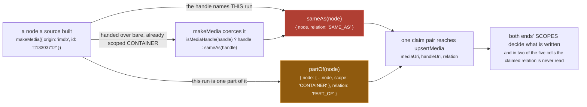
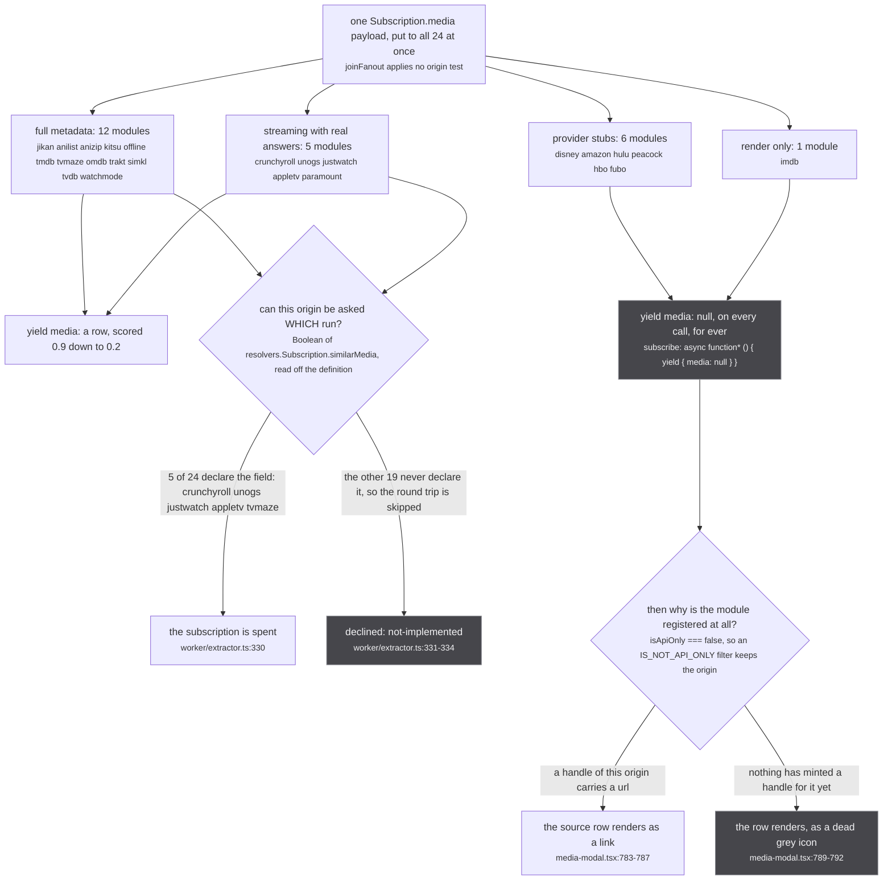

A source is an ES module namespace re-exported from `src/sources/index.ts`, and that export line is the on switch: `export const extractors = Object.values(extractorDefinitions).map(makeExtractor)` (src/worker/extractor.ts:551). No enable flag, no config, no allowlist. Disabling a source is deleting one line, so the count and every name are pinned by test (tests/unit/sources/index.test.ts:24).

| export | who reads it | what it decides |
| --- | --- | --- |
| `origin`, `originUrl`, `name`, `icon`, `color`, `isApiOnly` | `normalizeOrigin` (src/worker/extractor.ts:72-79) | the origin row. An explicit six-field literal, so anything else on the namespace stops there |
| `resolvers` | merged over the defaults (src/worker/extractor.ts:418-466) | which of `media`, `mediaPage`, `similarMedia`, `Media.episodes` this source answers. A declared resolver REPLACES the default outright |
| `supportedUris` | `answersForOrigins` (src/sources/supported.ts:27-29) | which FOREIGN ids may re-ask it, a different set from `origin`: anizip mints `anizip:` uris but answers from `anidb` or `mal`, so its own name cannot appear in a cluster until it has already answered. Not a field on `ExtractorDefinition` (src/worker/extractor.ts:164-173), so it is read through a structural cast |
| a module-level `const SCORE` | nothing automatic; threaded by hand into every row and field | see below. There is no `export const score` anywhere |
| `metadataOnly`, `official`, module-level `categories` | nothing | nothing. `isApiOnly` is what keeps a source off the source rows, and `src/sources/players.ts:11-13` mapping only `cr` and `nf` is what keeps imdb out of playback |

## What it may mint

A source yields rows and handles and never writes to the store ([sources/contract](/sources/contract/)). Two constructors, one welds.

*Amber is a one-way door. What each claim then becomes is decided by the scopes, at [the write](/tldr/write/).*

- **`sameAs`** (src/sources/utils.ts:27) is the one claim that can reach `graph.link` (src/worker/store/db.ts:193), the write with no inverse, so media welded by a wrong handle stay welded for the life of the worker.
- **`partOf`** (src/sources/utils.ts:40) copies the node with `scope: 'CONTAINER'`, making `mediaScope !== handleScope` true, which routes the claim to a deletable edge whatever was claimed. The stamp is then sticky (src/worker/store/db.ts:142-146). It spends the recoverable failure, a missing SAME_AS, to avoid the permanent one.
- **A bare media in `handles` becomes `sameAs`.** `isMediaHandle` is the structural test `'node' in handle` (src/sources/utils.ts:20, applied at :66), so meaning SAME_AS and forgetting to say anything are indistinguishable. The quiet default claims identity.

Never mint a show-level id as SAME_AS. `SHOW_LEVEL_ORIGINS` is one entry, `imdb` (src/worker/store/db.ts:42), forced to CONTAINER at :92 whatever row it arrives in.

A refusal is written `return yield`, never `return`: a generator that completes without yielding makes yoga answer 204 No Content (src/worker/extractor.ts:459-462). On `similarMedia` that burns the full `SIMILAR_MEDIA_TIMEOUT_MS` 30_000 (:198) while holding a per-caller and a global slot ([the funnel](/tldr/similar/)), where an explicit null settles in milliseconds. [sources/what-a-source-mints](/sources/what-a-source-mints/).

## What a score decides

Seventeen modules keep a module-level `const SCORE` hand-threaded into every `makeMedia`, `makeEpisode`, title, cover, banner and thumbnail. It picks which spelling is shown, which scalar wins the aggregate, which six titles a cluster is compared on, and which tier votes on a number.

Tiers are lexicographic, never additive (src/worker/store/consensus.ts:36): the best score present decides which claims are read, agreement breaks ties among equals, nothing beneath is consulted. The sum that was tried first, and what it published, is at [the merge](/tldr/merge/).

Nothing normalises an absent score on the way in (`media.score ?? null`, src/worker/store/normalize.ts:18) and the readers disagree: -1 in `byScore` and `selectTitles`, 0 in `tieredConsensus` (consensus.ts:44-45) and the cluster sort. anizip stamps 0.9 per field and passes NO score to `makeMedia`, so it is top tier per field and bottom tier per row at once. Most readings recompute per read; the one that does not, `selectTitles` feeding `sameShow` into `linkSameMediaPairs` (src/worker/store/fuzzy-merge.ts:664), is a union with no inverse ([sources/scores](/sources/scores/)).

## The search gate

A search hit must clear TWO axes that agree: title for the franchise, a SEASON-level date for which season. `CONFIDENT_TITLE_THRESHOLD` 0.9 (src/sources/catalogue-gate.ts:98) is safe only because the date axis sits underneath it, over 243194 correct and 139507 wrong pairs (:45, :86).

| gate | wrong links | |
| --- | --- | --- |
| title axis alone at 0.90 | 5.116% | catalogue-gate.ts:50 |
| title alone at threshold **1.00** | 4.002%, 5583 pairs, exactly equal after season stripping, so no number in 0..1 refuses them | :69-70 |
| plus season-level year membership | 0.825% | :76 |
| plus `SEASON_DATE_WINDOW` 45 days, inclusive and symmetric | 0.695% | :77, :230 |
| 0.94 instead of 0.90 | 208 fewer wrong links, 13046 correct ones lost, ratio 0.016 against a bar of 1.0 | :83-84 |
| 0.85 instead of 0.90 | 714 wrong links above the floor, against 331 | :84-85 |

Read at SHOW level the date axis collapses: same year recalls 16.543% against season-level membership's 93.221% (:168-175). Spend is capped: `MAX_SEARCH_QUERIES` 4 including the primary title (:110), `MAX_CATALOGUE_CANDIDATES` 3 survivors (:109). Ranking candidates beats first-over-the-line by more than the threshold move itself: at the gate that shipped before, best welds 274 of 913 (30.011%) against 544.3 expected for first (59.618%) (:132-134). Crunchyroll keeps its own copies of all three constants (src/sources/crunchyroll/extractor.ts:366, :369, :370); JustWatch never calls `pickGatedCandidate`, composing both axes by hand and taking the first survivor, since a year membership has no distance to rank on (src/sources/justwatch/extractor.ts:680-711). [sources/search-gate](/sources/search-gate/).

## Season scoped ids

Every media here is one season and every catalogue models a show, so a show-level id lands on all of them at once and welds them. The rule is absolute: a series media is `<node>-<season>`, never the bare node id (src/sources/justwatch/id.ts:4-17, `jwId` at :20), and the suffix is the season's own objectId rather than its ordinal, so it survives a renumbering or a split cour. Before it: search's season 2 opened season 3, one aggregated uri carried two anilist and two mal ids, and two unrelated shows merged on a shared handle.

Where the season cannot be resolved, the source declines. Over 33 multi-season Netflix series and 105 runs, refusing into the show-level id accounted for 30 of 41 welds; declining to mint anything drops it to 11, costing 56 runs their Netflix row (src/sources/unogs/extractor.ts:215-218). Crunchyroll takes the same trade, a seasonless series id entering as a CONTAINER that answers metadata and no episodes (src/sources/crunchyroll/extractor.ts:174, :269-272). Residue is 11 of 105, down from 51 under the rule it replaced (src/sources/season.ts:154-173), because the picker sees one run and one candidate at a time ([sources/season-ids](/sources/season-ids/)).

## The 24 modules

`M` media row, `P` search page, `E` `Media.episodes`, `S` `similarMedia`, `O` mints provider handles or deep links.

| module | origin | SCORE | answers | note |
| --- | --- | --- | --- | --- |
| jikan | `mal` | 0.9 | M P | sole member of the 0.9 row tier, so its spelling and its episode count lead every aggregate |
| anilist | `anilist` | 0.8 | M P | the only 0.8 tier; `frontend.ts` is split out of the module because `worker/extractor.ts` reaches urql and cannot load under vitest |
| anizip | `anizip` | 0.9 per field, none per row | M | the only module declining `mediaPage`; episodes ride inside its media row, not the field resolver |
| crunchyroll | `cr` | 0.5 | M P E S O | playable (`players.ts:12`); `SEASON_CANDIDATES_TTL_MS` 10 min at crunchyroll/extractor.ts:319 |
| unogs | `nf` | 0.2 | M P E S O | playable; publishes under `nf`, so grepping for netflix finds nothing |
| justwatch | `jw` | 0.2 | M P E S O | `PACKAGE_ORIGIN_MAP` 13 package keys onto 10 origins (id.ts:75-79); offers dedupe on origin, not package |
| appletv | `appletv` | 0.2 | M P E S O | publishes a per-DAY season date, which is what the 45 day window is for |
| paramount | `paramount` | 0.2 | M E O | search yields empty nodes |
| tmdb | `tmdb` | 0.3 | M P E | can be season scoped, which is why it is kept out of `SHOW_LEVEL_ORIGINS` |
| tvmaze | `tvmaze` | 0.3 | M P E S | the only metadata source declaring `similarMedia` |
| kitsu | `kitsu` | 0.3 | M P E | publishes Crunchyroll `/series/` urls on every season record, the case `partOf` exists for |
| omdb | `omdb` | 0.3 | M P E | key |
| trakt | `trakt` | 0.3 | M P E | key |
| simkl | `simkl` | 0.3 | M P E | key |
| tvdb | `tvdb` | 0.3 | M P E | key |
| watchmode | `watchmode` | 0.25 | M P E O | key. Every provider handle is show level, so all of them mint PART_OF; unplugged for three commits when it refused them individually and contributed nothing |
| offline | `offline` | 0.2 | M P | asked by `offline`, `mal`, `anilist`, `kitsu`, `anidb`; its `SCORE` lives in offline/normalize.ts:31 |
| disney | `disney` | none | - | `PACKAGE_ORIGIN_MAP` target |
| amazon | `amazon` | none | - | `PACKAGE_ORIGIN_MAP` target |
| hulu | `hulu` | none | - | `PACKAGE_ORIGIN_MAP` target |
| peacock | `peacock` | none | - | two package tiers, `pcp` and `pct`, one origin |
| hbo | `hbo` | none | - | `parts[1]` of an HBO series url is the literal string `watch`, which once handed 22 titles one handle (id.ts:91-93) |
| fubo | `fubo` | none | - | `PACKAGE_ORIGIN_MAP` target |
| imdb | `imdb` | none | - | registered only so an `imdb:tt` handle has a name, icon and colour to render against |

*Seven modules can never yield a row, and are registered so a handle of that origin renders.*

Worked examples: [sources/crunchyroll](/sources/crunchyroll/) walks seasons to place a run, [sources/justwatch](/sources/justwatch/) has no season node at all. What the store then does with a yielded row and its claims, gate by gate, is [the write](/tldr/write/).
