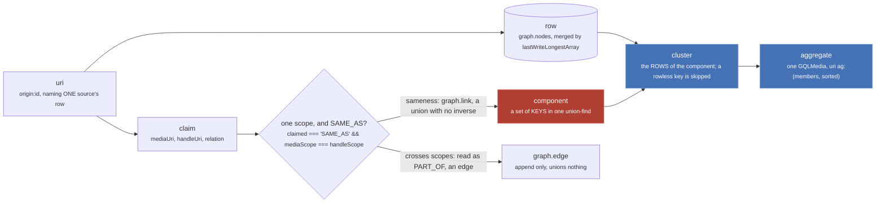

Read this first. Nothing else on the site re-explains these, and four of them get used
interchangeably in conversation while meaning four different things.

They stack. A **uri** names one source's row, a **claim** about two uris becomes a **component**, the
rows of that component are a **cluster**, and an **aggregate** of the cluster is what a page renders.

*Blue is recomputed on every read and persists nothing. Rose has no inverse.*

| word | what it is | where it is decided |
| --- | --- | --- |
| origin | the short name a source publishes under: `anilist`, `cr`, `jw`, `imdb` | `store/db.ts:44` |
| uri | `origin:id`, naming one source's row. Never a work | `utils/uri.ts:3` |
| aggregated uri | `ag:(uri,uri)` with an optional `-episodeId` tail, naming a work as a cluster | `utils/uri.ts:95`, `:97` |
| handle | `{ node, relation }`: one row pointing at another, with a claim attached | `media/schema.gql:226` |
| handle relation | `SAME_AS` or `PART_OF`. Only `SAME_AS` unions | `store/types.ts:28` |
| media relation | thirteen narrative values (`SEQUEL`, `ADAPTATION`, ...). Unions nothing, ever | `store/types.ts:38` |
| scope | `RUN` or `CONTAINER`: which identity space this row's sameness unions in | `store/types.ts:87`, `db.ts:91` |
| run | one broadcast run: a cour, a film. The unit a card shows and episodes belong to | `media/schema.gql:107` |
| container | a show, a series, a franchise page: something several runs are part of | `media/schema.gql:109` |
| claim | a handle flattened to `{ mediaUri, handleUri, relation? }` on its way to the store | `store/db.ts:110` |
| row | one source's stored `Media`, merged field by field rather than replaced | `store/graph.ts:124`, `:388` |
| component | a set of KEYS in one union-find. May hold keys no row describes | `store/graph.ts:107` |
| cluster | the ROWS of a component. A rowless member is silently skipped | `store/graph.ts:316` |
| aggregate | one `GQLMedia` computed from a cluster, `_id` a component uuid rather than a uri | `store/aggregate.ts:306`, `:293` |
| view | anything computed per read and never written back | `store/consensus.ts:247` |
| tier | the top score band, the only one a numeric consensus consults | `store/consensus.ts:44` |

Paths are relative to `src/worker/` except `utils/uri.ts`, which is `src/utils/uri.ts`.

## The four that get confused

A **component** is keys, a **cluster** is the rows those keys have, and the difference is not
cosmetic: `graph.link` accepts a uri that was never stored, so a component can carry a member no
cluster and therefore no aggregate will ever show. A **row** is one source's answer; an **aggregate**
is all of them folded into one object, and it exists only for the duration of the read that asked for
it.

## The three identity spaces are separate union-finds

`MEDIA_SAME_AS` (`db.ts:14`), `CONTAINER_SAME_AS` (`db.ts:15`) and `EPISODE_SAME_AS` (`db.ts:45`). A
union in one is invisible in the other two. `sameAsLabelFor` picks between the first two and is total:
`CONTAINER` gives the container space, everything else gives the media space (`db.ts:94`).

Scope is never stored per claim. It is read off the uri at write time by `scopeOf` (`db.ts:91`), a
three step ladder: `SHOW_LEVEL_ORIGINS.has(originOf(uri))` first, then the stored row's own `scope`,
then `RUN`. `SHOW_LEVEL_ORIGINS` has exactly one member, `new Set(['imdb'])` (`db.ts:42`).

:::danger[Two of these words name something permanent]
`SAME_AS` within one scope becomes `graph.link`, a union-find union. There is no `unlink`, no `split`
and no `disunion` in the repo. Scope is a one way ratchet: `scopeOf(media.uri) === 'CONTAINER' ?
'CONTAINER' : media.scope ?? 'RUN'` (`db.ts:146`), so once any row for a uri said `CONTAINER`, no
later row moves it back.
:::

The long version of this page, with the validators, the two encodings of an aggregated uri and the
`ag:()` that is valid and yields nothing, is at [Vocabulary](/start/vocabulary/).
