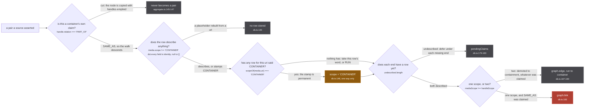
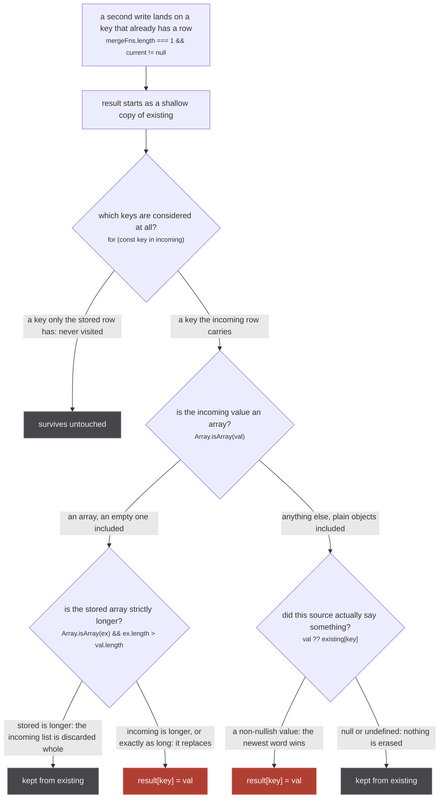

Every media row and every handle claim enters the store through `upsertMedia` (src/worker/store/db.ts:132-201). Everything it does is in front of one line: `graph.link` at db.ts:193, the union-find union that has no inverse anywhere in `src/`, which is [why every gate below exists](/).

## Answer to row

An envelop `useOnResolve` hook fires on the resolver's **return value**, keyed on `getNamedType(info.returnType).name`, never on the selection set (src/worker/extractor.ts:473-495), so a `Media` row lands whole where two fields were selected. An unselected field is a resolver that never runs, so an unselected `Media.episodes` stores nothing: measured on one cluster, the page owning the fan-out stored 10 Netflix episode rows and the page that gained the same run through [the similar document](/similar/document/) stored 0 (similar-document.ts:8-20). The selection set therefore decides what is STORED, not just what is drawn.

| loader | batch | flush | cache |
| --- | --- | --- | --- |
| `mediaInserter` | 250 (worker/extractor.ts:132), also the blast radius of one `graph.set` throw | `setTimeout(callback, 50)` | `cache: false` (worker/extractor.ts:130) |
| `episodeInserter` | 250 (worker/extractor.ts:150) | 50ms | `cache: false` |
| `originInserter` | 50 (worker/extractor.ts:160) | 50ms | `cache: false` |

Write queues, not caches: an identical row arriving twice writes twice, or a correction is lost. `recursivelyUnwrapMediaHandles` flattens the handle tree into the batch and stops at a `PART_OF` node, storing a copy with its subtree cut, `[{ ...handle.node, handles: [] }]` (aggregate.ts:145-147): carry a container's handles through and two runs hanging `PART_OF` off one show contribute a `SAME_AS` pair rooted at it, welding season 1 to season 3.

## Five gates, then the union

*Four gates end a pair's journey; the third changes what the fifth sees.*

**The placeholder gate** (db.ts:104-108) refuses a row whose every field is in `IDENTITY_FIELDS` (`uri`, `origin`, `id`, `scope`), null or `[]`, so a bare sibling rebuilt from an aggregated uri stores nothing. A row carrying only `scope: 'CONTAINER'` is not a placeholder and is stored: a stamp is a source's reading of the id.

**The ratchet** is `scopeOf(media.uri) === 'CONTAINER' ? 'CONTAINER' : media.scope ?? 'RUN'` (db.ts:146), applied before `graph.set` sees the value, because `lastWriteLongestArray` treats `scope` as a scalar and would let an incoming RUN overwrite CONTAINER. RUN to CONTAINER, one way. `SHOW_LEVEL_ORIGINS = new Set(['imdb'])` (db.ts:42) is read before any stored row, so an `imdb:` uri is a CONTAINER whatever row it arrived in.

## What a claim becomes

Both ends' scopes decide, not the source (db.ts:171): two cells never read the claimed relation.

| ends | claimed | write | permanence |
| --- | --- | --- | --- |
| RUN x RUN | `SAME_AS` | `graph.link(a, b, MEDIA_SAME_AS)` (db.ts:193) | irreversible |
| CONTAINER x CONTAINER | `SAME_AS` | `graph.link(a, b, CONTAINER_SAME_AS)` | irreversible |
| RUN x CONTAINER | ignored | `graph.edge(run, container, MEDIA_PART_OF)` (db.ts:187-190) | appended, deletable |
| CONTAINER x RUN | ignored | the same edge, the pair flipped first | appended, deletable |
| one scope | `PART_OF` | `graph.edge(mediaUri, handleUri, MEDIA_PART_OF)` | appended, deletable |

Three identity spaces, a union-find each: `media:same_as` and `container:same_as` (db.ts:14-15), picked by `sameAsLabelFor(scope)` (db.ts:94), plus `episode:same_as` (db.ts:45). Nothing unions across them. `EPISODE_PART_OF` is written at db.ts:411 and read by nothing in `src/` or `tests/`.

## Pending claims

A claim naming a uri with no row has no scope to derive a relation from, so it is deferred under **each** missing end (db.ts:113-124, :179-183) and released by the flush keyed on `landed` (db.ts:155-160). It used to read as RUN, unioning a run with a show whose CONTAINER row was still in flight; the CONTAINER that followed flipped the scope, not the union. [The bucket](/write/pending-claims/) has no cap, no timestamp, no sweep, no log line: a claim stuck forever is correct, and a timeout reintroduces the guess. It closes only the no-row window: a described RUN row minted for a show id applies at once.

## The other one-way write

*`lastWriteLongestArray` (graph.ts:388-400): no per-source layer, no provenance on a field.*

Fields are monotonic: nothing puts `episodeCount: 13` back to unknown, and a shorter corrected array is discarded whole. A partial selection is not private: `titles { title }` writes a same-length, poorer array over everyone else's copy, costing Crunchyroll's rows their language and score on 2026-09-05 (similar-document.ts:26-29).

## upsertEpisodes has none of that

Eleven lines of body (db.ts:404-414): no placeholder gate, no scope, no `pendingClaims`, no demotion, and the `graph.link` at db.ts:410 reads the claimed relation and nothing else. `find` calls `ensure`, minting a singleton for any string, so an episode uri no source described joins `episode:same_as` permanently and invisibly: `cluster` skips a member with no stored row. Nothing built-in mints an episode handle either, so two sources describing one run are never reconciled on the way in: that fold happens at **read** time, on the number alone ([episodes](/tldr/read/)).

## Closing the loop

`upsertMedia` emits `media:changed` only if `changed` (db.ts:200), driven by `isNew = !graph.has(media.uri)` (db.ts:141), a test of the uri and not of the content: a row arriving with a description and cover it lacked merges and emits nothing. `upsertEpisodes` emits `episode:changed` unconditionally (db.ts:414). Subscribers wake and re-read; `Subscription.mediaPage` debounces 100ms trailing (media/index.ts:108). Because a warm store produces no event, [its whole-store fallback](/write/events/) is load bearing (media/index.ts:112-125). Returning `[]` from it is the obvious refusal and breaks the page outright: `insertedUris` is empty until a source answers, the generator only re-runs on `media:changed`, and `graph.set` is idempotent, so no event ever fires. Measured 2026-09-06 at media/index.ts:126: 0 cards for 60 seconds where the same url opened cold answered 24.

Every read that follows recomputes its answer from what landed here and persists nothing, except for the two writes that hide inside one of them: [the read](/tldr/read/).
