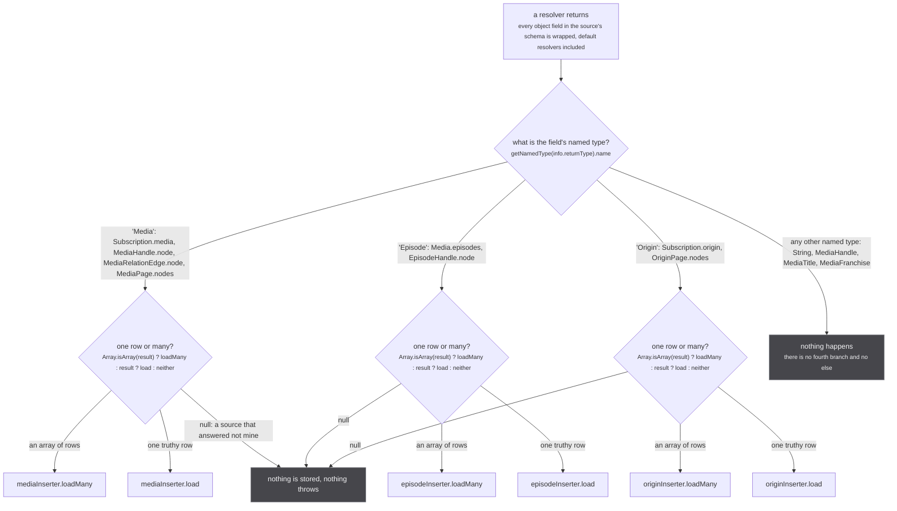
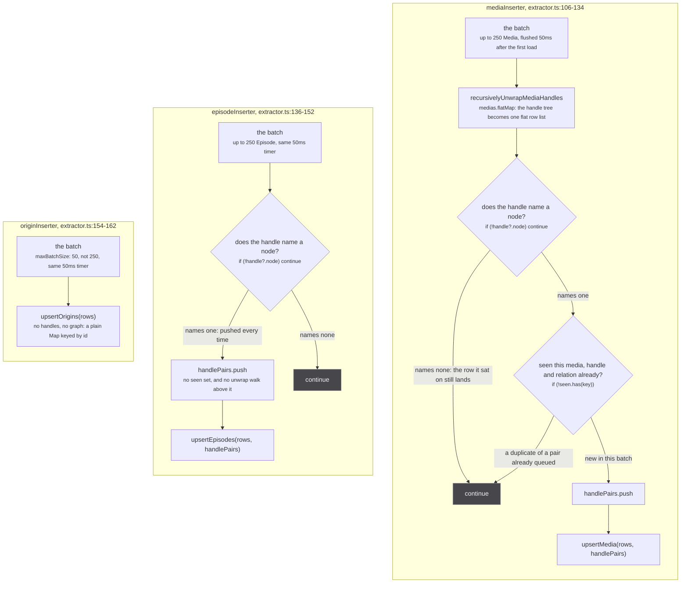
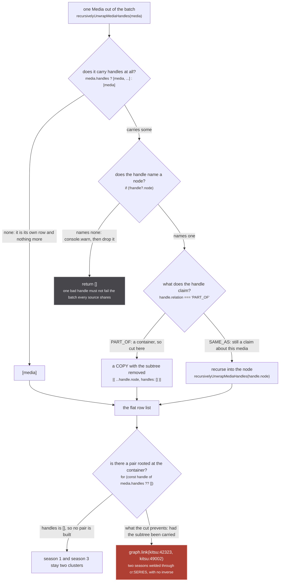
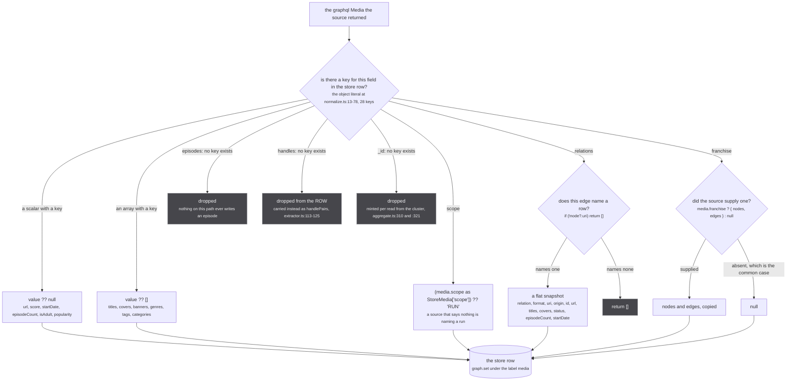

A source never hands its answer back to the page. It answers its own private yoga, and on the way out
of every resolver an envelop hook reads the value, decides which of three DataLoaders it belongs to,
and writes it into the store. The page finds out because the store emits `media:changed` and the
page's own read runs again.

That hook is the whole funnel. `upsertMedia` has exactly two callers in the tree
(`src/worker/extractor.ts:127` and `src/worker/similar-consumer.ts:255`, the second with an empty row
list), and `upsertEpisodes` and `upsertOrigins` have exactly one each, both in the same file. Nothing
else in `src/` writes a media, an episode or an origin.

This page is the stretch from a returned object to the argument list of `upsertMedia`. What happens
after that argument list is [upsertMedia](/write/upsert-media/).

## The hook fires on a return value, not on a selection set

`src/worker/extractor.ts:473-495`, installed by `makeExtractor` into every source's yoga, built-in and
plugin alike:



*A source that says "not mine" by yielding `{ media: null }` walks the same path as one that says nothing: the falsy branch stores nothing and raises nothing.*

Two facts decide everything downstream, and both are stated in the codebase itself.

**It fires on what the resolver returned.** The type test is `getNamedType(info.returnType).name` at
`extractor.ts:475`, `:481` and `:487`, and the value it inspects is `result`. The selection set is
never consulted, so a row lands whole even where the caller asked for two of its fields.

**A field that is not selected is a resolver that never runs**, so its named type never reaches the
test at all. Put those together and the rule is: rows arrive whole, but only for the fields the
document asked for.

`src/worker/similar-document.ts:8-20`

> THE ROW is inserted whatever is asked for: `useOnResolve` in the extractor fires on the RESOLVER'S
> RETURN VALUE rather than on the selection set, so the whole Media lands even where a field is not
> selected. THE EPISODES ARE NOT, and this document said otherwise until 2026-09-10.
>
> `useOnResolve` is per RESOLVED FIELD and keys on that field's named type (extractor.ts:473-486):
> `Media` reaches `mediaInserter`, `Episode` reaches `episodeInserter`, and `mediaInserter` writes
> rows and handle pairs only, dropping `media.episodes` on the floor (extractor.ts:106-133). So an
> unselected `episodes` is a resolver that never runs, an Episode type that is never resolved, and an
> `episodeInserter` that never fires. Netflix is how this surfaced: since unogs' own search died it
> arrives ONLY as a `similarMedia` claim, its season media attached and its episodes never existed, so
> the media header carried the Netflix icon while every episode row showed none. Measured on the same
> cluster from two pages: the one whose own subscription owned the fan-out stored 10 nf episode rows,
> the one that gained the same nf run through this document stored 0.

"Every object field, default resolvers included" is not an inference from the call site. The plugin
replaces `field.resolve` for every field of every non-introspection object type in the schema, and the
resolver it wraps is `field.resolve || defaultFieldResolver`. So `MediaHandle.node`, which no source
writes a resolver for, is wrapped exactly like `Subscription.media`, which is why a nested handle
becomes a row at all.

### A correction: relation nodes reach the same loader

The subsystem report lists `Subscription.media`, `MediaHandle.node`, `Media.episodes`,
`EpisodeHandle.node` and `Subscription.origin` as the fields that fire. The schema adds one the report
does not name. `MediaHandle.node` is `Media!` at
`src/worker/resolvers/media/schema.gql:228`, and so is `MediaRelationEdge.node`, at `schema.gql:170`.
The branch keys on the named type and on nothing else, so a narrative relation's other end reaches
`mediaInserter` the same way an identity handle's does.

It is selected in practice: `GET_MEDIA_MODAL` asks for `relations { relation format node { ... } }` at
`src/router/home/media-modal.tsx:381-400`, and the fan-out replays the caller's document verbatim at
every source (`query: ctx.params.query!`, `extractor.ts:784`). The other end therefore lands as its own
row, with the fields the modal selected.

It unions nothing, which is the part the design cares about: the relation node's own `handles` are not
selected, so `recursivelyUnwrapMediaHandles` returns it alone and the pair loop finds nothing to claim.
But it is a row, and two comments read as though it is not:

`src/worker/store/normalize.ts:40-41`

> Flattened here rather than kept as nested media: the other end is a snapshot the store never
> clusters on. See `Relation` in ./types.ts.

`src/worker/store/types.ts:47-50`

> A snapshot, not a row. Storing the other end as a `Media` would put a second copy of a work into
> the store's own space, where the clustering would then have to decide what it is, and the whole
> point of this axis is that it never asks that question. Flat also keeps the record small: a
> franchise is dozens of edges and each carries a title and a cover, nothing more.

Both are exactly right about `normalizeToStoreMedia`, which does flatten the edge into a snapshot on
the parent row. Neither covers the second path the same object takes, as a resolved field of named
type `Media`. Read them as a statement about the relations array, not about what the store ends up
holding.

## Three loaders, and the asymmetry between the first two



*The media lane has an unwrap walk and a dedupe set; the episode lane has neither, and reads handles exactly one level deep.*

All three are `new DataLoader(..., { cache: false, batch: true, maxBatchSize: N, batchScheduleFn: (callback) => setTimeout(callback, 50) })`. The constants are `250` at `extractor.ts:132` and `:150`,
`50` at `:160`, and the 50ms timer at `:133`, `:151` and `:161`. `cache: false` on all three
(`:130`, `:148`, `:158`) is the important one: the loader is being used as a batching write queue, not
as a cache, so an identical row arriving twice must write twice. A cache here would silently drop a
source's correction.

The 50ms window is what makes `media:changed` affordable at all, and it is also why an empty batch is
expensive: the event re-runs the whole read for every subscribed page.

The media lane's dedupe key is built at `extractor.ts:119` as
`${media.uri}\0${handle.node.uri}\0${handle.relation}`, three parts joined by NUL, and the third part
is the point:

`src/worker/extractor.ts:109-112`

> The relation rides all the way to the store, because it is the store that acts on it: SAME_AS
> unions the cluster and PART_OF hangs a directed edge that unions nothing. Deduping on the RELATION
> too, not just the pair, so one media may hold both kinds for one origin without either silently
> winning on arrival order.

Both lanes refuse a handle that names nothing, at `extractor.ts:118` and `:140`:

`src/worker/extractor.ts:117`

> a handle naming no node claims nothing; the row it sits on still lands

The episode lane has no `seen` set and no recursive walk. A handle's node becomes an episode row only
because `EpisodeHandle.node` is itself a resolved field of named type `Episode`
(`src/worker/resolvers/episode/schema.gql:85`), so the hook fires on it separately, and therefore only
when the document selects it.

## The subtree cut, and the weld it is there to prevent

`recursivelyUnwrapMediaHandles` (`src/worker/store/aggregate.ts:135-152`) flattens one returned media
and everything hanging off it into the row list `upsertMedia` receives. Results are memoised in a
`WeakMap` at `aggregate.ts:106`, keyed by the object, so a media reached twice in one batch is walked
once.



*The one rose node on this page is a call that does not happen, and the branch at `aggregate.ts:145` is the only reason it does not.*

The branch is three lines, at `aggregate.ts:145-147`:

```ts
return handle.relation === 'PART_OF'
  ? [{ ...handle.node, handles: [] }]
  : recursivelyUnwrapMediaHandles(handle.node)
```

`src/worker/store/aggregate.ts:111-133`

> EVERY node becomes a row, whatever it claims: this walk feeds `graph.set`, and a PART_OF node has to
> be stored or its url can never be rendered. The relation decides how a node is LINKED, in
> `upsertMedia`, not whether it is stored.
>
> THE WALK STOPS AT A PART_OF NODE, and that is the load bearing part. A PART_OF node is a CONTAINER,
> usually a show, and its own handles are claims about the CONTAINER rather than about the run that
> pointed at it. Carrying them through means two different runs, each hanging PART_OF off the same
> show, each contribute a SAME_AS pair rooted at that show:
>
>     season 1 -PART_OF-> cr:SERIES -SAME_AS-> kitsu:42323
>     season 3 -PART_OF-> cr:SERIES -SAME_AS-> kitsu:49002
>
> and `cr:SERIES` is one uri, so the union-find puts kitsu:42323 and kitsu:49002 in one cluster. Two
> seasons welded, with no inverse, by a relation whose entire purpose is not to weld. The container's
> row still arrives, so its url renders; only its claims are dropped, because nothing can reach them
> anyway: `findPartOfMedia` returns the direct targets of a cluster and never walks their handles.
>
> The copy is what enforces it. Returning the node untouched would leave `handles` populated for the
> pair loop in worker/extractor.ts to read, so the subtree has to be cut here rather than there.
>
> KEPT DELIBERATELY, and weighed against letting a container contribute its handles after all. Nothing
> in the tree mints a PART_OF node carrying any, so the choice was only ever about which way the
> default fails, and unrelated media being read as SAME_AS is the failure with no inverse.

The copy matters more than it looks. The cut has to happen here because the pair loop at
`extractor.ts:115-125` reads `media.handles` off exactly these rows; leaving the node untouched and
filtering later would mean two places had to agree, and the second one is in a different file.

The uris in the comment are real, and so is the shape of the test that pins it.
`tests/unit/worker/store/part-of-subtree.test.ts:49-61` builds season 1 pointing at `cr:G24H1N3MP`
claiming `kitsu:42323` and season 3 pointing at the same series claiming `kitsu:49002`, then asserts
that no pair is rooted at the show:

`tests/unit/worker/store/part-of-subtree.test.ts:60`

> a pair rooted at the show welds every run that points at it

The same file carries the control that keeps the change honest, at `:66-73`: a `SAME_AS` handle is
still walked all the way to the bottom, `anilist:108465` to `kitsu:42323` to `mal:39535` to
`anidb:14758`, four rows out of one returned media.

:::danger
**`graph.link` has no inverse, and this cut is one of the guards standing in front of it.**
`src/worker/store/graph.ts:279-291` unions two components in a union-find, and the `UnionFind` surface
declared at `graph.ts:10-16` is `has`, `find`, `union`, `component`, `allComponents`. There is no
split, no unlink and no disunion anywhere in the repo. `union` ends with
`components.delete(oldRoot)` at `graph.ts:103`, which destroys the record of which members came from
which side, so nothing afterwards can ask what the component would hold with one node removed. The
only reset is `resetStore()` at `src/worker/store/db.ts:509-513`, which empties the whole store and
exists for tests.

A handle that reaches `upsertMedia` as `SAME_AS` between two rows of one scope is a permanent
decision. Everything on this page runs before that call.
:::

## What lands: 28 keys, and three things that do not

`normalizeToStoreMedia` (`src/worker/store/normalize.ts:13-78`) is the last step before
`upsertMedia`. It is a hand-written object literal of exactly 28 keys, one per field of the store's
`Media` type in `src/worker/store/types.ts`.



*Every nullable field lands as `null` and every list as `[]`, never `undefined`, and that is what makes the placeholder test in `upsertMedia` decidable at all.*

`src/worker/store/normalize.ts:5-12`

> The graphql row a source produced, as the row the store holds.
>
> Every nullable field lands as `null` rather than `undefined`, and `scope` defaults to RUN: a source
> that says nothing about scope is naming a run, which is what every source did before scope existed.
> Pure, and outside ../extractor.ts on purpose: that module reaches urql and cannot load under vitest,
> so a field dropped here would go unpinned.

The last sentence is the reason the file exists as its own module, and
`tests/unit/worker/store/normalize.test.ts` is what it bought. Its own header says why:

`tests/unit/worker/store/normalize.test.ts:1-2`

> Both mappers between the graphql row and the store row are hand written, so a new field is dropped
> silently unless something pins it. `scope` is the field whose loss reopens the season weld.

Of the three keys that are absent, only one is a genuine drop. `handles` is not lost, it is carried in
the other argument, as `handlePairs`. `_id` is not lost either, it is not a stored property: a
cluster's `_id` is minted per read by `graph.componentId` through `clusterId`
(`src/worker/store/aggregate.ts:310` for a singleton, `:321` for a real cluster).

`episodes` is the real one, and the Netflix measurement quoted above is what it costs. Nothing about
the media path writes an episode row; episodes exist in the store only because `Media.episodes`
(`src/worker/resolvers/media/schema.gql:319`) is a separately resolved field whose named type is
`Episode`, defaulting to `parent.episodes ?? []` at `extractor.ts:436`. Do not select it and no episode
row is ever created, however complete the media is.

The episode side has its own field list, `normalizeToStoreEpisode` at `extractor.ts:53-70`, sixteen
keys: `uri origin id url embedUrl mediaUri score titles descriptions shortDescriptions thumbnails
releaseDate seasonNumber episodeNumber absoluteEpisodeNumber runtime`. One of them decides more than
the rest:

`tests/unit/worker/similar-document.test.ts:41-44`

> The list is `normalizeToStoreEpisode` in worker/extractor.ts, which is what an inserted row keeps.
> A field missing here is a column the store cannot fill for any source that arrives this way, and
> `episodeNumber` in particular is the ONLY key episodes are joined on across sources
> (`mergeByEpisodeNumber`), so an episode selected without it can never reach a row.

The origin side is the smallest, `normalizeOrigin` at `extractor.ts:72-79`, six keys:
`id url name icon color isApiOnly`. Origins never enter the graph at all; `upsertOrigins`
(`db.ts:515-521`) writes into a plain `Map<string, Origin>` and emits `origin:changed`.

:::caution
**A row that lands is merged, and the merge is a one-way door on every field.**
`graph.set` runs each incoming row through `lastWriteLongestArray`
(`src/worker/store/graph.ts:387-400`), registered for the `media` and `episode` labels at
`db.ts:85-86`. Its own one-line doc is the whole contract:

`src/worker/store/graph.ts:387`

> Merge strategy: scalars last-write-wins, arrays longest-wins.

Two consequences reach back into this page. A scalar merges as `val ?? existing[key]`, so an incoming
`null` never erases a stored value: a source cannot correct `episodeCount: 13` back to unknown. An
array merges as `(Array.isArray(ex) && ex.length > val.length) ? ex : val`, strictly longest, with the
tie going to the incoming array. That is why a partial selection is not a private choice. A document
that asks for `titles { title }` alone writes a same-length, poorer `titles` array back over everyone
else's copy, which is exactly what cost Crunchyroll's rows their language and score on 2026-09-05
(`src/worker/similar-document.ts:26-29`).
:::

## What this funnel does not decide

Everything above is about which rows and which pairs reach `upsertMedia`. Nothing above has looked at a
scope, chosen a union-find space, or refused a claim on the grounds that the row it names does not
exist yet. Those are the next three pages: the placeholder gate and the scope ratchet in
[upsertMedia](/write/upsert-media/), the 2x2 that turns a claimed relation into a union or an edge in
[scopes and relations](/write/scopes-and-relations/), and the wait in
[claims that wait](/write/pending-claims/).

The one thing worth carrying forward is the shape of the call this page ends at:

```ts
await upsertMedia(allUnwrapped.map(normalizeToStoreMedia), handlePairs)
```

Rows and claims, in two separate arrays, deliberately. The rows are stored first and the claims are
read afterwards, which is the only reason a claim can ask whether the uri it names has a row.
