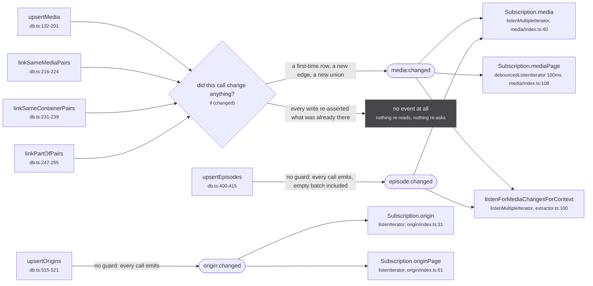
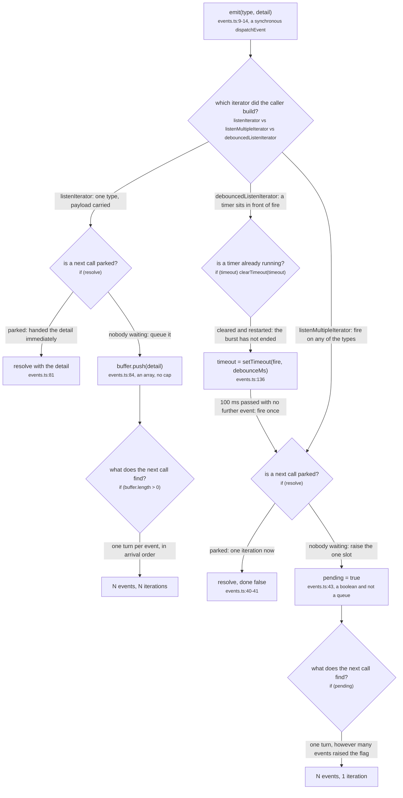
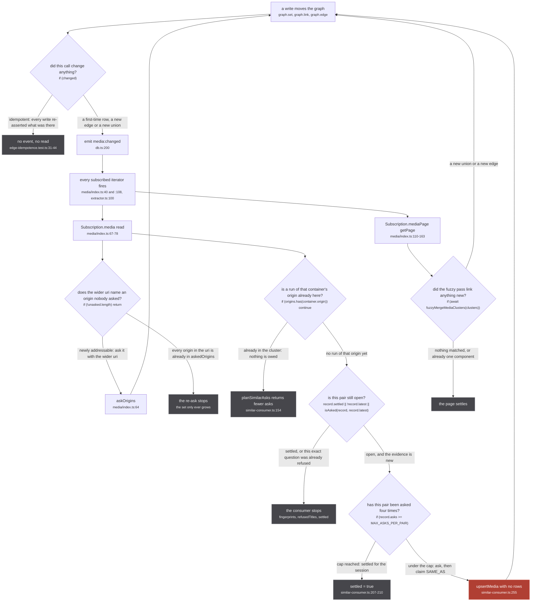

Nothing in this system returns an answer to the caller that asked for it. A source writes to the
store, the store says something moved, and every subscribed page reads again. That is the entire
delivery mechanism, and it is 147 lines in `src/worker/store/events.ts`.

The bus is one `EventTarget` (`events.ts:7`) and three event types (`events.ts:1-5`):

```ts
type StoreEventMap = {
  'media:changed': { uris?: string[] }
  'episode:changed': { uris?: string[] }
  'origin:changed': { ids?: string[] }
}
```

`emit` is a bare `dispatchEvent` (`events.ts:9-14`), synchronous, with no queue in front of it. So
`upsertMedia` has already woken every listener by the time it returns, whether or not the caller
awaits it.

Read the payload types and then read the call sites: **every one of the six emit sites passes `{}`.**
`uris` and `ids` are declared and never populated, at `db.ts:200`, `:222`, `:237`, `:253`, `:414` and
`:520`. No listener reads a detail either. An event carries the fact that something moved and never
what moved, which is why every listener re-reads the whole thing it is responsible for.

## Six emitters, five listeners



*Four of the six emit sites carry the same guard and two carry none, and `episode:changed` reaches only two of the five listeners: a listing never redraws because episodes arrived.*

Three asymmetries are worth reading off that figure before anything else.

**The four media writers share one guard and the two others have none.** `db.ts:200`, `:222`, `:237`
and `:253` are all literally `if (changed) emit('media:changed', {})`. `db.ts:414` and `db.ts:520`
are bare `emit(...)` calls at the end of the function. `upsertEpisodes([], [])` emits, and the
episode DataLoader flushes on a 50ms timer (`extractor.ts:151`), so an episode batch that stores
nothing new still wakes `Subscription.media` and every source-side context listener.

**`Subscription.mediaPage` does not listen to `episode:changed`.** `media/index.ts:108` names
`['media:changed']` alone, where `media/index.ts:40` and `extractor.ts:100` both name
`['media:changed', 'episode:changed']`. A listing has no episodes in its selection set, so this is
deliberate, and it is also why the unconditional episode emit costs the home page nothing.

**The origin lane is a different iterator from the media lane**, and that difference is not
cosmetic. See the next section.

The one exported function on this file that exists for a test rather than for the app says why the
guard is worth having:

`src/worker/store/events.ts:16-18`

> Subscribe to one store event, returning the unsubscribe. Exported so a test can COUNT emissions:
> `media:changed` re-runs the fuzzy merge and every subscribed page, so an upsert that reports a
> change it did not make is not free.

That test is `tests/unit/worker/store/edge-idempotence.test.ts`, and its header is the measurement
behind every `if (changed)` above:

`tests/unit/worker/store/edge-idempotence.test.ts:1-8`

> `graph.link` has always reported whether it changed anything and `graph.edge` did not, so every
> caller of the second had to guess. `upsertMedia` guessed "yes", which meant a source re-minting a
> handle it had already minted emitted `media:changed` anyway.
>
> That is not a cosmetic event. `media:changed` re-runs the whole fuzzy merge pass and wakes every
> subscribed page, and the sources re-mint constantly: the DataLoader flushes on a 50ms timer and the
> media page re-asks every origin. So a PART_OF edge that never changes still paid for a full pass
> each time it was asserted.

The fix lives in the primitive, not in the caller:

`src/worker/store/graph.ts:293-296`

> Returns whether the edge is NEW, the same contract `link` above has. A caller that re-asserts an
> edge it already made needs to know nothing changed: `upsertMedia` used to set `changed = true` on
> every PART_OF whatever the state, so a source re-minting the same handle emitted `media:changed`
> forever and every listener re-read the store for a graph that had not moved.

The test pins both halves at `edge-idempotence.test.ts:31-44`: two identical `upsertMedia` calls,
`expect(afterFirst).toBe(1)` and `expect(events).toBe(1)`.

### One thing `changed` does not track

`changed` is set by exactly three kinds of event inside `upsertMedia`: a first-time row
(`if (isNew)`, `db.ts:148`), a new `MEDIA_PART_OF` edge (`db.ts:190`, `:196`), and a new same-space
link (`db.ts:193`). The row-level signal is `const isNew = !graph.has(media.uri)` at `db.ts:141`, and
that is a test of the **uri**, not of the row's content.

So a media row that already exists and arrives again carrying a description, a cover and an
`episodeCount` it did not have before merges into the graph through `lastWriteLongestArray` and
**emits nothing**, unless one of its handles happens to be new. The store has genuinely moved and no
listener is told. In practice a richer answer usually arrives with a handle nobody had asserted yet,
which is what covers this, and nothing in the code depends on that being true.

## The four iterators

`listen` (`events.ts:19-26`) is the raw subscription and is used directly by exactly one caller: the
test above. Everything in the app goes through one of three iterator builders, two of which share an
implementation.



*The difference between the two families is one line: `pending = true` against `buffer.push(detail)`. A boolean saturates and an array does not.*

`makeAsyncIterator` (`events.ts:30-70`) is the coalescing one. Its `fire` (`events.ts:38-45`) either
resolves a parked `next()` or sets `pending = true`, and `pending` is a boolean. Fifty events fired
while a read is in flight leave the flag exactly as raised as one event does, so the consumer runs
one extra iteration and reads the store once. Both `listenMultipleIterator` (`events.ts:110-122`) and
`debouncedListenIterator` (`events.ts:124-147`) are thin wrappers over it, and both yield `void`:
there is nothing to carry, because the detail is `{}` everywhere.

`listenIterator` (`events.ts:72-108`) does not share that implementation. It keeps
`const buffer: StoreEventMap[K][] = []` at `events.ts:77` and pushes into it at `events.ts:84`, so it
delivers one iteration per event, in order, forever. It is the only iterator that carries a payload
through to the consumer, and the payload is always `{}`.

Its two users are `Subscription.origin` and `Subscription.originPage`, and `upsertOrigins` emits
unconditionally. So the origin lane is the one place in the worker where a no-op write produces a
guaranteed re-read: the origin DataLoader batches at 50 origins on a 50ms timer
(`extractor.ts:154-162`), each flush emits, and each emit is one full `findOrigins` per subscribed
origin page. The lists are small and the reads are `Map` lookups (`db.ts:83`, `originMap` is a plain
`Map`, not the graph), so it costs little. It is still the opposite discipline from the media lane on
both axes at once, guard and queue.

The debounce is trailing-edge and unconditional about it: every event calls `clearTimeout` and starts
a fresh `setTimeout(fire, debounceMs)` (`events.ts:133-138`). A stream of `media:changed` arriving
faster than every 100ms **never fires it at all** until the stream stops. On a cold media page, where
24 sources are answering into a 50ms DataLoader flush, that is the normal condition for the first
second or two.

## The re-read loop

Everything above exists to serve one cycle. A write moves the graph, the graph says so, a read runs,
and the read starts more writes.



*Six brakes, and only one of them is a counter. The other five are sets that grow and never shrink, which is the same argument the union-find makes for why the cluster can only get wider.*

The loop terminates because every path back into `W` is guarded by something monotone.

| brake | where | what it is |
| --- | --- | --- |
| `askedOrigins` | `media/index.ts:58-65` | a `Set` an origin enters once and never leaves |
| `origins.has(container.origin)` | `similar-consumer.ts:154` | a cluster that already holds that origin's run is owed nothing |
| `record.fingerprints` / `record.refusedTitles` | `similar-consumer.ts:137` | a question already refused is not re-asked unless the evidence changed |
| `record.settled` | `similar-consumer.ts:204`, `:241`, `:254` | an answer was claimed, or another run of the origin turned up |
| `MAX_ASKS_PER_PAIR = 4` | `similar-consumer.ts:41`, read at `:207` | the one hard counter, per (run cluster, container) pair |
| the novelty return values | `graph.ts:279-291`, `graph.ts:297-306` | an idempotent write never reaches `emit` at all |

The re-ask half states its own termination proof in the file:

`src/worker/resolvers/media/index.ts:55-57`

> Terminates: an origin enters the set once and never leaves, and the cluster only ever gains members
> (union-find unions, it never splits), so each source is asked at most twice.

The `at most twice` figure is contradicted by `extractor.ts:812-819`, which counts once per origin a
source declares plus once for its own. The termination argument is unaffected either way, and the
count is settled on [the re-ask](/request/re-ask/).

The similarMedia half states the same loop from the other end, and it is the clearest description on
the site of why an event is the delivery mechanism rather than a return value:

`src/worker/similar-consumer.ts:273-277`

> The claim goes through `upsertMedia` with no rows: the answer's own row lands through the answering
> extractor's insertion, the claim waits for it under `pendingClaims`, and a RUN x RUN union emits
> `media:changed`, which re-runs the page's read, whose re-ask of the newly named origin is how the
> answer's episodes reach the store. The container edge is never touched.

Follow that sentence through the figure: `SIM` writes a claim, the union emits, the iterator fires,
`read()` runs, `askUnasked` sees an origin it has never asked, and the ask that follows is what
finally produces the episodes. Four hops, no callback, no return value, and each hop is one of the
six emit sites above.

:::danger
**A read on this loop performs an irreversible write.** `Subscription.mediaPage` calls
`fuzzyMergeMediaClusters` at `media/index.ts:127`, inside `getPage`, and that pass ends in
`linkSameMediaPairs` or `linkSameContainerPairs` (`fuzzy-merge.ts:663-664`), which call `graph.link`.
`graph.link` (`graph.ts:279-291`) is a union-find union and there is no inverse anywhere in the repo:
`union` ends with `components.delete(oldRoot)` (`graph.ts:103`), which destroys the record of which
members came from which side. So the loop above is not a cache being refreshed. Each turn of it can
weld two clusters together for the life of the worker, and the only reset is `resetStore()`
(`db.ts:509-513`), which is tests only.
:::

:::caution
**`upsertEpisodes` emits unconditionally, and that is the one loop input with no brake on it**
(`db.ts:414`). It does not compute `changed`, so an empty batch, a re-insert of the same twelve
episodes, and a genuinely new season all produce exactly one `episode:changed`. Nothing downstream is
irreversible (`Subscription.media` re-reads and `aggregateMedia` is a view), so the cost is a wasted
pass rather than a wrong graph, but it is the asymmetry to know about when a media page will not
stop re-rendering. The full guard-by-guard comparison is on
[upsertEpisodes](/write/upsert-episodes/).
:::

## The tension

The guard and the loop pull against each other, and there is one place in the codebase where the
guard wins and the result is a blank page.

```mermaid
flowchart LR
  S["a second subscription over a warm store<br/><small>a filter changed, the same rows are re-read</small>"] --> D1{"was any row new?<br/><small>const isNew = !graph.has(media.uri)</small>"}
  D1 -->|"every uri already had a row: changed stays false"| NOEV["no media:changed<br/><small>db.ts:200</small>"]
  NOEV --> NORD["getPage never runs a second time<br/><small>the generator has only one wake-up source</small>"]
  NORD --> D2{"what does the first and only yield draw from?<br/><small>uris.length ? uris : undefined</small>"}
  D2 -->|"insertedUris is empty until a source answers"| FALL["findAllAggregatedMedia with no uris<br/><small>the whole store, media/index.ts:126</small>"]
  D2 -->|"a source already answered on this subscription"| NARROW["findAllAggregatedMedia with those uris"]
  FALL --> ALT["the version that refused the fallback<br/><small>0 cards for 60 seconds, measured 2026-09-06</small>"]
  FALL --> FILT["applyMediaFilters<br/><small>media/index.ts:137, what keeps the fallback honest</small>"]
  NARROW --> FILT
  FILT --> OUT["cards on screen"]
  classDef irrev fill:#b03f33,stroke:#e0796f,color:#ffffff
  classDef ratchet fill:#8f5a0e,stroke:#f2b45c,color:#ffffff
  classDef view fill:#4572b5,stroke:#8db0de,color:#ffffff
  classDef refuse fill:#46464b,stroke:#8b8c93,color:#f2f2f4
  class ALT refuse
  class FILT view
  class OUT view
```



*The obvious behaviour, refusing to draw rows the current query did not fetch, is the one that breaks: with nothing new to write there is no event, and with no event there is no second read to correct it.*

`src/worker/resolvers/media/index.ts:112-125`

> THE WHOLE-STORE FALLBACK IS LOAD BEARING, and it does not look it.
>
> `insertedUris` is empty until a source answers, so this is the first yield's only content. Refusing
> it and answering [] instead is the obvious way to keep a filtered page from opening on the previous
> page's results, and it BREAKS the page outright: this generator only re-runs on `media:changed`,
> and a second subscription over a warm store changes nothing, because `graph.set` is idempotent
> (tests/unit/worker/store/edge-idempotence.test.ts). So no event ever fires and the page stays
> empty. Measured 2026-09-06 on the search page: picking a format on a loaded season sat at 0 cards
> for 60 seconds, where the same url opened cold answered 24.
>
> What keeps the fallback honest is `applyMediaFilters` below, which runs on it like any other page:
> a stale row from an earlier query only survives if it genuinely matches the season, format, genres
> and tags now being asked for.

One clarification the comment compresses, because the distinction matters when reading `db.ts`:
`graph.set` is not idempotent in the sense of skipping the write. It always writes, and merges
through `lastWriteLongestArray` (`graph.ts:388-400`). What is idempotent is the **signal**:
`upsertMedia` reports novelty from `!graph.has(media.uri)` alone, so re-storing a row that already
exists produces no `changed`, no emit, and no read. Same observable outcome, different mechanism, and
the mechanism is what tells you that a row arriving with better content is equally silent.

The general shape, worth carrying to any new subscription in this worker:

- **A generator whose only wake-up is `media:changed` must be able to answer usefully on its first
  yield**, because there may never be a second one. Warm-store subscriptions are the common case, not
  the edge case: every filter change on a listing is one.
- **Never make a first yield depend on a source answering.** `insertedUris` is empty at subscribe
  time by construction (`extractor.ts:786`), and a source that has nothing to add answers nothing.
- **Correctness on the fallback comes from filtering it, not from withholding it.** `applyMediaFilters`
  runs on the whole-store read exactly as it runs on the narrow one, so a stale row survives only if it
  genuinely matches what is being asked for now.
