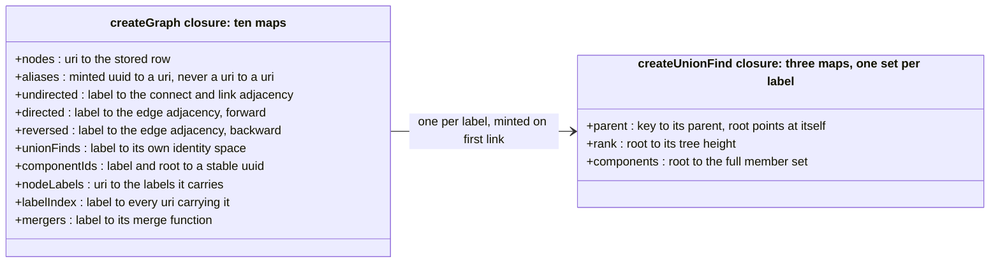
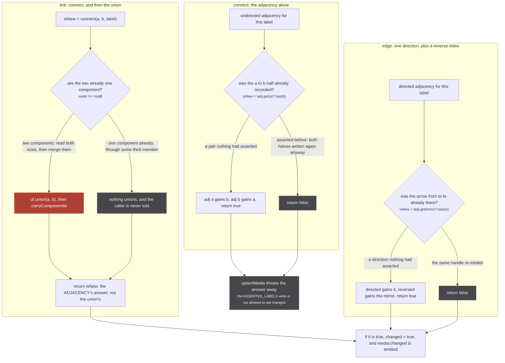
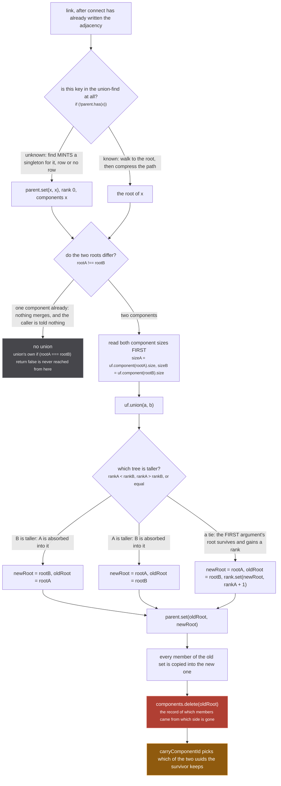
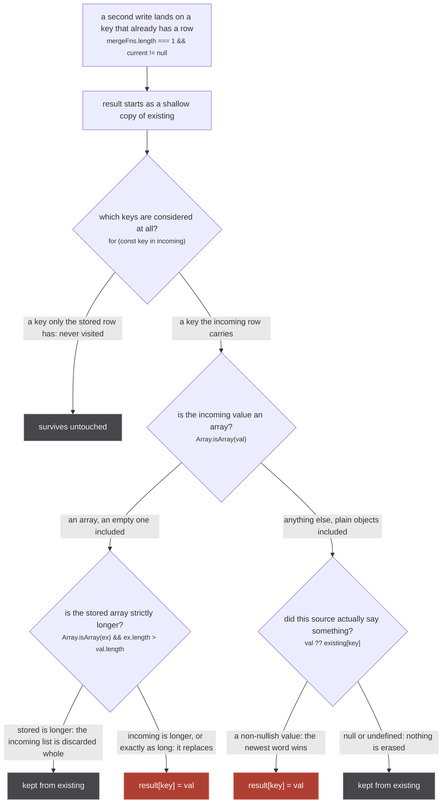

`src/worker/store/graph.ts` is 401 lines and knows nothing about anime. No media, no episodes, no
scopes, no origins, no uris: it is generic over `T`, its keys are strings, and every rule this site
describes is imposed on top of it by `src/worker/store/db.ts`. There is exactly one instance,
`export const graph = createGraph<Media | Episode>()` at `db.ts:82`, and one label registry, written
twice at module load (`db.ts:85-86`).

The file holds two closures. `createUnionFind` (`graph.ts:56-121`) is the identity half: it can merge
two sets and cannot split them. `createGraph` (`graph.ts:123-383`) is everything else: rows, labels,
aliases, two kinds of adjacency, and one union-find per label created on demand.

## What it holds



*Nothing in either closure is keyed by origin, scope or relation. Those live entirely in `db.ts`, which chooses a label per claim and hands strings down.*

The maps are declared at `graph.ts:124-141` and the union-find's three at `graph.ts:57-59`. Only three
labels ever get a `UnionFind`, because only three labels are ever passed to `link`: `media:same_as`
and `container:same_as` from `upsertMedia` (`db.ts:193`, through `sameAsLabelFor`) and
`episode:same_as` from `upsertEpisodes` (`db.ts:410`). Four labels reach `directed` (`media:part_of`,
`episode:part_of`, `has_episode`, `asserted:media_part_of`), five reach `undirected` (the three
same-as labels, plus `asserted:media_same_as` and `asserted:container_same_as` written by `connect`),
and exactly two node labels are ever registered: `media` and `episode`.

:::note
**One correction to the page brief.** The inventory calls this figure "the eleven internal maps". The
code has **ten** in `createGraph` (`graph.ts:124-141`), plus **three** inside each `createUnionFind`
(`graph.ts:57-59`), and there is one of those per label. The eleventh thing at that site is
`componentKey` (`graph.ts:137`), which is a key-building function rather than a map.
:::

`aliases` carries the whole page's sharpest invariant, and it is written as a comment above the map
it protects:

`src/worker/store/graph.ts:133-135`

> `${label}\u0000${root}` -> uuid. The alias table only ever receives these uuids as keys, never a
> uri: `has` and `get` fall through aliases, so a uri alias would make `upsertMedia`'s novelty test
> and its pendingClaims gate report a row that was never stored.

Read that against the three accessors it describes, `graph.ts:217-227`:

```ts
function get(key) { return nodes.get(key) ?? nodes.get(aliases.get(key)!) }
function has(key) { return nodes.has(key) || aliases.has(key) }
function resolve(key) { return aliases.get(key) ?? key }
```

`upsertMedia`'s `isNew = !graph.has(media.uri)` (`db.ts:141`) and its description gate
`!graph.has(uri)` (`db.ts:179`) both run through that alias-aware `has`. Alias one uri to another and
both would answer yes for a row that was never written, which turns off the placeholder gate and the
`pendingClaims` wait in one stroke. The only two writes into `aliases` are `graph.ts:241` and
`graph.ts:261-262`, and both write a `crypto.randomUUID()`. `Graph.alias` is exported on the type
(`graph.ts:25`) and is called from nowhere in `src/`.

## Three ways to record a pair, three different meanings of "new"

`connect`, `link` and `edge` all return a boolean that reads as "was this new", and each of the three
means something different by it.



*One rose node in three primitives. The other two write only what a later reader could delete again.*

`connect` is `graph.ts:265-273`, `link` is `graph.ts:279-291`, `edge` is `graph.ts:297-306`. The doc
comment on `connect` says why a graph needs both it and `link`:

`src/worker/store/graph.ts:28-33`

> Write the undirected adjacency of `label` without unioning anything, and say whether the pair is
> new. What `link` does minus the union-find half: an adjacency records WHO said what about which
> pair, where a union-find records only the component and can never be asked what it would hold with
> one node removed.

`edge` reporting novelty at all is a fix with a bug behind it:

`src/worker/store/graph.ts:293-296`

> Returns whether the edge is NEW, the same contract `link` above has. A caller that re-asserts an
> edge it already made needs to know nothing changed: `upsertMedia` used to set `changed = true` on
> every PART_OF whatever the state, so a source re-minting the same handle emitted `media:changed`
> forever and every listener re-read the store for a graph that had not moved.

### `link` reports the adjacency, not the union

This is the sentence to carry away from the figure. `link` opens with
`const isNew = connect(a, b, label)` at `graph.ts:280` and returns that value at `graph.ts:290`. The
union in between returns its own boolean and it is dropped on the floor.

So take `anilist:108465`, `mal:39535` and `anidb:14758`, all three already welded into one cluster
because anilist claimed each of the other two. A fourth pass in which mal claims anidb directly is a
pair the adjacency has never seen: `connect` answers `true`, `rootA === rootB` so `union` answers
`false` and nothing merges, and `link` returns `true`. `db.ts:193` sets `changed = true`,
`media:changed` fires, and every subscribed page re-reads a cluster that did not grow.

That is the conservative direction and it is the right one: something new really was recorded, and it
is the adjacency that `exportStore` walks (`export.ts:54` and `:75`), so a pass that only added an
assertion still changed what an export would produce. The cost is one extra read cycle. The opposite
error, staying silent on a real change, is what
`tests/unit/worker/store/edge-idempotence.test.ts` exists to keep from happening in the other
direction.

`tests/unit/worker/store/graph.test.ts:39-51` pins the difference between the two primitives with a
control in the test itself: after `connect('a', 'b', 'L')` the cluster of `a` is `['a']`, and after
`link('a', 'b', 'L')` on the same pair it is `['a', 'b']`.

## The union, and the line that destroys information



*Textbook union by rank, and one line of it is the reason every other page on this site is careful.*

`link` is `graph.ts:279-291`, `union` is `graph.ts:82-105`, `find` is `graph.ts:69-80`, and `ensure`
is `graph.ts:61-67`. `link` tests `rootA !== rootB` itself at `graph.ts:284` before calling `union`,
and it is the only caller: `createUnionFind` and `.union(` appear nowhere else in `src/` or `tests/`.
So `union`'s own `if (rootA === rootB) return false` at `graph.ts:85` is a second guard that nothing
in the app can reach. Three more things on that figure decide behaviour elsewhere.

**`find` mutates.** It calls `ensure(x)` on the way in, so asking the union-find about a key it has
never seen *creates* a singleton component for that key. `link` calls `find` twice
(`graph.ts:282-283`), which means **`link` will happily add a uri that has no stored row.**
`upsertMedia` never lets that happen: its description gate at `db.ts:179-183` holds the claim in
`pendingClaims` until a row lands. `upsertEpisodes` has no such gate (`db.ts:410`), so an episode
handle naming a uri nobody stored puts a permanent member into the episode identity space that
`graph.cluster` then skips forever, because `cluster` pushes only members with a row
(`graph.ts:321-324`). Invisible, and never collected.

Two functions deliberately do not mint. `component(x)` opens with
`if (!parent.has(x)) return emptySet` (`graph.ts:108`), and `root(key, label)` is guarded as
`uf?.has(key) ? uf.find(key) : key` (`graph.ts:231`). Both read without creating, which is what lets
a read path ask about a uri that was never linked without changing the store.

**The sizes are read before the union, not after.** `graph.ts:285-286` calls
`uf.component(rootA).size` and `uf.component(rootB).size` while both sets still exist. After
`components.delete(oldRoot)` at `graph.ts:103` one of them is gone, so a `carryComponentId` that
measured afterwards would be measuring one set twice.

**A rank tie makes argument order matter.** `graph.ts:95-98`: when the ranks are equal the *first*
argument's root survives. Nothing user-facing may depend on that, which is exactly why the component
id is decided by a different rule, below.

:::danger
**`components.delete(oldRoot)` at `graph.ts:103` is the point of no return.** After it, nothing can
ask what this component would hold with one node removed, because the record of which members arrived
from which side no longer exists.

The whole `UnionFind` surface is declared at `graph.ts:10-16`: `has`, `find`, `union`, `component`,
`allComponents`. Five functions, and the returned object at `graph.ts:120` is exactly those five.
There is no split, no unlink, no disunion, no undo, anywhere in the repo. Once `link` runs on a pair,
the two clusters are one for the life of the worker, and the only reset is `graph.clear()`
(`graph.ts:363-375`) through `resetStore` (`db.ts:509-513`), which empties everything and is tests
only:

`src/worker/store/db.ts:506-507`

> Not exported through ./index.ts, and never called by the app: a live reset would drop every cluster
> mid-session with no way to rebuild them short of re-asking every source.

This is the reason `db.ts` pays for a second, redundant data structure. `ASSERTED_LABELS`
(`db.ts:66-70`) records every pair a source claimed, in `connect` and `edge` only, so the question
the union-find cannot answer has somewhere else to go:

`src/worker/store/db.ts:59-64`

> Two properties the identity labels above cannot supply, and the export needs both. `graph.link`
> carries the same label whether the pair came from a handle or from `linkSameMediaPairs`, so a
> cluster cannot say which of its unions a source actually asserted; and a union-find cannot answer
> "what would this component be with that node removed", which is exactly what excluding a plugin or
> the offline origin asks. An adjacency answers both, and unions nothing, so nothing downstream of
> the store sees these labels at all.

`exportStore` is the reader: it BFS-walks `graph.neighbours(uri, ASSERTED_LABELS.RUN)`
(`export.ts:54`) rather than calling `graph.cluster`, which is the only way to reconstruct what a
cluster would be without a given origin in it.
:::

## The component id, and why it is not the union-find's root

`componentId(key, label)` (`graph.ts:234-244`) is a lookup that writes. On the first call for a
component it mints a uuid, files it under `${label}\u0000${root}`, and aliases the uuid to the root so
`resolve(id)` finds the cluster again. Its contract is on the type:

`src/worker/store/graph.ts:39-44`

> A stable id for the component `key` belongs to under `label`: minted once per component, carried
> across unions (the survivor keeps its id; when both sides had one the larger component's wins, ties
> to the lexicographically smaller root, and the other id becomes an alias of the survivor), and
> dropped by `clear`. Every id is aliased to its component so `resolve(id)` finds the cluster.

Its only caller in `src/` is `clusterId` at `src/worker/store/aggregate.ts:293-294`, reached from
`aggregateMedia` on every page render. That makes it one of the two dashed edges on this site: a read
that writes. What it is keyed on is the point:

`src/worker/store/aggregate.ts:290-292`

> Keyed on the union-find ROOT of the cluster's identity space, never on a member: the smallest uri
> moved whenever a member sorting before it landed, and the container cut in `findAllAggregatedMedia`
> handed the same cluster a second id. Any member maps to the same root.

`carryComponentId` (`graph.ts:249-263`) is what keeps it stable across a union, and it refuses to use
the union-find's own answer:

`src/worker/store/graph.ts:246-248`

> Which id survives a union is decided here by SIZE and then by the smaller root, never by the
> union-find's own choice of root: that one follows rank and argument order, so an id that followed it
> would change with the order two sources happen to land in.

```ts
const kept = idA && idB
  ? (sizeA > sizeB || (sizeA === sizeB && rootA < rootB) ? idA : idB)
  : (idA ?? idB)!
```

Three behaviours worth naming, all pinned by `tests/unit/worker/store/stable-id.test.ts`:

- **Neither side ever had an id: nothing to carry.** `if (!idA && !idB) return` (`graph.ts:256`). The
  ids are minted lazily, so most unions in a cold worker carry nothing at all.
- **The losing uuid is never deleted.** `graph.ts:262` aliases it to the survivor too, so a client
  still holding the old `_id` keeps resolving. `stable-id.test.ts:63-81` asserts both ids find both
  rows after the merge, and that the retired one resolves to the survivor's current root rather than
  the root it was minted under.
- **Size beats claim order, in both directions.** `stable-id.test.ts:86-129` runs the same union with
  the arguments swapped and asserts the same id survives each time: a three-member component keeps its
  id over a two-member one, a pair keeps its id over a singleton, and two singletons tie to the
  lexicographically smaller root (`anilist:1` over `mal:2`) whichever side claimed.

:::caution
**A minted id is a one-way door, not an irreversible one.** The uuid never changes for the life of a
component and never moves to a different one, but nothing is destroyed: the retired id is kept as a
second alias. The only thing that drops a component id is `clear()`.
:::

## The merge: `lastWriteLongestArray`

`graph.set` (`graph.ts:155-191`) looks up the merge function registered for the node's effective
labels and applies it only when a row already exists (`graph.ts:170-173`). Both labels the store
registers carry the same one (`db.ts:85-86`), thirteen lines at `graph.ts:388-400`, described by its
own doc comment as *"Merge strategy: scalars last-write-wins, arrays longest-wins."*



*Two rose nodes, and both of them are a source's row overwriting another source's row with no copy kept.*

Read the four branches as rules:

1. **A scalar is monotonic toward "something".** `result[key] = val ?? existing[key]`
   (`graph.ts:396`). An incoming `null` never erases a stored value, so a source that wants to correct
   `episodeCount: 13` back to unknown cannot. Pinned at `graph.test.ts:21-24` for both `null` and
   `undefined`.
2. **An array is replaced unless the stored one is strictly longer.** `ex.length > val.length ? ex : val`
   (`graph.ts:394`), so **a tie goes to the incoming array** and a shorter, corrected list is
   discarded whole. `graph.test.ts:9-19` pins all three cases, including the one that matters:
   *"equal non-zero lengths take the incoming"*.
3. **A plain object falls in the scalar branch**, because only `Array.isArray` is tested. So
   `nextAiringEpisode` and `franchise` are replaced whole, never merged field by field.
4. **Only keys present in `incoming` are visited** (`for (const key in incoming)` at `graph.ts:390`).
   That is safe only because `normalizeToStoreMedia` emits every key on every row. A partial row fed
   in from anywhere else would silently keep stale fields alive.

The reason this function is pinned at all is on the first line of its test file:

`tests/unit/worker/store/graph.test.ts:1-3`

> The seed's whole safety argument rests on `lastWriteLongestArray`: a seed handle node carries no
> arrays and no scalars beyond identity and url, so it can never win a field against a live row. That
> function was unpinned until this file.

:::danger
**Rule 2 has already cost real data, and the measurement is in the code.** A handle node is written
back to the store as a row, so a caller that selects a partial version of an array hands the store a
list of the same length as the one already there, and the tie goes to the newcomer.

`src/worker/similar-document.ts:26-29`

> The titles are selected WHOLE. A caller that attaches the answer as a handle writes the node back to
> the store as a row, where an array of equal length replaces the one it finds, so titles selected as
> `{ title }` alone cost crunchyroll's rows their language and score (2026-09-05). Every field of
> `MediaTitle` is here so that row is complete whoever writes it.

The same day is recorded from the calling side at `src/sources/anilist/extractor.ts:247-249`: *"its
titles, one field each, replaced crunchyroll's own of equal length, language and score gone"*. The
whole document, and why every array in it is selected whole, is on
[the document](/similar/document/).

There is no per-source layer under this, no provenance on a field, and no way to ask what a given
origin said. `aggregateMedia` reads merged rows and has never seen anything else. There is also no
`delete` on `Graph`: a node, once `set`, exists until `clear()`.
:::

### The one `throw` in the write path

`graph.set` can throw, and this is the only place in the store that does:

```ts
if (mergeFns.length > 1) {
  throw new Error(`Node "${key}" has multiple labels with merge functions: cannot resolve which to use`)
}
```

`graph.ts:166-168`. Both registered labels carry a merge function, so the way to reach it is to store
one uri under both `media` and `episode`. The blast radius is the whole DataLoader batch: up to 250
medias flushed together (`src/worker/extractor.ts:129-134`), all of them lost, which is why this
refusal is drawn differently from every other one on
[reading these diagrams](/start/reading-the-diagrams/#four-ways-to-say-no-drawn-four-different-ways).

## What the read side gets back

`cluster(start, label)` (`graph.ts:316-330`) has two branches and one filter worth knowing. When the
union-find has the key it walks the whole component; when it does not, the result is the single row
for `start`, or an empty array when there is no row. Either way it pushes only members that have a
row, so a phantom member added by a `link` on an unstored uri is invisible here and everywhere
downstream.

`clusters(label, nodeLabel?, uris?)` (`graph.ts:332-361`) picks its seeds three ways, at
`graph.ts:337-339`: an explicit `uris` list mapped through `resolve`, else every uri carrying a node
label, else every key in `nodes`. It dedupes by root, and drops any group whose members all lack rows
(`if (group.length > 0)` at `graph.ts:357`). `db.ts:376-379` calls it twice, once per media identity
space.

The rest of the read surface is thin and each function has exactly one interesting caller:

| primitive | `graph.ts` | who reads it, and for what |
| --- | --- | --- |
| `labeled(label)` | `:213-215` | `db.ts:261` refuses a uri that is not a media row; `export.ts:34-35` seeds the export |
| `neighbours(key, label)` | `:275-277` | `export.ts:54` and `:75`, walking the asserted adjacency instead of the cluster |
| `targets(key, label)` | `:308-310` | `db.ts:281` for `PART_OF`, `db.ts:436` for `HAS_EPISODE` |
| `sources(key, label)` | `:312-314` | `db.ts:307`, the reverse index, which is the only reason `findRunsOfContainer` can exist |
| `resolve(key)` | `:227` | `db.ts:258`, turning a client's `_id` back into a uri |

## Surface that nothing in `src/` calls

Four exports are declared, implemented and unreached by the app. Worth knowing before assuming a
behaviour is load bearing:

- **`setLabel`** (`graph.ts:202-211`). No caller anywhere in `src/`; the only use in the repo is
  `tests/store.ts:138`. Its refusal is `if (!nodes.has(key)) return`, which is the raw `nodes.has`
  rather than the alias-aware `has`, so a minted uuid can never be given a label.
- **`alias`** (`graph.ts:225`). Exported on the type and never called from outside the module.
- **`root`** (`graph.ts:229-232`). Used internally by `componentId` and, outside it, only by
  `stable-id.test.ts:80` and `:135-136`.
- **`UnionFind.allComponents`** (`graph.ts:112-114`). Declared at `graph.ts:15`, returned at
  `graph.ts:120`, and called nowhere in `src/` or `tests/`.

## `clear`, and the one thing it deliberately does not clear

`graph.ts:363-375` empties eight maps outright (`nodes`, `aliases`, `undirected`, `directed`,
`reversed`, `unionFinds`, `componentIds`, `nodeLabels`), then empties the contents of `labelIndex`
without dropping its keys, and leaves `mergers` alone:

`src/worker/store/graph.ts:372-373`

> the LABELS survive, because `registerLabel` runs once at module load in ./db.ts and a cleared
> registry would silently drop the merge functions that `set` looks up. Only their contents go.

That is a real trap avoided. `registerLabel` (`graph.ts:193-200`) is called exactly twice, at
`db.ts:85-86`, at module load. A `clear()` that dropped `mergers` would leave every subsequent
`graph.set` writing rows with no merge at all, so the second write for a uri would replace the first
outright rather than merging into it, and every test after the first `resetStore` would be measuring a
different store from the one the app runs.

One last asymmetry: origins are not in the graph. `originMap` is a plain `Map<string, Origin>`
(`db.ts:83`), and `upsertOrigins` applies `lastWriteLongestArray` to it by hand at `db.ts:515-518`.
Same merge, no labels, no identity space, and `resetStore` clears it separately.

## Where to go next

- what actually calls these primitives, and the three phases around them:
  [upsertMedia](/write/upsert-media/)
- the same primitives with none of the guards, and the phantom members that follow:
  [upsertEpisodes](/write/upsert-episodes/)
- which label a claim is routed into, and why two scopes never share one:
  [scopes and relations](/write/scopes-and-relations/)
- why a claim waits for a row before it may reach `link`: [claims that wait](/write/pending-claims/)
- what a `changed` return value wakes up: [events, and the re-read loop](/write/events/)
- the adjacency `ASSERTED_LABELS` keeps, and the walk that reads it: [exporting](/read/export/)
