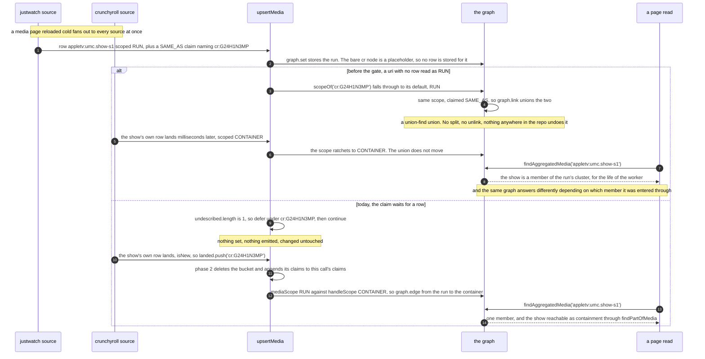
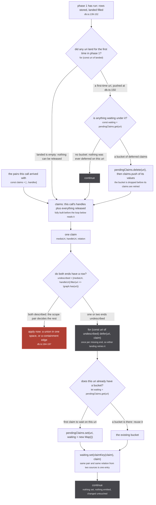
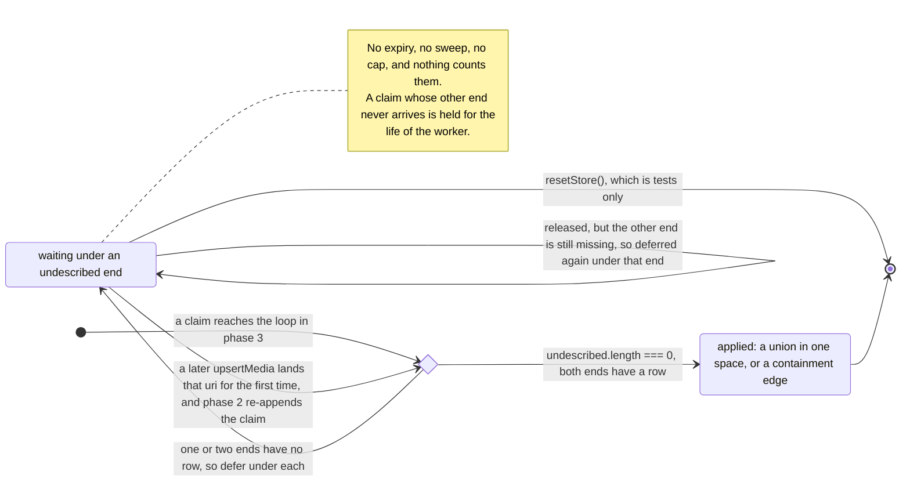

A handle pair arrives with two uris and a relation. `upsertMedia` decides what to do with it by
reading the **scope** of both ends, and a uri that has no row has no scope to read. The store used to
answer `RUN` for it, which is the default, and that default put a show inside a season's cluster on
the live site.

The fix is eighteen lines in four places. A claim whose ends are not both described is not applied and
not dropped: it is parked under each missing uri, and applied by whichever later call stores the row
it was waiting for.

```ts
const pendingClaims = new Map<string, Map<string, Claim>>()   // db.ts:124

const defer = (uri: string, claim: Claim) => {                 // db.ts:126-130
  let waiting = pendingClaims.get(uri)
  if (!waiting) pendingClaims.set(uri, waiting = new Map())
  waiting.set(claimKey(claim), claim)
}
```

Outer key is the uri that is missing. Inner key is the claim itself, through `claimKey`
(`src/worker/store/db.ts:111`):

```ts
const claimKey = ({ mediaUri, handleUri, relation }: Claim) => `${mediaUri}\0${handleUri}\0${relation ?? 'SAME_AS'}`
```

The relation is folded through `?? 'SAME_AS'` in the key too, so a claim carrying
`relation: undefined` and one carrying `relation: 'SAME_AS'` are one entry, not two.

## The race it fixes



*The two lanes differ in one thing only: whether a claim is allowed to be read before the store knows what its ends are.*

The comment on the map is the account of that, and it is worth reading whole:

`src/worker/store/db.ts:113-123`

> Claims naming a uri no row describes yet, keyed by that uri and deduped on the claim.
>
> The relation is derived from BOTH scopes, and a uri with no row has none. It used to read as RUN,
> which let a run union with a show whose own row was still in flight: a media page reloaded cold
> fans out to every source at once, each answers with the aggregated uri's siblings rebuilt as bare
> SAME_AS nodes, and whichever landed first decided. A RUN row for `cr:G24H1N3MP` minted by justwatch
> milliseconds before crunchyroll said CONTAINER was a RUN x RUN union, the CONTAINER that followed
> flipped the scope and not the union, and the same graph then answered differently depending on
> which member it was entered through.
> A claim now waits for the row and is applied when it lands.

Three details in that paragraph decide the shape of the mechanism.

**Every source rebuilds the siblings, so every source makes this claim.** Open
`ag:(cr:G24H1N3MP,tvmaze:52279)` and each source that answers calls `buildHandlesFromUri`
(`src/sources/utils.ts:465-471`), which mints `sameAs(makeMedia({ origin, id }))` for every sibling
except its own. Those nodes carry an origin, an id and nothing else, so the placeholder gate at
`db.ts:140` refuses to store them. The claim they ride on is therefore about a uri with no row, by
construction, on every cold load of every aggregated uri.

**The window is milliseconds and it is not avoidable by ordering.** The `mediaInserter` DataLoader
batches on a 50ms timer (`src/worker/extractor.ts:106-134`), and every source's yoga is subscribed at
once by `proxyRequestToExtractors`. Which batch flushes first is a race between upstream APIs.

**The wrong outcome has no inverse and the right one does.** A missing edge is recoverable on the next
read. A union is not.

:::danger
The operation this whole page exists to delay is `graph.link` at `db.ts:193`. It is a union-find
union (`src/worker/store/graph.ts:279-291`), and its `union` ends with `components.delete(oldRoot)`
at `graph.ts:103`, which destroys the record of which members came from which side. The whole
`UnionFind` surface is `has`, `find`, `union`, `component`, `allComponents` (`graph.ts:10-16`). There
is no split, no unlink and no disunion anywhere in the repo.

`src/worker/store/db.ts:7-13`

> Two identity spaces, one per scope. A run's SAME_AS unions in the first, a container's in the
> second, and nothing ever unions across them: a show-level id entering a run's cluster is what
> welded Mushoku Tensei season 1 to season 3 on the live site (the bare crunchyroll series id and the
> bare tvmaze show id were fuzzy merged into season 1's cluster on the search path, and season 3's
> media path then asserted sameness through one of them; `graph.link` is a union-find with no
> inverse).

Deferring a claim costs one map entry and a later retry. Applying it early costs a cluster, until the
worker restarts.
:::

### What the gate does and does not close

Read `scopeOf` next to it, `db.ts:91-92`:

```ts
const scopeOf = (uri: string): MediaScope =>
  SHOW_LEVEL_ORIGINS.has(originOf(uri)) ? 'CONTAINER' : (graph.get(uri) as Media | undefined)?.scope ?? 'RUN'
```

The `?? 'RUN'` default is still there. It was never removed, and it is not defensive:

`src/worker/store/db.ts:88-90`

> The backstop first, then the stored row, then RUN, which is the default the schema gives an absent
> `scope`. A uri with NO row never reaches a union or an edge: `upsertMedia` holds its claims until a
> row lands, so the default here only ever reads a stored row that said nothing.

That is the contract in one sentence. `scopeOf` is allowed to be simple **because** the description
gate guarantees it is never asked about a uri the store has never seen.

**One correction to the page brief.** It reads the race as one `pendingClaims` closes on its own. The
code is narrower. `pendingClaims` closes the window where a claim names a uri with **no row at all**. It does not stop a source from minting a described RUN row for an
id that names a show, because a described row lands immediately and the claim is applied at once. What
stops that on the JustWatch path today is upstream, in the source: `providerContentId` refuses a
crunchyroll id outright and the offer is demoted (`src/sources/justwatch/extractor.ts:386-391`), and
`partOf` (`src/sources/utils.ts:40`) stamps `scope: 'CONTAINER'` on the node it copies, which turns the
claim into a cross-scope pair and therefore an edge. The wait and the stamp are two different guards
against the same weld, and the source-side one is what covers a described row.

## Defer and flush



*The only node on this figure that touches an identity space is the one both branches above it exist to keep a pair away from. Everything else is bookkeeping in a Map.*

The flush is `db.ts:154-160`, six lines that run between the rows loop and the claims loop:

```ts
const claims = [...handles]
for (const uri of landed) {
  const waiting = pendingClaims.get(uri)
  if (!waiting) continue
  pendingClaims.delete(uri)
  claims.push(...waiting.values())
}
```

The deferral is `db.ts:179-183`, the first thing the claims loop does:

```ts
const undescribed = [mediaUri, handleUri].filter(uri => !graph.has(uri))
if (undescribed.length) {
  for (const uri of undescribed) defer(uri, claim)
  continue
}
```

Five mechanics that a reader gets wrong on a skim, all of them decided by those twelve lines.

**The claim is stored once per missing end.** `undescribed` can hold one uri or two. When both ends
are missing, the same claim object is written into two buckets under the same `claimKey`, so
**whichever end lands first releases it**. It is then re-checked, and if the other end is still
missing it is deferred again, under that end only.

**The flush is keyed on `landed`, which holds first-time uris only** (`db.ts:148-151`, pushed inside
`if (isNew)`). A row that merely merged into an existing one releases nothing. That is not a gap: a
claim is only ever deferred when `!graph.has(uri)`, so nothing can be waiting for a uri that already
had a row.

**`claims` is fully built before phase 3 iterates it.** A claim deferred *during* the claims loop is
not retried in the same call, and cannot be: rows land in phase 1 only, so nothing new can become
describable while the loop runs. The earliest a deferred claim is applied is the next `upsertMedia`
call that lands the row it waits on.

**The bucket is deleted before its claims are retried.** `pendingClaims.delete(uri)` at `db.ts:158`
happens while the claims are being appended, not after they succeed. A released claim whose other end
is still undescribed is re-deferred by the loop below, so nothing is lost, but the record is rebuilt
rather than kept.

**`graph.has` is the alias-aware one** (`src/worker/store/graph.ts:221-223`), which is exactly why the
alias table is allowed to hold only minted uuids:

`src/worker/store/graph.ts:133-135`

> `${label}\u0000${root}` -> uuid. The alias table only ever receives these uuids as keys, never a
> uri: `has` and `get` fall through aliases, so a uri alias would make `upsertMedia`'s novelty test
> and its pendingClaims gate report a row that was never stored.

Aliasing a uri would make this gate answer "described" for something with no row, which is the exact
state it exists to detect.

## Lifetime



*The only way out of `pending` in a running worker is the row landing. The other exit is `resetStore`, which the app never calls, and there is no third state where a claim gives up.*

`pendingClaims` is a module-level singleton, like the rest of the store. It is not scoped to a request,
a page, a fan-out or an origin, so a claim deferred while one page was reading is applied by whatever
call happens to land the row next, which may be a completely different page's insert of a completely
different source's answer.

It is unbounded. There is no cap on buckets, no cap on claims per bucket, no timestamp on an entry and
no sweep. The only thing that empties it is `resetStore` at `db.ts:509-513`, and that function is
tests only, for a stated reason:

`src/worker/store/db.ts:496-508`

> Empty the store. TESTS ONLY, and it exists for one kind of test.
>
> The store is a module singleton, so every test in a run shares it. [...]
>
> Not exported through ./index.ts, and never called by the app: a live reset would drop every cluster
> mid-session with no way to rebuild them short of re-asking every source.

Two properties follow, and they are worth stating plainly because neither is visible from outside.

**A stuck claim is silent.** Nothing logs a deferral, nothing counts the buckets and nothing exports
the map. Compare `src/worker/request-context.ts:75-76`, which keeps a `misses` counter next to a
policy that fails open precisely so the failure is observable. There is no equivalent here. The only
way to see a claim waiting is a debugger.

**Being stuck is the correct outcome, not a leak to be swept.** A claim naming a uri no source ever
describes is a claim about something the store has no evidence for. Dropping it after a timeout would
buy back a few map entries and reintroduce exactly the question the mechanism refuses to guess at. In
practice the map stays small anyway: a bucket exists only for a uri some source named and no source
described, and the claims inside it are deduped by `claimKey`, so a page re-asked twenty times over a
session adds nothing after the first ask.

## Who depends on this on purpose

Two subsystems are built on the wait rather than merely tolerating it.

**`resolveSimilarRuns` calls `upsertMedia` with no rows at all.** `src/worker/similar-consumer.ts:255`:

```ts
await upsertMedia([], [{ mediaUri: ask.runUri, handleUri: result.media.uri, relation: 'SAME_AS' }])
```

Phase 1 does nothing, `landed` is empty, and phase 3 normally finds `result.media.uri` undescribed and
defers. That is the design:

`src/worker/similar-consumer.ts:273-277`

> The claim goes through `upsertMedia` with no rows: the answer's own row lands through the answering
> extractor's insertion, the claim waits for it under `pendingClaims`, and a RUN x RUN union emits
> `media:changed`, which re-runs the page's read, whose re-ask of the newly named origin is how the
> answer's episodes reach the store. The container edge is never touched.

The consumer never polls and never retries. The row landing **is** the retry.

**The offline seed is built to be a placeholder, so every seeded handle waits.** Its handle nodes
carry identity and nothing else, deliberately:

`src/sources/offline/seed-source.ts:136-146`

> Identity and nothing else, which makes every seeded handle a PLACEHOLDER.
>
> Deliberate, and the whole reason the seed cannot damage a store. A placeholder is not stored
> (`IDENTITY_FIELDS` in store/db.ts), so its claim waits under `pendingClaims` and lands the moment
> the owning source describes that uri. Three things follow: the seed can win no field in either
> arrival order, because it writes no field; a url minted here would be the one scalar it could
> write, and scalars are last-write-wins, so a walk up to a day old would overwrite the live url; and
> a seeded id no live source knows never enters the cluster at all, so it never reaches an aggregated
> uri for the next source to re-assert SAME_AS across.

The same argument runs through the asset format itself (`src/sources/offline/seed.ts:64-72`, *Identity
and scope, and NO url*) and through the container claim, which refuses to use `partOf` because the
CONTAINER stamp would make the node describable and therefore stored
(`src/sources/offline/seed-source.ts:150-157`).

Read those two together and the mechanism stops being a guard and becomes a feature: **a claim that
waits lets a component assert a pair without also claiming to know what either end of it is.** The
seed knows that `anilist:108465` and `kitsu:42323` are the same run, the pair
`arrival-order.test.ts:76-87` walks. It does not know what either of them is, it says so by carrying
no field, and the store holds the claim until something that does know arrives.

## What it does not cover

The wait lives in `upsertMedia` and nowhere else.

- **`upsertEpisodes` has no description gate at all** (`db.ts:400-415`). `graph.link(episodeUri,
  handleUri, EPISODE_SAME_AS)` is called on whatever it is handed, and `uf.find` calls `ensure`
  (`graph.ts:61-67`), so the union-find gains a member for a uri that has no row. `graph.cluster`
  then skips it (`graph.ts:321-323` reads `nodes.get(key)` and pushes nothing when it is undefined),
  so the phantom member sits in the component permanently and invisibly. See
  [upsertEpisodes](/write/upsert-episodes/).
- **`linkSameMediaPairs` has no wait either** (`db.ts:216-224`). Its refusal is
  `if (scopeOf(uriA) === 'CONTAINER' || scopeOf(uriB) === 'CONTAINER') continue`, which demands
  NOT-CONTAINER, so a uri with no row reads `RUN` and passes. It is safe for a different reason: its
  only caller checks first. `fuzzy-merge.ts:648-650` reads both clusters out of the store and does
  `if (!clusterA.length || !clusterB.length) continue`, so a uri with no row never reaches the link.
  A second caller added without that check would not inherit this page's protection.

## The worked example, with real ids

`tests/unit/worker/store/arrival-order.test.ts` is this page in executable form, and its header states
the bug in the past tense:

`tests/unit/worker/store/arrival-order.test.ts:1-10`

> Arrival order used to decide whether a show entered a run's identity space. Every source answering a
> media page rebuilds the aggregated uri's siblings as BARE nodes (`buildHandlesFromUri` in
> sources/utils.ts: no url, no title, `makeMedia`'s default scope) and asserts SAME_AS to each, and
> the store read a uri with no row as RUN. So a run that landed before the show's own row unioned with
> a RUN row minted for the show, the CONTAINER that followed flipped the scope and not the union, and
> the same graph answered differently depending on which member it was entered through.
>
> A bare node is now a placeholder: not stored, and a claim naming it waits for a row that describes
> the uri.

`arrival-order.test.ts:58-73` is the live weld, and it is the case worth carrying away because two
claims wait on one uri at the same time.

1. `appletv:umc.show-s1` and `nf:80987039-3` are two different runs of one show. Both are inserted in
   the same call, and both rebuilt `ag:(cr:G24H1N3MP)` into a bare SAME_AS handle naming
   `cr:G24H1N3MP`.
2. Phase 1 stores both runs and skips both placeholder nodes. Phase 3 finds `cr:G24H1N3MP`
   undescribed twice, so the bucket under that uri holds **two** claims, one per run, distinct because
   their `mediaUri` differs.
3. Crunchyroll later inserts a described CONTAINER row for `cr:G24H1N3MP`. It is new, so it lands.
4. Phase 2 deletes the bucket and appends both claims. Phase 3 now reads RUN against CONTAINER for
   each of them, twice, and writes two containment edges.

The assertions are the whole argument: each run is still its own cluster, each still points at the
show, and `findAllAggregatedMedia()` answers `[['appletv:umc.show-s1'], ['cr:G24H1N3MP'],
['nf:80987039-3']]`, described in the test as *two run clusters, and the show hidden behind nothing*.

Applied a few milliseconds earlier, those same two claims would have been two RUN x RUN unions
through one shared uri, which is one cluster holding two seasons and one crunchyroll show, with no
inverse.

## Where to go next

- the function this runs inside, phase by phase: [upsertMedia](/write/upsert-media/)
- what the two scopes decide once both ends are described, and the 2x2 that follows:
  [scopes and relations](/write/scopes-and-relations/)
- where the bare sibling nodes come from, and the subtree cut that runs before any of this:
  [from an answer to a row](/write/answer-to-row/)
- `graph.link`, `graph.edge` and the union-find with no inverse: [the graph](/write/graph/)
- the same job for episodes, with none of these guards: [upsertEpisodes](/write/upsert-episodes/)
- why a show and a season are different things in this store at all:
  [a run is not a show](/start/run-and-show/)
