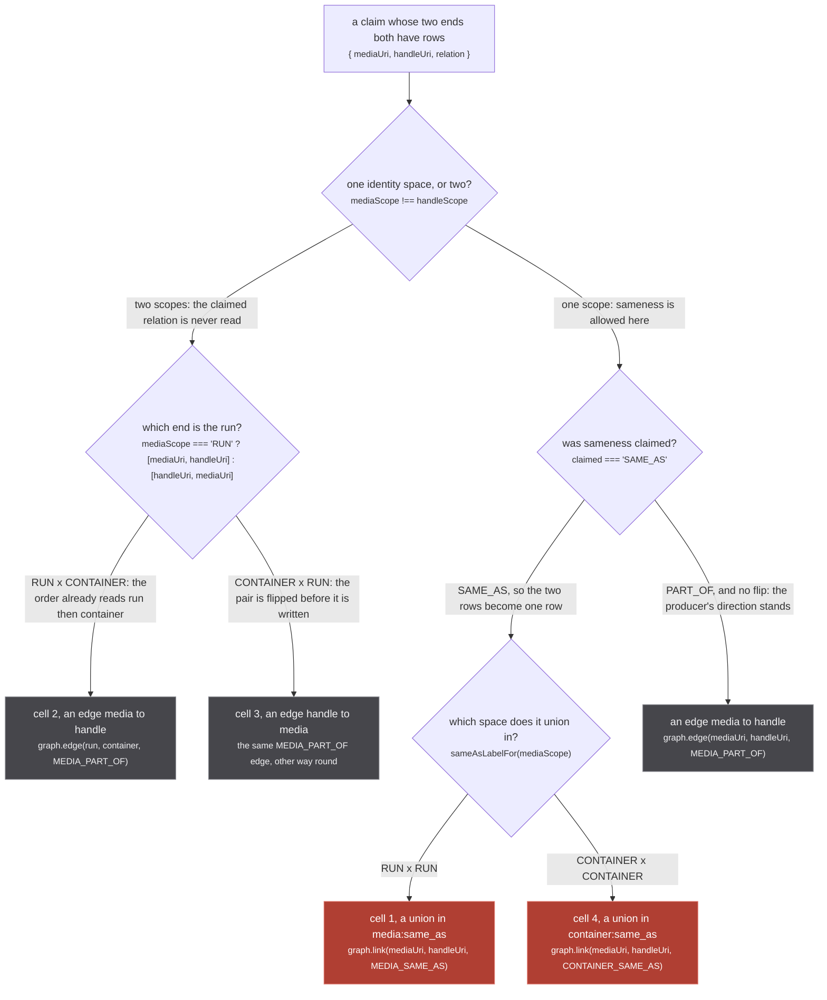
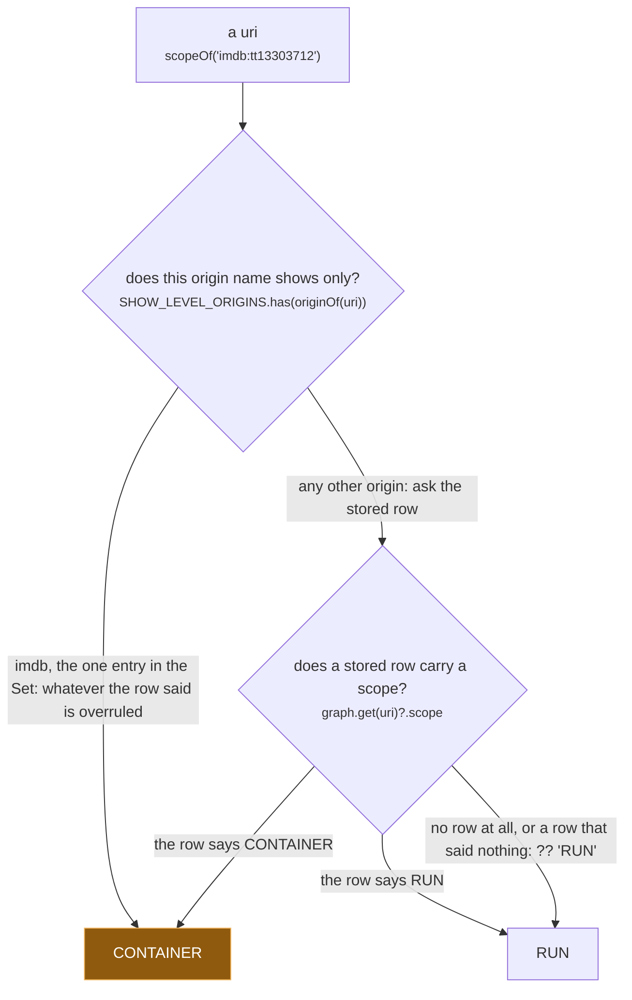
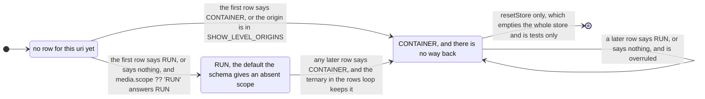
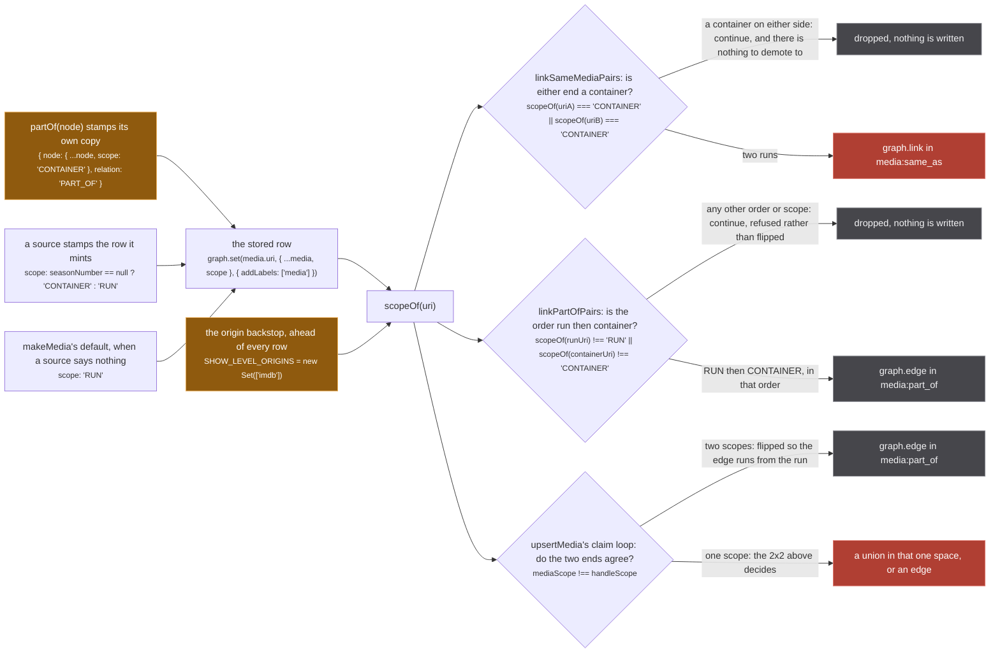

A source hands over a claim: this media, that handle, and one of two relations. The store does not
apply it. It reads the **scope** of each end, and the pair of scopes decides what the claim is allowed
to become. In two of the four combinations the relation the source asked for is not read at all.

The whole rule is written out in the comment above the loop that implements it, `src/worker/store/db.ts:162-176`:

> The rows loop above runs first, so every handle node that describes itself has a stored row when
> the pairs are read (worker/extractor.ts unwraps every handle node into the rows list). The
> relation is DERIVED from the two scopes and the claim:
>
>     RUN x RUN                claimed SAME_AS unions in the run space, PART_OF is an edge
>     RUN x CONTAINER          an edge media -> handle, whatever was claimed
>     CONTAINER x RUN          an edge handle -> media: the edge always runs from run to container
>     CONTAINER x CONTAINER    claimed SAME_AS unions in the container space, PART_OF is an edge
>
> Guesses go on edges, which are deletable; only asserted sameness within one scope goes on a union.
>
> Each applied claim is also recorded in ASSERTED_LABELS, and those writes' return values are
> DISCARDED: `changed` stays driven by the real labels alone. Feeding it an asserted write would put
> every listener back in the re-read loop tests/unit/worker/store/edge-idempotence.test.ts exists to
> stop, since the two records can go new at different times.

## The 2x2, as a figure



*Two rose cells and three grey ones, and the claimed relation is read on exactly one of the two paths: cross-scope, it is ignored entirely.*

The code is `db.ts:184-197`. `claimed = relation ?? 'SAME_AS'` at `db.ts:184`, so an absent relation is a
claim of sameness, not a claim of nothing. The two scopes are read at `db.ts:185-186`, the cross-scope
flip is `db.ts:188`, the cross-scope edge is `db.ts:190`, the union is `db.ts:193`, and the same-scope
`PART_OF` edge is `db.ts:196`.

**The comment names four rows and the code has three branches, and both are right.** The table is
indexed by the pair of scopes; the `if/else if/else` is indexed by what has to happen. Cross-scope is
one branch because the two cross-scope rows differ only in argument order, and the two same-scope rows
share their `PART_OF` half, which is why the figure above has five terminal nodes rather than four:
four cells times two claimed relations is six outcomes, and `graph.edge(mediaUri, handleUri, MEDIA_PART_OF)`
is the same write for a `RUN x RUN` `PART_OF` and a `CONTAINER x CONTAINER` one.

Each applied claim is written twice. `ASSERTED_LABELS.PART_OF` at `db.ts:189` and `db.ts:195`, and
`ASSERTED_LABELS.RUN` or `ASSERTED_LABELS.CONTAINER` through `graph.connect` at `db.ts:192`, are a
second, adjacency-only record whose only reader is `./export.ts`. Those three writes' return values are
discarded on purpose, so a re-asserted pair cannot set `changed` and cannot wake every subscribed page.

:::danger
**Cell 1 and cell 4 have no inverse.** `graph.link` (`src/worker/store/graph.ts:279-291`) is a
union-find union: it reads both roots, and when they differ it calls `uf.union(a, b)`, which ends with
`components.delete(oldRoot)` (`graph.ts:103`) and destroys the record of which members came from which
side. The whole `UnionFind` surface is `has`, `find`, `union`, `component` and `allComponents`
(`graph.ts:10-16`). There is no split, no unlink, no disunion anywhere in the repo, so once cell 1 or
cell 4 runs on a pair, those two clusters are one cluster for the life of the worker. The only reset is
`resetStore()` at `db.ts:509-513`, which empties the whole store and is tests only.

The schema says the same thing to the source that is about to mint the relation,
`src/worker/resolvers/media/schema.gql:80-85`:

> The handle names THIS run. The only relation that unions clusters, in `upsertMedia`, and the union
> has NO INVERSE: once two media are welded they stay welded for the session.
>
> Minting this for an id that names a SHOW is the single most expensive mistake available here. It
> merged three Mushoku Tensei seasons, four Demon Slayer films and fifteen Dragon Ball Z films, each
> time because one id was the only thing a source could offer and the only relation was this one.
:::

Cells 2 and 3 are the answer to that. `schema.gql:89-95`:

> This media is one PART of what the handle names: a run of that show, a film published under that
> series, a season of that title.
>
> It carries the handle's url WITHOUT claiming to be it, so a show-level id is worth keeping instead
> of being dropped. It never unions, so no number of these can weld two runs together. What it costs
> is that nothing may read episodes, titles, covers or any other metadata across it: the thing on the
> other end is a bigger thing, and its episode list is every run's at once.

### The four cells with real ids

`tests/unit/worker/store/container-scope.test.ts` pins one case per cell, with the ids the failure
actually happened on. `cr:G24H1N3MP` is the bare Crunchyroll series id, which is a CONTAINER;
`anilist:108465` and `anilist:178789` are two runs of it; `tvmaze:52279` is another show-level row.

| cell | the claim | what lands | test |
| --- | --- | --- | --- |
| RUN x CONTAINER | `anilist:108465` says SAME_AS `cr:G24H1N3MP` | an edge; the run's cluster stays `['anilist:108465']` and the link survives as containment | `:28-37` |
| CONTAINER x RUN | `cr:G24H1N3MP` says SAME_AS `anilist:108465` | the same edge, flipped, so it runs from `anilist:108465` to `cr:G24H1N3MP` | `:41-56` |
| CONTAINER x CONTAINER | `cr:G24H1N3MP` says SAME_AS `tvmaze:52279` | a union in `container:same_as`; `anilist:108465` sees none of it | `:59-75` |
| RUN x RUN | `anilist:108465` says SAME_AS `kitsu:42323` | a union in `media:same_as`, and the control that proves the change is not "stop unioning" | `:129-137` |

The last row is doing work the other three cannot. `tests/unit/worker/store/container-scope.test.ts:128`
says why: *THE CONTROLS: without these the change is indistinguishable from "stop unioning at all"*.

## `scopeOf`, the three-step ladder

Every decision above rests on one function, `src/worker/store/db.ts:91-92`:

```ts
const scopeOf = (uri: string): MediaScope =>
  SHOW_LEVEL_ORIGINS.has(originOf(uri)) ? 'CONTAINER' : (graph.get(uri) as Media | undefined)?.scope ?? 'RUN'
```



*Three steps, and the first one never looks at the store: an `imdb:` uri is a CONTAINER before any row is consulted.*

`db.ts:88-90` states the precedence and the one thing that makes step three safe:

> The backstop first, then the stored row, then RUN, which is the default the schema gives an absent
> `scope`. A uri with NO row never reaches a union or an edge: `upsertMedia` holds its claims until a
> row lands, so the default here only ever reads a stored row that said nothing.

That last clause is load bearing and it is enforced somewhere else: the description gate at
`db.ts:179-183` defers any claim naming a uri with no row, so step three of the ladder is never the
answer for a claim in `upsertMedia`. See [claims that wait](/write/pending-claims/). It is **not**
enforced for the three handle-less link functions, which read `scopeOf` on uris a fuzzy pass supplied;
there a uri with no row reads `RUN`, and `linkSameMediaPairs` does not refuse it.

Two details of the ladder that do not show in the diagram:

- **`SHOW_LEVEL_ORIGINS` has exactly one entry**, `db.ts:42`: `const SHOW_LEVEL_ORIGINS = new Set(['imdb'])`.
  `originOf` is `uri.slice(0, uri.indexOf(':'))` (`db.ts:44`), so it is the text before the first colon
  and nothing else.
- **`graph.get` is alias-aware** (`graph.ts:217-219`): it falls through the alias table, which holds
  component uuids pointing at a member uri. That is harmless here only because no uuid is ever handed to
  `scopeOf`, and because `graph.ts:133-135` forbids ever aliasing a uri.

The comment above the Set is the history of the whole scope idea, `db.ts:17-41`:

> Origins whose id names a SHOW and has no season-level equivalent to name instead.
>
> A handle is an identity claim: linking it says "this media and that one are the same thing". An
> IMDb `tt` id is the series, so every season of a show carries the same one and the claim is that
> they are all one media - which is what merged Mushoku Tensei's three seasons even after JustWatch,
> TMDB and TVmaze each stopped doing it, because five separate sources (tvmaze, trakt, simkl, omdb,
> watchmode) all emit it.
>
> TMDB and TVmaze could be scoped because both model seasons; IMDb does not, so there is no honest
> season id to mint and scoping would invent one that no source could independently reproduce.

and it ends by saying why the Set is still there now that the producers stamp their own scope:

> It stays as a backstop rather than being deleted with the producers migrated: it is one Set lookup,
> and it means a source that starts emitting a bare imdb id again is corrected here instead of
> welding every season of a show.

Once the scope is known, `sameAsLabelFor` (`db.ts:94`) turns it into the identity space, and it is
total: `scope === 'CONTAINER' ? CONTAINER_SAME_AS : MEDIA_SAME_AS`. There is no third answer and no
refusal, so every scope decision in the store is carried by `scopeOf` alone.

## The scope ratchet

`upsertMedia`'s rows loop does not store the scope a row arrived with. It stores
`scopeOf(media.uri) === 'CONTAINER' ? 'CONTAINER' : media.scope ?? 'RUN'` (`db.ts:146`), which is a
one-way door.



*Nothing leaves CONTAINER except the total reset, and the self-loop is the transition worth reading: a later row saying RUN is not an error and does not fail, it is simply not believed.*

`db.ts:142-145`:

> Scope is STICKY toward CONTAINER: once any row for this uri said CONTAINER, a later row that says
> RUN or says nothing does not flip it back. The failure with no inverse is a wrong SAME_AS, and
> the failure of a wrong CONTAINER is a missing SAME_AS, which a later slice can recover. The
> merge function alone would let an incoming RUN overwrite it (scalars are last-write-wins).

:::caution
**The last sentence is the reason the ternary exists at all.** `graph.set` merges through
`lastWriteLongestArray` (`graph.ts:388-400`), whose scalar rule is `result[key] = val ?? existing[key]`
(`graph.ts:396`): an incoming scalar that is neither null nor undefined always wins. `scope` is a
scalar, so a row arriving with
`scope: 'RUN'` would overwrite a stored `'CONTAINER'` if the correction were left to the merge
function. It is applied to the value **before** `graph.set` sees it, at `db.ts:146-147`.

`tests/unit/worker/store/container-scope.test.ts:80-94` pins it by upserting CONTAINER, then RUN, then a
row with no scope at all, and asserting `CONTAINER`; it then makes a `RUN x RUN` SAME_AS claim against
that uri and asserts the cluster is still a singleton, so the flip attempt cannot buy a union either.
:::

The trade in that comment is the site's clearest statement of why this system prefers a missing answer
to a wrong one. A wrong CONTAINER costs a link that never forms, and the next slice of data can form
it. A wrong SAME_AS costs two works fused into one, and nothing can take it apart.

## Where else a scope is decided

Four ways a scope gets set, one function that reads it back, and three consumers whose refusals are
all written against that function rather than against the row. Every one of them converges on the same
rule from a different direction.



*Rose appears twice, at the end of a fuzzy title match and at the end of a handle claim, and neither is reachable unless the two ends already agree on a scope.*

The three handle-less functions are `db.ts:216-224`, `db.ts:231-239` and `db.ts:247-255`. Their only
caller is `fuzzyMergeMediaClusters`, which derives the same order the callee then re-checks, and the
redundancy is deliberate.

**The contrast worth holding on to is cell 3 against `linkPartOfPairs`.** Cell 3 flips a claim whose
scopes arrive in the wrong order; `linkPartOfPairs` refuses one. `db.ts:242-245` says why:

> Hang a run under a container that no handle connects, which is what a fuzzy title match between a
> run and a show decides. An edge, never a union, and only when the scopes are RUN then CONTAINER in
> that order: anything else is refused rather than flipped, since a caller that got the order wrong
> may have the scopes wrong too.

A handle carries a producer's intent that can be re-read, so the store can normalise its direction. A
positional pair out of a fuzzy pass carries none, so the store has nothing to re-read and declines.

`linkSameMediaPairs` differs from cell 2 and cell 3 the same way, and `db.ts:212-214` states it:

> There is no PART_OF fallback to demote to, because there is no handle and nothing asserted a
> containment. A pair with a CONTAINER on either side is simply refused, which subsumes the
> show-level backstop: those origins read as CONTAINER.

So the same cross-scope situation is **demoted** on the handle path and **dropped** on the fuzzy path.
`linkSameContainerPairs` (`db.ts:231-239`) is the exact mirror of `linkSameMediaPairs`: either end not
CONTAINER refuses, *because a run is never the same thing as a show* (`db.ts:228-229`).

Note the direction of each test. `linkSameMediaPairs` demands not-CONTAINER, so a uri with no row,
which `scopeOf` answers `RUN` for, passes it. `linkSameContainerPairs` and `linkPartOfPairs` demand
CONTAINER positively, so a uri with no row fails both.

## Which source answers with which scope

Every row in the store carries a scope because some source decided one, or because `makeMedia`
defaulted it. `src/sources/utils.ts:65` is that default:

```ts
scope: 'RUN',
```

| source | how the scope is decided | file:line |
| --- | --- | --- |
| crunchyroll | `id === series.id ? 'CONTAINER' : 'RUN'`, so an id with no `-<seasonId>` segment is the bare series id | `crunchyroll/extractor.ts:174` |
| unogs | `titleScope = vtype === 'movie' ? 'RUN' : 'CONTAINER'`, then rewritten to `'RUN'` when a season is pinned | `unogs/extractor.ts:136`, `:271` |
| justwatch | `showAsContainer` builds `scope: 'CONTAINER'`; `normalizeMedia` leaves `makeMedia`'s RUN for a season-scoped row or a MOVIE | `justwatch/extractor.ts:452` |
| appletv | `scoped \|\| content.type === 'Movie' ? 'RUN' : 'CONTAINER'`, where `scoped = season?.seasonNumber != null` | `appletv/extractor.ts:92`, `:102` |
| tvmaze | `seasonNumber == null ? 'CONTAINER' : 'RUN'`, and its imdb handles are stamped CONTAINER | `tvmaze/extractor.ts:81`, `:63` |
| tmdb | `seasonNumber == null ? 'CONTAINER' : 'RUN'` | `tmdb/extractor.ts:106` |
| paramount | always CONTAINER, because its id is the show slug | `paramount/extractor.ts:54` |
| trakt | always CONTAINER, and both handles it mints (imdb, tmdb) too | `trakt/extractor.ts:95`, `:82`, `:83` |
| tvdb | always CONTAINER, for search rows, series rows and remote-id handles alike | `tvdb/extractor.ts:96`, `:114`, `:41` |
| omdb | `result.Type === 'movie' ? 'RUN' : 'CONTAINER'`, applied to the row and to its imdb handle | `omdb/extractor.ts:47`, `:52`, `:53` |
| simkl | `scopeForType = type === 'tv' ? 'CONTAINER' : 'RUN'`; `imdbScopeForType = type === 'movies' ? 'RUN' : 'CONTAINER'` | `simkl/extractor.ts:87`, `:92` |
| watchmode | `categoriesForType(type)[0] === 'MOVIE' ? 'RUN' : 'CONTAINER'` | `watchmode/extractor.ts:183` |
| anilist | RUN by default; its `similarMedia` answer is re-minted preserving `answer.scope` | `anilist/extractor.ts:250` |
| jikan, anizip, kitsu, offline | never set `scope`, so RUN by `makeMedia`'s default | `sources/utils.ts:65` |
| disney, amazon, hulu, peacock, hbo, fubo, imdb | never build a media at all | |

Three of those carry their reasoning, and the reasoning is the same argument each time:

`src/sources/watchmode/extractor.ts:181-182`

> Watchmode has no season concept, so a series record is the whole show: one id for every run of it.
> That is a CONTAINER, and only a film, which is its own single run, is a RUN.

`src/sources/simkl/extractor.ts:84-86`

> A tv record is one show with every season under it (its episodes carry a season field), so it is a
> CONTAINER. An anime record is one run, the reason this source is worth reading: Mushoku Tensei is
> five records here, each with its own mal, anilist and kitsu id. A movie is a run.

`src/sources/crunchyroll/extractor.ts:172-173`

> bare cr:G24H1N3MP fuzzy merged into Mushoku Tensei season 1's cluster on the search path is what
> welded season 1 to season 3 on the live site. Anything carrying a season segment is one run.

The last row of that table is not an omission. `src/sources/imdb/extractor.ts:11-13` is the only
module in the tree that explains why it answers nothing, and it points straight back at the backstop:

> It will never resolve a media, and that is not a gap to be filled later. An IMDb `tt` id names the
> SHOW and IMDb models no seasons, so there is no season-level id to ask it about: `worker/store/db.ts`
> keeps imdb in `SHOW_LEVEL_ORIGINS` for exactly that reason and demotes every imdb handle to PART_OF.

Read that last clause against the code as it stands: **nothing rewrites the relation any more.** The
uri is scoped CONTAINER by `scopeOf`, the claim crosses scopes, and cell 2 or cell 3 writes a
`MEDIA_PART_OF` edge. Same outcome on screen, arrived at through the scope rather than through the
relation, and `db.ts:34-37` is where that change is recorded:

> Now it reads as a SCOPE: a uri of one of these origins is a CONTAINER, whatever row it arrived in,
> and `upsertMedia` derives the relation from the two scopes exactly as it does for a row a source
> stamped CONTAINER itself. Same outcome for a run's claim (an edge, never a union), and a claim from
> another container unions in the container space instead of being thrown away.

The second half of that sentence is the part a demotion could not do. Rewriting a SAME_AS to PART_OF
threw away a container's claim about another container; scoping it routes that claim to cell 4, where
it unions in `container:same_as` and no run sees it.

The stamp `partOf` puts on its copy is the fourth producer, and it is what makes a `PART_OF` handle
unable to reach a union by any route, `src/sources/utils.ts:36-38`:

> THIS IS THE SCOPE STAMP. A PART_OF target is by definition a container of this run, so the node goes
> out as a copy scoped CONTAINER whatever it said, and the store then keeps it out of every run's
> identity space for good (scope is sticky toward CONTAINER there). The input is left untouched.

## The scope is read again on the way out

Nothing on this page ends at the write. `scopeOf` is what a read uses to pick which identity space to
walk: `findAggregatedMedia` clusters through `sameAsLabelFor(scopeOf(resolved))` (`db.ts:263`),
`findPartOfMedia` does the same for each target (`db.ts:282`), and `findRunsOfContainer` refuses a
member that is not a run, `if (!graph.has(runUri) || scopeOf(runUri) !== 'RUN') continue` (`db.ts:308`).

The aggregate has its own, separate rule, and it is a view rather than a lookup,
`src/worker/store/aggregate.ts:263-265`:

> a cluster is a container only when nothing in it names a run: a legacy mixed cluster is a run

```ts
const scopeOfCluster = (medias: Media[]): Media['scope'] =>
  medias.every(media => media.scope === 'CONTAINER') ? 'CONTAINER' : 'RUN'
```

That is a different question from `scopeOf`, which answers about a uri. `scopeOfCluster` answers about
a set of rows, it is recomputed on every read, and it is deliberately biased the other way: a cluster
that should never have mixed scopes is reported as a run rather than as a show.

Next: [claims that wait](/write/pending-claims/), which is the gate ahead of the 2x2 and the race that
put it there. The loop the 2x2 lives in, phase by phase, is [upsertMedia](/write/upsert-media/); the
episode path that has none of these guards is [upsertEpisodes](/write/upsert-episodes/); and the
union-find underneath every rose node on this page is [the graph](/write/graph/).
