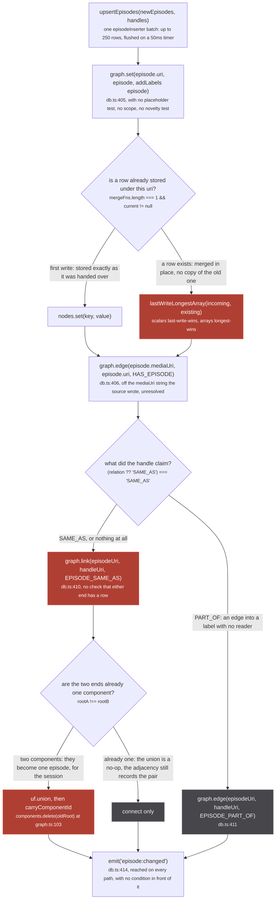
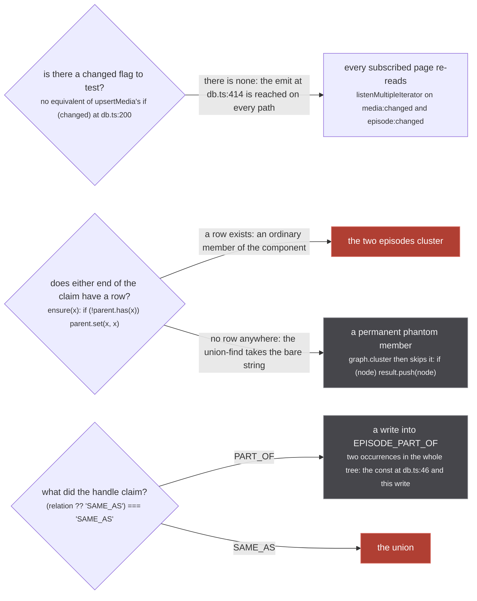
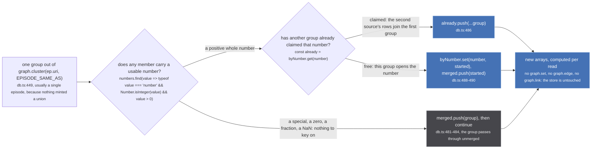

`upsertEpisodes` sits at `src/worker/store/db.ts:400-415`. Read it next to
[upsertMedia](/write/upsert-media/), which is seventy lines and three phases, and the shape of this
page is already clear:

```ts
export async function upsertEpisodes(
  newEpisodes: Episode[],
  handles: { episodeUri: string; handleUri: string; relation?: HandleRelation }[]
) {
  for (const episode of newEpisodes) {
    graph.set(episode.uri, episode, { addLabels: ['episode'] })
    graph.edge(episode.mediaUri, episode.uri, HAS_EPISODE)
  }

  for (const { episodeUri, handleUri, relation } of handles) {
    if ((relation ?? 'SAME_AS') === 'SAME_AS') graph.link(episodeUri, handleUri, EPISODE_SAME_AS)
    else graph.edge(episodeUri, handleUri, EPISODE_PART_OF)
  }

  emit('episode:changed', {})
}
```

That is the whole function. There is no gate anywhere in it, and the one line with no inverse,
`graph.link` at `db.ts:410`, is reached with no test in front of it at all.

It has exactly one caller in the app: `episodeInserter`, the DataLoader at
`src/worker/extractor.ts:136-152`, which calls it at `extractor.ts:145` with up to 250 rows on a 50ms
timer, `cache: false`. The rows arrive through `normalizeToStoreEpisode` (`extractor.ts:53-70`), which
drops `handles`, `_id`, `relativeNumber` and `absoluteNumber`, so the stored row is sixteen fields and
carries no record of the claims that came with it. The handle pairs are collected at
`extractor.ts:137-143` with one refusal, `if (!handle?.node) continue` at `:140`, and, unlike the
media loader at `extractor.ts:114-124`, **no dedupe set**: the same pair claimed three times is three
calls to `graph.link`.

## The whole function



*Two of the three decisions on this figure belong to `graph.ts`, not to this function. `upsertEpisodes` itself makes exactly one, the relation ternary at `db.ts:410`.*

Compare that with the [`upsertMedia` spine](/write/upsert-media/): there, two whole phases exist to
decide which pairs may reach `graph.link`. Here the pair goes straight there.

## What is missing, guard by guard

Every column on the right reads "none", and that is the page.

| guard | `upsertMedia` | `upsertEpisodes` |
| --- | --- | --- |
| placeholder refusal | `if (isPlaceholder(media)) continue` (`db.ts:140`) | none |
| scope ratchet | `scopeOf(media.uri) === 'CONTAINER' ? ...` (`db.ts:146`) | none, and an episode row has no `scope` field (`store/types.ts:134-151`) |
| description gate, `pendingClaims` | `db.ts:179-183` | none |
| cross-scope demotion | `db.ts:187-190` | none |
| `changed` tracking | `let changed = false`, four assignment sites | none |
| conditional emit | `if (changed) emit('media:changed', {})` (`db.ts:200`) | unconditional (`db.ts:414`) |
| asserted shadow record | three `ASSERTED_LABELS` writes | none |

Some of those absences are honest. An episode has no scope, so there is nothing to ratchet. The
shadow record has nothing to answer either: `exportStore` reaches an episode through `HAS_EPISODE`
off each cluster member and filters it by its own origin, `if (excluded.has(originOf(episodeUri)) ||
!published(episodeUri)) continue` at `src/worker/store/export.ts:85`, so it never has to ask what an
episode component would look like with a member removed. Three of the absences do have observable
consequences.



*Two of these three cost work on every batch; the third costs nothing and means nothing, which is its own kind of problem.*

### The emit is unconditional

`upsertMedia` earned its `if (changed)` the hard way, and the test that pins it says what the event
costs:

`tests/unit/worker/store/edge-idempotence.test.ts:1-8`

> `graph.link` has always reported whether it changed anything and `graph.edge` did not, so every
> caller of the second had to guess. `upsertMedia` guessed "yes", which meant a source re-minting a
> handle it had already minted emitted `media:changed` anyway.
>
> That is not a cosmetic event. `media:changed` re-runs the whole fuzzy merge pass and wakes every
> subscribed page, and the sources re-mint constantly: the DataLoader flushes on a 50ms timer and the
> media page re-asks every origin. So a PART_OF edge that never changes still paid for a full pass
> each time it was asserted.

`episode:changed` rides the same two listeners: `src/worker/resolvers/media/index.ts:40` and
`src/worker/extractor.ts:100` both subscribe with
`listenMultipleIterator(['media:changed', 'episode:changed'])`, so an episode batch that stored
nothing new still re-runs `read()` for every open media subscription. `graph.set` and `graph.edge`
both return enough to build a `changed` flag out of (`graph.ts:299`, and `graph.edge`'s contract note
at `graph.ts:293-296`), so this is an absence rather than an impossibility.

**One correction to the page brief.** The inventory says "an empty batch still emits". True of a
direct call, `upsertEpisodes([], [])`, and every test that makes one measures the emit. But
`episodeInserter` is a DataLoader and a DataLoader never dispatches an empty batch, so the case that
actually happens every 50ms is the other one: a batch full of rows the store already holds, whose
every `graph.set` merges into an identical row and whose every `graph.edge` re-asserts an edge that
was already there. That emits too.

### A claim needs no row, and never gets one

:::danger
**`graph.link` at `db.ts:410` is a union-find union and there is no inverse anywhere in the repo.**
`link` (`graph.ts:279-291`) calls `uf.find` on both ends, and `find` (`graph.ts:69-80`) begins with
`ensure(x)` (`graph.ts:61-67`), which creates a singleton component for any string it has not seen.
So an episode uri that no source ever described is admitted to the `episode:same_as` space simply by
being named in a claim. `union` (`graph.ts:82-105`) then ends with `components.delete(oldRoot)` at
`graph.ts:103`, which destroys the record of which members came from which side. The whole
`UnionFind` surface is `has`, `find`, `union`, `component`, `allComponents` (`graph.ts:10-16`): no
split, no unlink, no disunion.

`upsertMedia` keeps a bare uri away from that line with the description gate at `db.ts:179-183`,
which defers the claim under each missing end until a row lands. `upsertEpisodes` has nothing of the
sort. The phantom is also invisible: `graph.cluster` (`graph.ts:316-330`) pushes only members that
resolve to a stored node, `if (node) result.push(node)` at `graph.ts:322-323`, so the component holds
a member no read will ever show, permanently, and a row landing under that uri later joins the
cluster with no claim having been made in the meantime.
:::

:::caution
**The row write is last-write-wins and keeps no history**, exactly as it is for media.
`graph.set` (`graph.ts:155-191`) looks up the merge function registered for the node's labels at
module load (`db.ts:85-86`) and, when a row already exists, applies `lastWriteLongestArray`
(`graph.ts:388-400`): scalars take the newest non-nullish value, arrays take the longest with ties to
the incoming one, non-array objects are replaced whole. A source correcting a title to a shorter list
cannot, and a source correcting a `runtime` back to unknown cannot.

`graph.set` also carries the only `throw` in the write path (`graph.ts:166-168`): a node whose
effective labels include two with merge functions crashes the whole DataLoader batch. Both `media`
and `episode` register one, so a uri written by both `upsertMedia` and `upsertEpisodes` would take
down every source's rows in that batch. Nothing in the tree mints such a collision, because an
episode uri suffixes its media's: `toUriEpisodeId` is
`` `${uri}-${episodeId}` `` (`src/utils/uri.ts:277`) and `makeEpisode` follows the same convention
(`src/sources/utils.ts:98`). The guard is still real, and it is batch-wide.
:::

### `EPISODE_PART_OF` is written and never read

`const EPISODE_PART_OF = 'episode:part_of'` at `db.ts:46`, written at `db.ts:411`, and that is the
whole story: those two lines are the only occurrences of the name in `src/` or `tests/`. It is not in
`IDENTITY_LABELS` (`db.ts:53`), not in `ASSERTED_LABELS` (`db.ts:66-70`), and `export.ts` walks
`HAS_EPISODE_LABEL` (`db.ts:50`) and never this. A source that claims PART_OF between two episodes
gets an edge that nothing can observe.

## Nothing built-in mints an episode handle

The handles loop at `db.ts:409-412` is, today, dead for every first-party source. `makeEpisode`
(`src/sources/utils.ts:83-96`) defaults `handles` to `[]` and coerces a bare node at `:90`:

```ts
handles: (handles ?? []).map(handle => isEpisodeHandle(handle) ? handle : episodeSameAs(handle)),
```

All fifteen `makeEpisode` call sites in `src/sources/` omit `handles`. The one route into the loop is
a plugin: `readPluginHandles` (`src/worker/plugin-sources.ts:123-129`) reads a plugin media's nested
episodes and normalises their handles at **depth 1** (`:126`), against depth 4 for the media's own.
Its comment says so plainly:

`src/worker/plugin-sources.ts:111-122`

> A plugin's media with its handles in the shape the store reads.
>
> `stub-source@1` plugins were written against `handles: [Media!]!`, a bare list of the rows a media is
> the same as, and every one of them still sends it: the nyaa package restates the cluster's handles as
> bare rows. The schema made a handle an edge, `{ node, relation }`, on 2026-09-04 and the worker read
> `handle.node` from then on, so a bare row was an edge with no node, the unwrap dereferenced it, and
> the shared insert batch rejected for every extractor in it, first-party sources included
> (2026-09-05, on the deployed site). A bare row reads as the SAME_AS it always meant; an edge passes
> through with its node read the same way; anything that is neither is dropped. Episodes' handles are
> read alike. The depth cap bounds a self-referencing payload.

So the `EPISODE_SAME_AS` space is, in practice, empty, and the store comment at `db.ts:460` states the
consequence rather than the cause: *"Episodes only ever merged through an explicit `EPISODE_SAME_AS`,
which nothing mints between two metadata sources"*. Read against the code, the stronger version is
true: nothing built-in mints one at all, and the only producer that can is a third-party plugin
reaching the same unguarded `graph.link`.

## The edge is per member, the read is per cluster

`graph.edge(episode.mediaUri, episode.uri, HAS_EPISODE)` at `db.ts:406` hangs the episode off the
`mediaUri` string the source wrote, with no resolution and no check that the uri names a stored row.
That is deliberate, and it is how episodes from one origin reach a cluster assembled by another:

`src/worker/store/db.ts:432-443`, the walk:

```ts
for (const mediaUri of mediaUris) {
  for (const epUri of graph.targets(mediaUri, HAS_EPISODE)) {
```

The caller passes **every member uri of one media cluster**, so the union of all their `HAS_EPISODE`
targets is the cluster's episode list. Crunchyroll uses this on purpose when it lends a containing
season to a run it cannot name:

`src/sources/crunchyroll/extractor.ts:386-394`

> WHAT IS RETURNED IS NOT AN IDENTITY. The season is one thing and the run is another, so it carries
> NO handles: claiming it would union both parts into one cluster through a shared uri, which is the
> defect the fold veto exists to prevent and which `graph.link` has no inverse for. What crosses over
> is the EPISODES, re-pointed at the run that asked, so a `HAS_EPISODE` edge exists and the run's own
> walk can reach them.
>
> They keep CRUNCHYROLL'S OWN NUMBERING. The node is shared with everything else that reads that
> season and `graph.set` is last-write-wins, so rewriting it here would change what those readers
> see.

That is the whole store/view divide in two paragraphs: the edge is the permanent part, the numbering
is not touched, and the run's own numbering is applied at read time by `alignRunEpisodes`
(`src/worker/store/consensus.ts:243-255`).

The same mechanism is what makes `Media.episodes` the most dangerous read in the tree, because it
takes the uris it walks from the caller:

`src/worker/store/aggregate.ts:97-101`

> WHY IT IS THE MOST DANGEROUS READ. `findAggregatedEpisodesForMedia` walks HAS_EPISODE for every uri
> handed to it and `Media.episodes` groups the union by `episodeNumber` ALONE. A PART_OF node is a
> SHOW, and `unogs/extractor.ts` hangs every season's episodes, each renumbered 1..n, off exactly that
> kind of uri. Passing one in puts every run's episodes into this run's list and the row count becomes
> the longest season: the 24-rows-on-a-14-episode-season defect, arriving by a new road.

The rule that keeps it safe lives in `sameAsHandleUris` (`aggregate.ts:103-104`) and is pinned at
`tests/unit/worker/store/part-of.test.ts:117-128`, because the resolver itself cannot be imported
under vitest. `src/sources/tvdb/extractor.ts:159-165` and
`src/sources/crunchyroll/extractor.ts:258-270` both carry the same guard on the producing side: a
show-level id gets the metadata and no episodes.

## The read-time compensation

Because `EPISODE_SAME_AS` is essentially never minted, two metadata sources describing one run
produced two full episode lists. The fix is a view, not a write.



*Same outcome on screen as an `EPISODE_SAME_AS` union, opposite permanence: this one is recomputed on every read and forgotten.*

`mergeByEpisodeNumber` is `db.ts:475-494`, and its comment is the best statement on the site of why a
merge belongs in a view:

`src/worker/store/db.ts:457-473`

> Within ONE run, two episodes carrying the same number are the same episode.
>
> Episodes only ever merged through an explicit `EPISODE_SAME_AS`, which nothing mints between two
> metadata sources, so a run described by two of them came out as two full lists rather than one.
> Measured 2026-09-09 on Mushoku Tensei season 2 part 2: twelve kitsu episodes with no titles followed
> by the same twelve from anizip with every title and date, drawn as twenty four rows.
>
> SAFE ONLY BECAUSE THE INPUT IS ONE RUN. The caller passes the uris of a single media cluster, which
> is its SAME_AS set by construction, and a run numbers its episodes once. This is emphatically not a
> rule about episodes in general: two runs of a show both have an episode 1, which is why nothing may
> read episodes across a PART_OF and why this must never be handed a container's uris.
>
> Keyed on the number ALONE, not on the season too. Sources disagree about which season a run belongs
> to (anizip says 2 where kitsu says nothing), so including it would prevent exactly the merges this
> exists for. A number is only usable when it is a positive whole one: a special carries none, so
> specials stay separate rather than colliding with episode 1.

The usability test is one line, `db.ts:480`:

```ts
const number = numbers.find(value => typeof value === 'number' && Number.isInteger(value) && value > 0)
```

`Number.isInteger` refuses `1.5` and `NaN`, and `value > 0` refuses `0` and `-1`; all four are pinned
at `tests/unit/worker/store/episode-merge.test.ts:57-65`. The search is over the **whole group**, not
its first member, so a group already joined by a stated same-as merges on whichever member is
numbered (`:67-73`). A group with no usable number falls through to `merged.push(group)` and stays its
own row, which is what keeps a special off episode 1 (`:47-55`).

And the merge is deliberately weaker than it looks. Keying on the number alone means a catalogue that
continues its numbering across a season boundary collides with nothing and lands on rows nobody else
occupies:

`src/worker/store/consensus.ts:90-97`

> How far another source's numbering sits from this run's, read off the DATES they share.
>
> A catalogue may number a season continuing from the previous one where everyone else restarts at 1.
> The Elusive Samurai season 2, in the shipped seed: anizip, kitsu, MAL and AniList all publish
> episodes 1 to 12, and Crunchyroll publishes the same broadcast as 13 to 20, with the SAME AIR DATES
> to the day. `mergeByEpisodeNumber` keys on the number alone, so the page drew twenty rows for a
> twelve episode run and put every Crunchyroll source on rows 13 to 20, where nothing else was.

That is what `alignRunEpisodes` and `runEpisodes` exist for, applied above this by `findRunEpisodes`
(`db.ts:424-430`) before the resolver ever sees the groups.

### The test that proves the call site exists

Worth reading for the note above it, which is the "check the checker" problem in one comment:

`tests/unit/worker/store/episode-merge.test.ts:87-88`

> The tests above drive the rule directly, so they pass whether or not anything CALLS it: deleting the
> call site left all nine green. This one goes through the store, which is the path the page uses.

The store-level test at `:99-118` upserts one media and twenty four episodes, twelve from kitsu with
no titles and twelve from anizip with them, all pointing at `kitsu:900001`, with **no handles at
all**, and asserts `findAggregatedEpisodesForMedia([media])` returns twelve groups each carrying both
origins. That is the shape of every real run in the store: no episode handle anywhere, and the merge
happening entirely in the read.

## Where the code disagreed with the brief

- The inventory calls this "twelve lines". The body is eleven statements across `db.ts:404-414`; the
  count does not change anything the page says.
- "An empty batch still emits" is true of a direct call but cannot come from `episodeInserter`, which
  is a DataLoader. The everyday case is a batch of rows the store already holds. Both emit.
- The inventory's guard table lists the scope ratchet and the asserted shadow record as absences.
  Neither was ever available to be absent. The store `Episode` type
  (`src/worker/store/types.ts:134-151`) has no `scope` field, and `exportStore` reads episodes off
  `HAS_EPISODE` per member rather than through any episode union (`export.ts:82-90`), so it never
  needs the adjacency that `ASSERTED_LABELS` exists to give the media side.
- The store comment at `db.ts:460` says nothing mints `EPISODE_SAME_AS` *between two metadata
  sources*. Reading the sources, no built-in source mints an episode handle at all: every
  `makeEpisode` call site omits `handles`. A plugin can, through
  `readPluginHandles` at depth 1.
