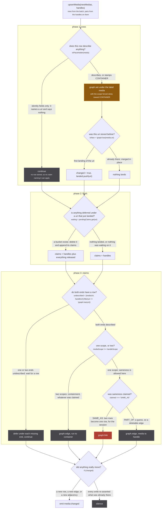
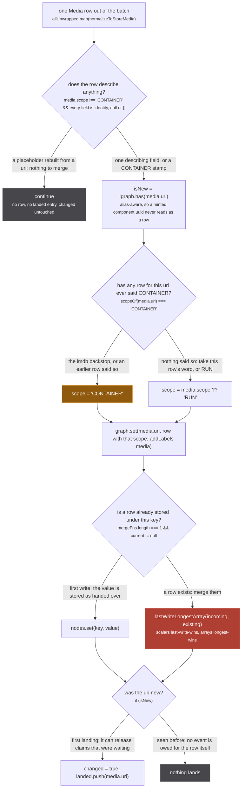
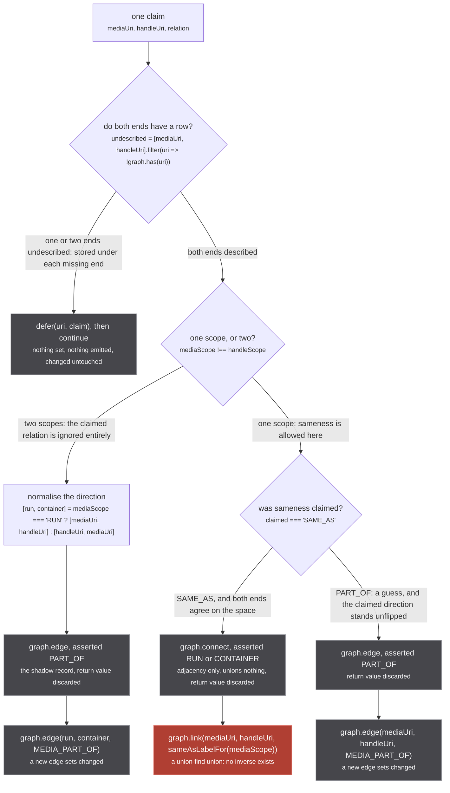
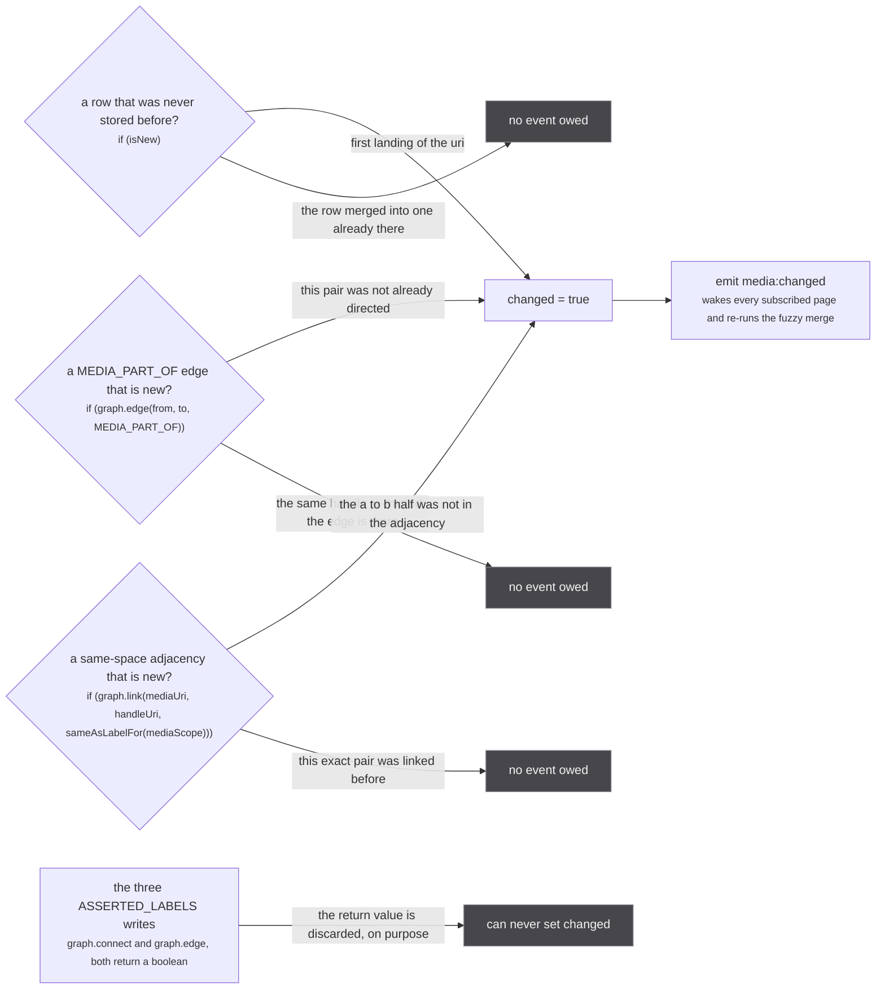

Every media row and every identity claim in the store passes through one function, `upsertMedia` at
`src/worker/store/db.ts:132-201`. Seventy lines, three phases, and exactly one operation in it that
cannot be undone.

```ts
export async function upsertMedia(
  newMedias: Media[],
  handles: Claim[]
)
```

`Claim` is three fields (`db.ts:110`):

```ts
type Claim = { mediaUri: string; handleUri: string; relation?: HandleRelation }
```

Two locals carry the whole function, declared at `db.ts:136-137`:

```ts
let changed = false
const landed: string[] = []
```

It is `async` and contains no `await`. Every write it makes is applied synchronously, including the
`emit` at the end (`src/worker/store/events.ts:9-14` is a bare `dispatchEvent`), so a caller that
forgets to await it still sees a store that has already moved.

There are two callers, and they use it in opposite ways. `mediaInserter`, the DataLoader in
`src/worker/extractor.ts:106-134`, calls it at `extractor.ts:127` with up to 250 rows and their
handle pairs. `resolveSimilarRuns` calls it at `src/worker/similar-consumer.ts:255` with **no rows at
all** and a single claim. Both are covered below.

## The three phases



*One rose node in the whole function. The other two phases exist to decide which pairs are allowed to reach it.*

The order is load bearing and the comment at `db.ts:162-163` says why: *"The rows loop above runs
first, so every handle node that describes itself has a stored row when the pairs are read
(worker/extractor.ts unwraps every handle node into the rows list)."* Every node hanging off a handle
was already flattened into `newMedias` by `recursivelyUnwrapMediaHandles`
(`src/worker/store/aggregate.ts:135-152`), so by the time phase 3 asks `graph.has(handleUri)` the
answer is normally yes, and when it is no that means something real: the node was a placeholder, or it
belongs to a batch that has not flushed yet.

## Phase 1: the rows loop

`db.ts:139-152`.



*Two of the four writes on this figure are one-way: the scope can only travel toward CONTAINER, and the merge keeps no copy of what it replaced.*

### The placeholder gate

`isPlaceholder` is `db.ts:105-108`, and the set it reads is `db.ts:104`:

```ts
const IDENTITY_FIELDS = new Set(['uri', 'origin', 'id', 'scope'])
const isPlaceholder = (media: Media) =>
  media.scope !== 'CONTAINER'
  && Object.entries(media).every(([field, value]) =>
    IDENTITY_FIELDS.has(field) || value == null || (Array.isArray(value) && value.length === 0))
```

`src/worker/store/db.ts:99-103`

> The fields that NAME a row rather than describe it. A row carrying nothing else is a placeholder
> rebuilt from a uri (`buildHandlesFromUri` in sources/utils.ts mints one per sibling of an aggregated
> uri), and a uri says nothing about what it names: the row would contribute no field to a merge and
> its scope is `makeMedia`'s default. So it is not stored, and a claim naming it waits for a row that
> is. A CONTAINER stamp counts as a description, since it is a source's own reading of the id.

Both clauses do work.

The first, `media.scope !== 'CONTAINER'`, short-circuits the whole test: **a row carrying nothing but
`scope: 'CONTAINER'` is not a placeholder and is stored.** That is not an oversight. `partOf`
(`src/sources/utils.ts:40`) stamps `CONTAINER` on its copy of the node, so the stamp is a claim the
minting source made about the id, and it is exactly the claim the store needs in order to keep that
uri out of a run's identity space. Pinned at `tests/unit/worker/store/arrival-order.test.ts:108-117`,
whose name is the rule: *a bare CONTAINER stamp is a description*.

The second clause treats a field as empty when it is `null`, `undefined`, or an empty array. That test
is only decidable because `normalizeToStoreMedia` normalises every absent field to `null` or `[]`
before the row arrives; a partially populated row would confuse it.

The refusal is a `continue`. No row, no `landed` entry, `changed` untouched, and every other row in
the batch of up to 250 still lands. A claim naming the skipped uri falls into `pendingClaims` in
phase 3 and stays there.

Where the placeholders come from: every source answering a media page rebuilds the aggregated uri's
siblings with `buildHandlesFromUri` (`src/sources/utils.ts:465-471`), which mints
`sameAs(makeMedia({ origin, id }))` per sibling, and `makeMedia` defaults `url: undefined`,
`scope: 'RUN'`, and every list to `[]`. Open `ag:(anilist:108465,cr:G24H1N3MP)` and the anilist source
hands over a bare `cr:G24H1N3MP` node. It is not stored, and
`arrival-order.test.ts:97-104` asserts exactly that: `findAggregatedMedia('cr:G24H1N3MP')` answers
`[]`.

### The novelty test

`const isNew = !graph.has(media.uri)` (`db.ts:141`). `has` is the alias-aware one
(`src/worker/store/graph.ts:221-223`): it answers true for a stored uri **or** for anything in the
alias table. That is why the alias table is allowed to hold only minted uuids, never uris:

`src/worker/store/graph.ts:133-135`

> `${label}\u0000${root}` -> uuid. The alias table only ever receives these uuids as keys, never a
> uri: `has` and `get` fall through aliases, so a uri alias would make `upsertMedia`'s novelty test
> and its pendingClaims gate report a row that was never stored.

### The scope ratchet

`db.ts:146`:

```ts
const scope: MediaScope = scopeOf(media.uri) === 'CONTAINER' ? 'CONTAINER' : media.scope ?? 'RUN'
```

`scopeOf` is `db.ts:91-92`, a three-step ladder: the `SHOW_LEVEL_ORIGINS` backstop (`db.ts:42`,
exactly one entry, `imdb`), then the stored row's own `scope`, then `'RUN'`. So the ternary reads:
if anything has ever said CONTAINER for this uri, it stays CONTAINER, whatever this row says.

:::caution
**RUN to CONTAINER is a one-way door.** Nothing in the store moves a uri back, including a row that
explicitly says `RUN` and a row that says nothing at all. Pinned by
`tests/unit/worker/store/container-scope.test.ts:80-94`, which upserts CONTAINER, then RUN, then no
scope, and asserts CONTAINER.

`src/worker/store/db.ts:142-145`

> Scope is STICKY toward CONTAINER: once any row for this uri said CONTAINER, a later row that says
> RUN or says nothing does not flip it back. The failure with no inverse is a wrong SAME_AS, and the
> failure of a wrong CONTAINER is a missing SAME_AS, which a later slice can recover. The merge
> function alone would let an incoming RUN overwrite it (scalars are last-write-wins).

Note the last sentence, because it decides where the code has to live. The ratchet cannot be a
property of the merge function: `lastWriteLongestArray` would cheerfully write `RUN` over
`CONTAINER`. It has to be applied to the value **before** `graph.set` ever sees it, which is why
`db.ts:146` sits where it does.
:::

### The write, and what it destroys

`graph.set(media.uri, { ...media, scope }, { addLabels: ['media'] })` at `db.ts:147`. A full row every
time, never a patch. `graph.set` (`graph.ts:155-191`) looks up the merge function registered for the
node's labels at module load (`db.ts:85-86`) and applies it only when a row is already there
(`graph.ts:171-173`).

:::danger
**The merge is last-write-wins and keeps no history.** `lastWriteLongestArray`
(`graph.ts:388-400`) is thirteen lines and every one of its behaviours is one-way:

- **Scalars: the newest non-nullish value wins.** `result[key] = val ?? existing[key]`, so an
  incoming `null` never erases a stored value. A source that wants to correct `episodeCount: 13`
  back to "unknown" cannot.
- **Arrays: strictly longest wins**, and a tie goes to the incoming array
  (`ex.length > val.length ? ex : val`). A shorter, corrected `titles` list is discarded whole.
- **Objects that are not arrays fall in the scalar branch**, so `nextAiringEpisode` and `franchise`
  are replaced whole.

There is no per-source layer, no provenance on a field, and no way to ask what a given origin said.
`aggregateMedia` reads merged rows and has never seen anything else. There is also no `delete` on
`Graph`: a node, once set, exists until `clear()`, and the only caller of that is `resetStore`
(`db.ts:509-513`), which is tests only.
:::

## Phase 2: releasing what was waiting

`db.ts:154-160`, six lines:

```ts
const claims = [...handles]
for (const uri of landed) {
  const waiting = pendingClaims.get(uri)
  if (!waiting) continue
  pendingClaims.delete(uri)
  claims.push(...waiting.values())
}
```

Three mechanics that a reader gets wrong if they skim it:

- **The flush is driven by `landed`, which holds first-time uris only.** A row that merely updated an
  existing one releases nothing. That is not a gap: a claim is only ever deferred when
  `!graph.has(uri)`, so nothing can be waiting for a uri that already had a row.
- **`claims` is fully built before phase 3 iterates it.** A claim deferred *during* phase 3 is never
  retried in the same call. Rows only ever land in phase 1, so the earliest a deferred claim can be
  applied is the next call that lands the row it is waiting on.
- **The bucket is deleted before its claims are retried.** If the claim's other end is still
  undescribed, phase 3 defers it again, under the still-missing end only.

The map itself is `db.ts:124`, keyed by uri, with each bucket keyed by `claimKey`
(`db.ts:111`), which folds `relation` through `?? 'SAME_AS'` so `{relation: undefined}` and
`{relation: 'SAME_AS'}` collapse to one entry. It is unbounded and never expires. The whole account
of the race that put it there is on [claims that wait](/write/pending-claims/).

## Phase 3: where a pair becomes a union or an edge

`db.ts:177-198`. This is the function's reason to exist.



*Every write on this figure is append-only except the one rose node, and the two decisions above it are the only things standing between a source's guess and that node.*

The comment above the loop is the decision table itself, and it is the single most useful paragraph in
the store:

`src/worker/store/db.ts:162-176`

> The rows loop above runs first, so every handle node that describes itself has a stored row when the
> pairs are read (worker/extractor.ts unwraps every handle node into the rows list). The relation is
> DERIVED from the two scopes and the claim:
>
>     RUN x RUN                claimed SAME_AS unions in the run space, PART_OF is an edge
>     RUN x CONTAINER          an edge media -> handle, whatever was claimed
>     CONTAINER x RUN          an edge handle -> media: the edge always runs from run to container
>     CONTAINER x CONTAINER    claimed SAME_AS unions in the container space, PART_OF is an edge
>
> Guesses go on edges, which are deletable; only asserted sameness within one scope goes on a union.
>
> Each applied claim is also recorded in ASSERTED_LABELS, and those writes' return values are
> DISCARDED: `changed` stays driven by the real labels alone. Feeding it an asserted write would put
> every listener back in the re-read loop tests/unit/worker/store/edge-idempotence.test.ts exists to
> stop, since the two records can go new at different times.

The full 2x2 and the five other places a scope is decided are on
[scopes and relations](/write/scopes-and-relations/). Three things about this loop specifically:

**The description gate refuses by waiting, not by dropping.** `db.ts:179-183` defers the claim under
**each** missing end, so it is retried when either one lands. Nothing is set and nothing is emitted.

**A cross-scope SAME_AS is silently demoted, and the direction is normalised.** In the
`mediaScope !== handleScope` branch the claimed relation is never read. `container-scope.test.ts:28-37`
pins a run claiming SAME_AS to a container: the cluster stays a singleton and the claim survives as
containment. `:41-56` pins the mirror, a container claiming a run, where the edge is flipped so it
always runs from the run to the container whatever the producer claimed.

**Within one scope the direction is taken as given.** The `else` branch at `db.ts:194-197` writes
`mediaUri -> handleUri` with no flip, because there is no run and no container to derive an order
from. Pinned by `container-scope.test.ts:139-149`, "control: two runs claiming PART_OF still get an
edge and no union". Contrast `linkPartOfPairs` (`db.ts:247-255`), which refuses a wrong order rather
than flipping it, for a stated reason: *a caller that got the order wrong may have the scopes wrong
too*.

:::danger
**`graph.link` at `db.ts:193` is the one irreversible operation in this function.**
`graph.link` (`graph.ts:279-291`) is a union-find union. Its `union` (`graph.ts:82-105`) ends with
`components.delete(oldRoot)` at `graph.ts:103`, which destroys the record of which members came from
which side, and the whole `UnionFind` surface is `has`, `find`, `union`, `component`,
`allComponents` (`graph.ts:10-16`). There is no split, no unlink, no disunion anywhere in the repo.
Once two media are welded they stay welded for the life of the worker.

`src/worker/resolvers/media/schema.gql:80-85`

> The handle names THIS run. The only relation that unions clusters, in `upsertMedia`, and the union
> has NO INVERSE: once two media are welded they stay welded for the session.
>
> Minting this for an id that names a SHOW is the single most expensive mistake available here. It
> merged three Mushoku Tensei seasons, four Demon Slayer films and fifteen Dragon Ball Z films, each
> time because one id was the only thing a source could offer and the only relation was this one.

The label is chosen by `sameAsLabelFor` (`db.ts:94`): `MEDIA_SAME_AS` when both scopes are RUN,
`CONTAINER_SAME_AS` when both are CONTAINER. They are separate `UnionFind` instances, so a union in
one space is invisible in the other, which is the invariant the header comment at `db.ts:7-13` is
about.

Everything else `upsertMedia` does exists to keep the wrong pair away from this line: the placeholder
gate, the scope ratchet, the wait for a row, the cross-scope demotion, the `partOf` stamp upstream,
and the PART_OF subtree cut in `recursivelyUnwrapMediaHandles`.
:::

### The shadow record

Every applied claim is written twice: once into the real label, once into `ASSERTED_LABELS`
(`db.ts:66-70`). The second write unions nothing (`graph.connect` for the two SAME_AS spaces,
`graph.edge` for PART_OF) and its return value is thrown away. It exists because the union it shadows
cannot be interrogated:

`src/worker/store/db.ts:55-65`

> A second, adjacency-only record of every pair a SOURCE claimed through a handle, written by
> `upsertMedia` and by nothing else. `./export.ts` is its only reader.
>
> Two properties the identity labels above cannot supply, and the export needs both. `graph.link`
> carries the same label whether the pair came from a handle or from `linkSameMediaPairs`, so a
> cluster cannot say which of its unions a source actually asserted; and a union-find cannot answer
> "what would this component be with that node removed", which is exactly what excluding a plugin or
> the offline origin asks. An adjacency answers both, and unions nothing, so nothing downstream of
> the store sees these labels at all.

That is the store paying, in a second data structure, for the fact that the first one has no inverse.

## What sets `changed`, and what deliberately does not



*Three kinds of change, four assignment sites, and one whole category of write that is measured and then thrown away.*

The assignments are at `db.ts:149` (a first-time row), `db.ts:190` (a new cross-scope
`MEDIA_PART_OF` edge), `db.ts:193` (a new same-space link) and `db.ts:196` (a new same-scope
`MEDIA_PART_OF` edge). The emission is `db.ts:200`, `if (changed) emit('media:changed', {})`.

**One correction to the page brief.** The inventory describes this figure as "three sources of
`changed = true`". The code has **four** assignment sites: the two `MEDIA_PART_OF` edges are written
by two different branches, `db.ts:190` with the direction normalised and `db.ts:196` with the
producer's direction taken as given. They are one kind of change and two lines, and the figure above
groups them the way the inventory does while the prose names both.

`graph.edge` reporting novelty at all is a fix, not a given, and the comment above it names the bug:

`src/worker/store/graph.ts:293-296`

> Returns whether the edge is NEW, the same contract `link` above has. A caller that re-asserts an
> edge it already made needs to know nothing changed: `upsertMedia` used to set `changed = true` on
> every PART_OF whatever the state, so a source re-minting the same handle emitted `media:changed`
> forever and every listener re-read the store for a graph that had not moved.

`tests/unit/worker/store/edge-idempotence.test.ts:1-8` states the cost:

> `graph.link` has always reported whether it changed anything and `graph.edge` did not, so every
> caller of the second had to guess. `upsertMedia` guessed "yes", which meant a source re-minting a
> handle it had already minted emitted `media:changed` anyway.
>
> That is not a cosmetic event. `media:changed` re-runs the whole fuzzy merge pass and wakes every
> subscribed page, and the sources re-mint constantly: the DataLoader flushes on a 50ms timer and the
> media page re-asks every origin. So a PART_OF edge that never changes still paid for a full pass
> each time it was asserted.

The test that pins it is `edge-idempotence.test.ts:31-44`: two identical `upsertMedia` calls, then
`expect(afterFirst).toBe(1)` and `expect(events).toBe(1)`.

One subtlety worth carrying away, because it decides what `changed` means: **`graph.link` returns the
novelty of the adjacency, not of the union.** It is `const isNew = connect(a, b, label)` at
`graph.ts:280`, and the union below it may well be a no-op. Two nodes already in one component through
a third, linked directly for the first time, return `true` while the internal `union` returns `false`.
So `media:changed` fires for a pair that was newly asserted even when the cluster did not grow, which
is the conservative direction: the graph did record something new.

## The second caller: a claim with no rows

`src/worker/similar-consumer.ts:255`:

```ts
await upsertMedia([], [{ mediaUri: ask.runUri, handleUri: result.media.uri, relation: 'SAME_AS' }])
```

Phase 1 does nothing, phase 2 has an empty `landed`, and phase 3 usually finds `result.media.uri`
undescribed and defers the claim. That is the design, not a miss:

`src/worker/similar-consumer.ts:273-277`

> The claim goes through `upsertMedia` with no rows: the answer's own row lands through the answering
> extractor's insertion, the claim waits for it under `pendingClaims`, and a RUN x RUN union emits
> `media:changed`, which re-runs the page's read, whose re-ask of the newly named origin is how the
> answer's episodes reach the store. The container edge is never touched.

Read that against the phase diagram: the claim enters at `C0`, takes the "wait for a row" branch, and
sits in the map until a completely different fan-out inserts the row, at which point phase 2 of *that*
call releases it and phase 3 of that call applies it. Nothing in the consumer waits, and nothing
retries: the row landing is the retry.

## A worked example, with real ids

`arrival-order.test.ts:41-55` walks every phase of this page with three real uris. An Apple TV run,
`appletv:umc.show-s1`, answers a page whose aggregated uri is `ag:(cr:G24H1N3MP,tvmaze:52279)`, so it
rebuilds both siblings as bare SAME_AS handles.

1. `tvmaze:52279` was already inserted as a described CONTAINER, so it has a row.
2. The Apple TV row lands, describing itself. Its two handle nodes are bare, so both are placeholders:
   phase 1 skips them and stores nothing.
3. Phase 3 reads the claim `appletv:umc.show-s1 -> cr:G24H1N3MP`. Nothing has ever described
   `cr:G24H1N3MP`, so the claim is deferred under it. The claim to `tvmaze:52279` is a different
   story: the handle node was skipped as a placeholder in this batch too, but a described row for that
   uri landed in step 1, so `graph.has` answers yes and the claim applies. The scopes differ (RUN
   against CONTAINER), so it becomes an edge from the run to the container, whatever it claimed. At
   this point `findAggregatedMedia('appletv:umc.show-s1')` is a singleton: *nothing to union with
   yet*.
4. Later, crunchyroll inserts a described CONTAINER row for `cr:G24H1N3MP`. It is new, so it lands,
   phase 2 releases the deferred claim, and phase 3 now reads two different scopes and writes the
   second containment edge.

The assertion the test ends on is the whole point: `'a show may never enter a run's identity space'`.
The cluster is still `['appletv:umc.show-s1']`, `findPartOfMedia` answers
`['cr:G24H1N3MP', 'tvmaze:52279']`, and the show answers the same way from its own side. Had the
claim been applied when `cr:G24H1N3MP` had no row, `scopeOf` would have answered `RUN` for it, the
claim would have been a RUN x RUN union, and the CONTAINER that arrived afterwards would have flipped
the scope and not the union. That is the live bug `pendingClaims` was written for.

## Where to go next

- what builds the rows and pairs this function receives, and the subtree cut that runs before it:
  [from an answer to a row](/write/answer-to-row/)
- the full 2x2, `scopeOf`, and the per-source scope table:
  [scopes and relations](/write/scopes-and-relations/)
- the race, the map, and how long a claim can wait: [claims that wait](/write/pending-claims/)
- the same job for episodes, with none of these guards: [upsertEpisodes](/write/upsert-episodes/)
- `graph.link`, `graph.edge`, `graph.connect` and the union-find underneath them:
  [the graph](/write/graph/)
- what `media:changed` wakes up: [events, and the re-read loop](/write/events/)
